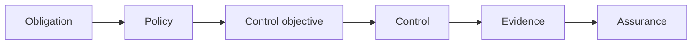

Governance becomes demonstrable when an organization can connect an obligation to accountable owners, control objectives, operating controls, and reliable evidence.

## Traceability

Compliance mapping records how regulatory, contractual, and internal obligations relate to policies and controls. It should avoid duplicating a separate control for every source when one control objective satisfies several obligations.

Useful evidence includes ownership and classification records, lineage, approvals, exceptions, configuration and rule versions, execution results, access and change events, issue remediation, and review decisions. Evidence needs provenance, integrity, retention, and a clear relationship to the period and assets being assessed.

Auditability is the ability to reconstruct what rule applied, who decided, what control operated, what exception existed, and what outcome followed. An audit trail is one input; logs without semantics, ownership, or retention are not sufficient assurance.

Continuous controls monitoring evaluates selected signals as operations occur instead of waiting for a periodic review. It can detect missing classifications, expired exceptions, failed checks, or policy drift. Monitoring does not replace judgment: thresholds, false positives, gaps, and remediation ownership must be reviewed.

This model is technology- and jurisdiction-neutral. Specialists interpret particular requirements; governance provides the common traceability and accountability through which those requirements are operationalized.
