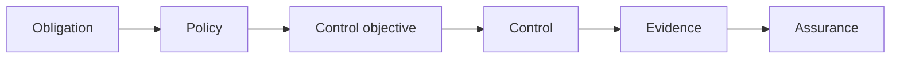

Governance becomes demonstrable when an organization can connect an obligation to accountable owners, control objectives, operating controls, and reliable evidence.

**Compliance** means satisfying an applicable requirement. The source may be a law, regulation, contract, industry commitment, or internal policy. **Auditability** is the ability to reconstruct and evaluate how the organization addressed that requirement. Governance provides the decision ownership and traceability that connect the two; it does not replace the legal, risk, privacy, security, or other specialists who interpret particular obligations.

## Traceability

Compliance mapping records how regulatory, contractual, and internal obligations relate to policies and controls. It should avoid duplicating a separate control for every source when one control objective satisfies several obligations.

The mapping begins with an interpretation of what an obligation requires and where it applies. That interpretation is translated into one or more control objectives, which express the intended outcome in organization-neutral terms. Existing controls are then mapped to those objectives. Gaps should result in an explicit decision to introduce a control, change the governed scope, accept risk through an authorized process, or document why the obligation does not apply.

## Evidence and Assurance

Useful evidence includes ownership and classification records, lineage, approvals, exceptions, configuration and rule versions, execution results, access and change events, issue remediation, and review decisions. Evidence needs provenance, integrity, retention, and a clear relationship to the period and assets being assessed.

Evidence quality depends on what claim it is meant to support. A current configuration may demonstrate how a control is designed today, but not that it operated throughout the previous quarter. A sample of approvals may demonstrate human review, while a complete execution record may demonstrate automated coverage. The control owner should define the expected evidence when the control is designed, rather than reconstructing it only when an audit begins.

Auditability is the ability to reconstruct what rule applied, who decided, what control operated, what exception existed, and what outcome followed. An audit trail is one input; logs without semantics, ownership, or retention are not sufficient assurance.

**Assurance** is the reasoned conclusion drawn from evidence about whether governance and controls are suitably designed and operating as intended. It may be performed by the control owner, an independent internal function, a customer, or an external auditor. Independence and depth should be proportionate to the decision being supported. Operational monitoring, management review, and independent audit answer different questions and should not be treated as interchangeable.

## Monitoring and Remediation

Continuous controls monitoring evaluates selected signals as operations occur instead of waiting for a periodic review. It can detect missing classifications, expired exceptions, failed checks, or policy drift. Monitoring does not replace judgment: thresholds, false positives, gaps, and remediation ownership must be reviewed.

A detected failure needs a defined path from finding to resolution. The path should identify severity, affected assets and obligations, temporary safeguards, remediation owner, due date, verification of closure, and any escalation or notification requirements. Repeated failures may indicate a weak control, but they may also reveal an unrealistic standard, an unreliable input, or unclear ownership. Review should distinguish these causes before adding more controls.

Compliance status is therefore not a permanent property of an asset or organization. Obligations, systems, uses, owners, and controls change. Governance maintains the relationships among them so that assurance can be refreshed when material changes occur.

This model is technology- and jurisdiction-neutral. Specialists interpret particular requirements; governance provides the common traceability and accountability through which those requirements are operationalized.
