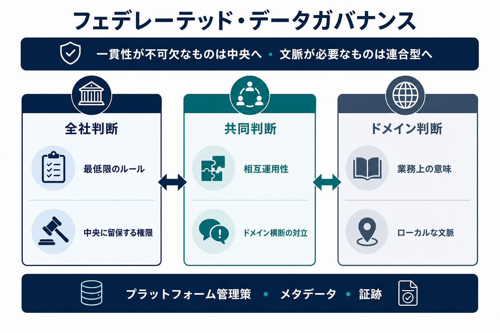

フェデレーテッド・データガバナンス（Federated Data Governance）は、定義された意思決定権をドメインへ分配しながら、組織全体に必要なポリシー、相互運用性、証跡を維持する運用モデルです。無秩序な分散化ではありません。

連合型はガバナンスの運用モデルの一つであり、すべてのガバナンス施策が目指す到達点ではありません。業務ドメインが異なる文脈と委譲された権限を行使できる能力を持ち、相互のデータに依存する場合に有効です。境界が単純な組織、ドメイン側の能力が限定される組織、直接的な中央統制が必要な組織には、中央集権またはハイブリッドモデルの方が適する場合があります。

> 一貫性が不可欠なものは中央に置き、ドメインの文脈が必要なものは連合型で判断する。

## 連合型にする理由

組織規模が大きくなると、中央機能だけではすべてのデータセット、用途、ローカルリスクを解釈できません。ドメインは多くの判断に必要な文脈を持ち、データプロダクトの成果を所有できます。一方、組織全体では、アイデンティティ、分類、インターフェース、証跡、ドメイン横断利用などに最低限の標準が必要です。

**ドメイン（Domain）** とは、生成または利用するデータの知識を持つ、持続的な業務責任の範囲です。ガバナンスを連合型にするとは、単に人員を事業部門へ配置することではなく、指定されたドメインの役割に、特定の判断に関する権限を与えることです。中央機能は、組織全体のガバナンスシステムと、中央に明示的に留保された判断について引き続き説明責任を持ちます。

補完性原則（Subsidiarity）は、責任ある判断に必要な文脈と権限を持つ最も現場に近い層へ判断を置きます。全社ポリシーは必須成果と中央に留保する判断を定義します。ドメインポリシーは、それらに反しない範囲でルールを具体化します。共有会議体は、ローカルな選択が他ドメインへ影響するときに対立を解消し、標準を更新します。

たとえば、全社ポリシーは、公開するすべてのデータプロダクトにオーナー、分類、サービス期待、承認済みアクセスパターンを設定するよう要求できます。ドメインはその範囲内で、プロダクトの業務定義、品質しきい値、サポートプロセスを判断します。二つのドメインが互換性のない識別子や定義を使用し、組み合わせて利用できない場合には共同判断が必要です。連合型は判断の種類を分けるものであり、すべての判断をドメインへ移すものではありません。

## 意思決定の境界

実用的な意思決定マップでは、次の層を区別します。

| 判断の層     | 典型的な関心事                                                                           | 典型的な権限主体                                     |
| ------------ | ---------------------------------------------------------------------------------------- | ---------------------------------------------------- |
| **全社**     | 必須義務、共通分類、アイデンティティ、最低限の証跡                                       | 全社ポリシーオーナーまたは委任されたガバナンス組織   |
| **ドメイン** | 業務上の意味、ローカルな品質しきい値、プロダクトのライフサイクル、文脈依存のアクセス判断 | 説明責任を持つドメインまたはデータプロダクトオーナー |
| **共同**     | ドメイン横断の意味、相互運用性、広範な影響を持つ例外                                     | 定義されたドメイン横断会議体を通じた関係オーナー     |

具体的な配分は組織によって異なります。委譲する各意思決定権には、境界、前提条件、証跡要件、エスカレーション経路が必要です。判断と運用に必要な情報、スキル、プラットフォーム機能、権限がなければ、ドメインに説明責任を持たせることはできません。

## 協調された実行

連合型ガバナンスでは、次を明確にします。

- 全社、ローカル、共同で行う判断
- 説明責任を持つドメインオーナーとエスカレーション経路
- 相互運用性とデータプロダクトの最低要件
- 再利用可能なプラットフォーム管理策と安全な既定値
- 各ドメインに必要な証跡
- 例外とポリシー変更のプロセス

メタデータは、オーナー、分類、ポリシー、資産、リネージ、管理策、証跡を結ぶ協調機構です。既存の [フェデレーテッドガバナンスのためのメタデータ](/ja/docs/data/metadata/federated-governance/) は、これらのシグナルが分散ポリシーを実行可能にする仕組みを説明します。 [データメッシュとメタデータ](/ja/docs/data/metadata/data-mesh/) は、ドメインオーナーシップ、データプロダクト、セルフサービス基盤、フェデレーテッド・コンピュテーショナル・ガバナンスを支えるメタデータを説明します。

メタデータだけで連合型運営が成立するわけではありません。合意したモデルを可視化して実行可能にし、システムが資産のオーナー、適用ポリシー、有効な例外、ドメインが生成した証跡を発見できるようにします。意思決定権と説明責任を持つ役割が合意されていなければ、同じメタデータは未解決の運用モデルを記録するだけになります。

フェデレーテッド・コンピュテーショナル・ガバナンスは、共通かつ検証可能なポリシーを共有プラットフォーム機能に符号化し、文脈依存の判断を説明責任のあるドメインに残します。自動化は反復的な承認を減らしますが、権限、説明、例外、レビューをなくすものではありません。

## 失敗パターンとレビュー

委譲が暗黙的である、能力を与えずにドメインへ責務だけを渡す、全社ルールが増え続けてローカルな権限が実質的に残らない、ローカルな選択同士が相互運用できない場合、連合型運営は機能しません。中央チームが連合型と呼びながら、すべての重要判断を引き続き行う場合も同様です。

レビューでは、実際にどこで判断が行われているか、ドメイン横断課題の解決にどれだけ時間がかかるか、ドメインが必要な証跡を生成しているか、全社標準が本当に一貫性を必要とする事項に限定されているかを確認します。目的は分散化の最大化ではなく、文脈、リスク、組織能力に合った信頼できる権限配分です。
