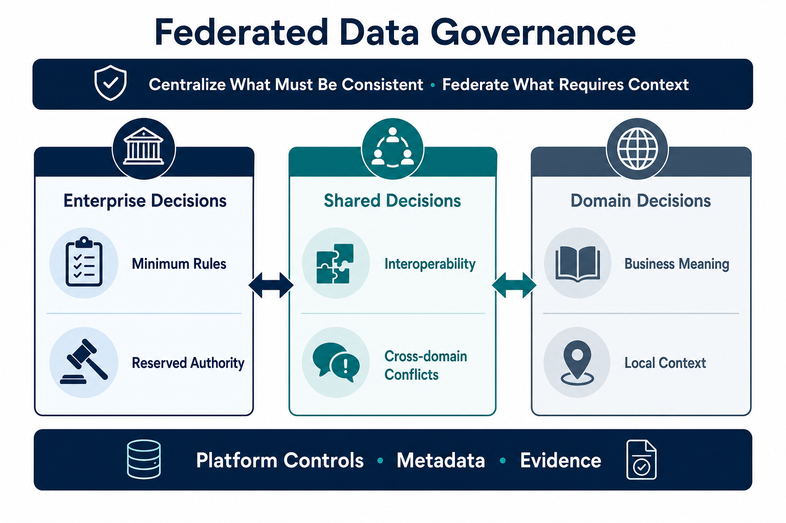

Federated Data Governance distributes defined decision rights to domains while preserving the policies, interoperability, and evidence the organization needs as a whole. It is not uncoordinated decentralization.

Federation is one governance operating model, not the destination of every governance program. It is useful when business domains have distinct context and sufficient capability to exercise delegated authority, while still depending on one another's data. Organizations with simpler boundaries, limited domain capacity, or requirements for direct centralized control may be better served by a centralized or hybrid model.

> Centralize what must be consistent; federate what requires domain context.

## Why Federate

A central function cannot interpret every dataset, use case, and local risk at organizational scale. Domains have the context to make many decisions and own data-product outcomes. The organization still needs minimum standards for matters such as identity, classifications, interfaces, evidence, and cross-domain use.

A **domain** is a durable area of business responsibility with knowledge of the data it produces or uses. Federating governance means giving designated domain roles authority over specified decisions, not merely placing staff in business units. The central function remains accountable for the organization-wide governance system and for decisions explicitly reserved at that level.

Subsidiarity places a decision at the lowest level that has the context and authority to make it responsibly. Global policy defines non-negotiable outcomes and reserved decisions. Domain policy refines those rules without contradicting them. Shared forums resolve conflicts and evolve standards when local choices affect other domains.

For example, an enterprise policy may require every published data product to identify an owner, classification, service expectations, and approved access pattern. A domain can decide the product's business definition, quality thresholds, and support process within that policy. A shared decision is needed when two domains use incompatible identifiers or definitions that prevent composition. Federation therefore separates decision types; it does not transfer every decision to domains.

## Decision Boundaries

A practical decision map distinguishes:

| Decision level | Typical concerns                                                                           | Typical authority                                    |
| -------------- | ------------------------------------------------------------------------------------------ | ---------------------------------------------------- |
| **Enterprise** | Non-negotiable obligations, common classifications, identity, minimum evidence             | Enterprise policy owner or delegated governance body |
| **Domain**     | Business meaning, local quality thresholds, product lifecycle, contextual access decisions | Accountable domain or data-product owner             |
| **Shared**     | Cross-domain semantics, interoperability, exceptions with wider impact                     | Affected owners through a defined cross-domain forum |

The exact allocation varies by organization. Each delegated right needs boundaries, prerequisites, evidence requirements, and an escalation path. A domain cannot be accountable for a decision if it lacks the information, skills, platform capabilities, or authority needed to make and operate it.

## Coordinated Execution

Federation works when it specifies:

- which decisions are global, local, or shared;
- accountable domain owners and escalation paths;
- minimum interoperability and data-product expectations;
- reusable platform controls and safe defaults;
- evidence required from each domain;
- a process for exceptions and policy change.

Metadata is the coordination mechanism connecting owners, classifications, policies, assets, lineage, controls, and evidence. The existing [Metadata for Federated Governance](/docs/data/metadata/federated-governance/) page explains how those signals make distributed policy executable. [Data Mesh and Metadata](/docs/data/metadata/data-mesh/) explains metadata support for domain ownership, data products, self-service platforms, and federated computational governance.

Metadata does not create federation by itself. It makes the agreed model visible and executable: systems can discover who owns an asset, which policy applies, whether an exception is active, and what evidence a domain has produced. Without agreed decision rights and accountable roles, the same metadata becomes documentation of an unresolved operating model.

Federated computational governance encodes common, testable policy in shared platform capabilities while leaving contextual judgments with accountable domains. Automation reduces repeated approvals; it does not eliminate authority, explanation, exceptions, or review.

## Failure Modes and Review

Federation fails when delegation is implicit, domains receive duties without capacity, enterprise rules expand until no meaningful local authority remains, or local choices cannot interoperate. It can also fail when a central team calls a process federated but continues to make every material decision.

Review should therefore examine where decisions are actually made, how long cross-domain issues remain unresolved, whether domains produce required evidence, and whether enterprise standards are limited to matters that truly need consistency. The objective is not maximum decentralization; it is a credible distribution of authority that matches context, risk, and organizational capability.
