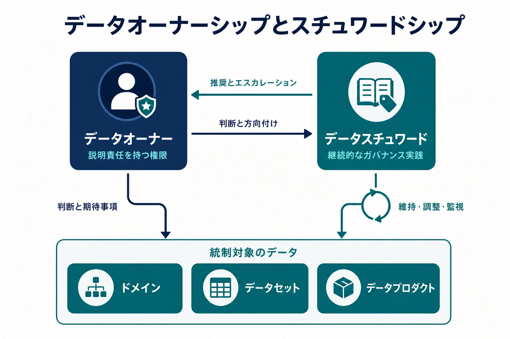

データオーナーシップ（Data Ownership）は、判断と成果に対する説明責任を割り当てます。スチュワードシップ（Stewardship）は、日々の実務でガバナンスを継続的に機能させます。どちらも、テーブルを保存するチームやパイプラインを運用するチームを指すだけではありません。

データに関する判断は、業務上の意味、リスク、技術運用をまたぐため、オーナーシップが必要です。プラットフォーム管理者はアクセスを付与できても、提案された利用目的が許容可能かを判断すべき立場とは限りません。スチュワードは二つの定義の対立を発見できても、どちらを全社標準にするかを決める権限を持たない場合があります。オーナーシップは、こうした判断を正式な権限を持つ人または組織へ結び付けます。

## 役割と境界

以下の役割はガバナンス上の責務を表すもので、必ずしも正式な職位ではありません。小規模な組織では一人が複数の役割を担い、大規模な組織では一つの役割を複数人で分担できます。重要なのは、責務と意思決定権が明示されていることです。

- **データオーナー（Data Owner）** は、ドメイン、データセット、データプロダクトに説明責任を持ち、許容される用途、品質期待、アクセス、ライフサイクルを判断する
- **データスチュワード（Data Steward）** は、定義、分類、課題、ポリシー適用を維持し、オーナー権限が必要な判断を準備する
- **技術・プラットフォームチーム** は、ストレージ、パイプライン、アクセス機構、メタデータサービス、自動管理策を運用する
- **データ提供側** はデータ生成元の意味、変更、品質シグナルを明示し、**データ利用側** は宣言された条件内で利用し、不適合を報告する
- ガバナンス、プライバシー、セキュリティ、リスク、コンプライアンスの専門家は横断的義務を定義または助言する

| 判断                             | 説明責任                               | 実務担当または協議先                 |
| -------------------------------- | -------------------------------------- | ------------------------------------ |
| 許容用途とサービス期待を定義する | データオーナー                         | スチュワード、提供側、利用側、専門家 |
| 定義と分類記録を維持する         | データオーナー                         | データスチュワード                   |
| アクセス・品質管理策を実装する   | データオーナー                         | プラットフォーム・デリバリーチーム   |
| 重大な例外を承認する             | 指定されたリスクまたはポリシーオーナー | データオーナー、専門家               |
| 利用状況と管理策の証跡を報告する | データオーナー                         | スチュワード、プラットフォームチーム |

説明責任と実務責任は区別します。スチュワードにカタログ更新を割り当てても、オーナーの説明責任は移転しません。

この区別は実務担当者も保護します。受容する権限のないリスクについてスチュワードに説明責任を負わせたり、管理策を実装したという理由でプラットフォームチームを暗黙のポリシーオーナーにしたりしてはいけません。判断が役割の権限を超える場合、その役割は判断材料を整理し、説明責任を持つオーナーまたは指定された会議体へ判断を委ねます。

## 運用実践としてのスチュワードシップ

スチュワードシップは共通理解を維持し、実際のデータの文脈にガバナンス要件を適用します。オーナーから依頼されたときだけ行う事務支援ではなく、継続的な実践です。運用モデルに応じて、次の活動を含みます。

- ビジネス定義、意味の一貫性、分類、その他のガバナンスメタデータを維持する
- 定義の対立、利用方法の不整合、データを適切に利用するために必要な文脈の不足を特定する
- データ品質とガバナンス上の課題を切り分け、データ提供側と利用側をまたいで解決を調整する
- 特定のドメイン、データセット、データプロダクトにポリシーと標準をどう適用するか解釈する
- 課題履歴、判断、例外、文脈を表すメタデータを維持する
- データオーナーまたはガバナンス会議体のために、推奨案、影響分析、エスカレーション資料を準備する
- 合意した判断がメタデータと運用へ継続的に反映されているか監視する

これらの活動を担っても、それを支える判断権限が自動的に与えられるわけではありません。スチュワードは二つの定義の対立を特定し、分析を調整して、解決案を提示できます。委譲された権限を超える場合、どちらを共通標準にするかは説明責任を持つオーナーまたは指定されたガバナンス会議体が判断します。その後、スチュワードが決定した定義を維持し、関係先への反映を支援します。

| 観点             | データオーナー             | データスチュワード                               |
| ---------------- | -------------------------- | ------------------------------------------------ |
| 主な関心         | 判断に対する説明責任       | 継続的なガバナンス実践                           |
| 典型的な権限     | 承認、判断、リスク受容     | 維持、調整、推奨、エスカレーション               |
| 時間軸           | 重要な判断と成果           | 継続的                                           |
| 主な成果物       | 判断、承認、期待事項       | 定義、分類、課題記録、ガバナンスメタデータ       |
| エスカレーション | 権限が必要な事項を受け取る | 委譲された権限を超える事項をエスカレーションする |

この表は責務を説明するものであり、必須の組織図や RACI テンプレートではありません。ビジネスまたはドメインのスチュワードは意味と利用を重視し、技術スチュワードはスキーマ、リネージ、管理策の実装を重視できます。スチュワードシップはデータプロダクトやドメインチームへ分散しても、中央のガバナンス機能が調整してもかまいません。「データスチュワード」という職位名を使う必要はありませんが、この実践を担う責務は割り当てる必要があります。

スチュワードへ実務を委譲しても、オーナーの説明責任は移転しません。逆も重要です。活動するスチュワードシップを伴わない説明責任は、機能するガバナンスではなく、カタログに氏名だけを記録した名目上のオーナーシップになりがちです。

## 何を所有するか

**データセットオーナー** は限定された資産を判断します。**ドメインオーナー** は持続的な事業境界における意味とポリシーを調整します。**データプロダクトオーナー** は利用者向けプロダクトの使いやすさ、信頼性、ライフサイクルに説明責任を持ちます。範囲が重なる場合は、意思決定記録でどの範囲を優先するかを明示します。

オーナーシップは、認識でき、継続的に維持できる境界に設定します。一人の経営責任者を無関係な数千テーブルのオーナーにすると、カタログ項目は埋まっても実質的な説明責任が生まれない可能性があります。反対に、物理コピーごとに別のオーナーを置くと、本来一貫させるべき判断が分断されます。まず顧客ドメイン、公開データプロダクト、規制対象の記録群など、判断の範囲を特定し、その範囲にオーナーを割り当てます。

## ライフサイクル全体のオーナーシップ

カタログに氏名を入力しても、オーナーシップは完了しません。オーナーまたは委譲された役割は、資産の提案、分類、公開、変更、共有、廃止の各段階に関与する必要があります。データ提供側は、意味や管理策に影響する変更をオーナーへ通知します。データ利用側には、適合性、アクセス、解釈上の問題を報告する経路が必要です。スチュワードは文脈と課題履歴を可視化し、判断が個人の記憶だけに依存しないようにします。

そのためオーナーシップ記録には、統制対象の範囲、適用期間、委譲した意思決定権、エスカレーション経路、再割り当てのプロセスを含めます。一時的な欠員や組織変更もガバナンス上のイベントです。オーナー不在の資産を暗黙に放置せず、代替権限を定義します。

このページはガバナンスに参加する役割だけを扱います。より広い組織モデルと役割は [データチーム](/ja/docs/data/teams/) を参照してください。
