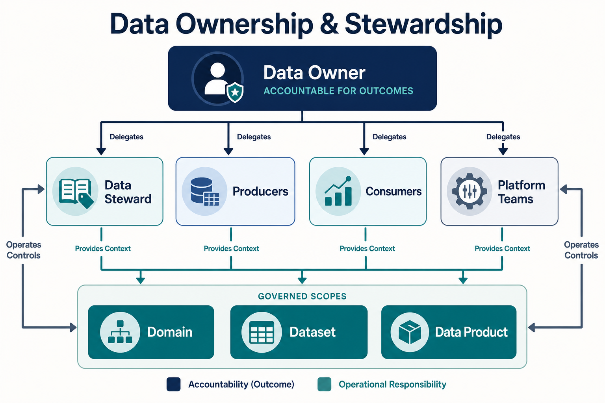

Data ownership assigns accountability for decisions and outcomes. Stewardship makes governance work continuously in day-to-day practice. Neither role is merely the team that stores a table or runs a pipeline.

Ownership is needed because data decisions often span business meaning, risk, and technical operation. A platform administrator may be able to grant access, but should not have to decide whether a proposed use is acceptable. A steward may recognize that two definitions conflict, but may not have authority to choose which definition becomes an enterprise standard. Ownership connects those decisions to a person or body with an explicit mandate.

## Roles and Boundaries

The roles below describe governance responsibilities, not necessarily job titles. One person may perform several roles in a small organization, while a large organization may divide one role across several people. What matters is that each responsibility and decision right is explicit.

- A **Data Owner** is accountable for a domain, dataset, or data product and accepts decisions about permitted use, quality expectations, access, and lifecycle.
- A **Data Steward** maintains definitions, classifications, issues, and policy application, and prepares decisions that require owner authority.
- **Technical and platform teams** operate storage, pipelines, access mechanisms, metadata services, and automated controls.
- **Producers** make source meaning, change, and quality signals explicit; **consumers** use data within declared terms and report unsuitable behavior.
- Governance, privacy, security, risk, and compliance specialists define or advise on cross-cutting obligations.

| Decision                                        | Accountable                     | Responsible or consulted                   |
| ----------------------------------------------- | ------------------------------- | ------------------------------------------ |
| Define acceptable uses and service expectations | Data Owner                      | Steward, producers, consumers, specialists |
| Maintain definitions and classification records | Data Owner                      | Data Steward                               |
| Implement access and quality controls           | Data Owner                      | Platform and delivery teams                |
| Approve a material exception                    | Designated risk or policy owner | Data Owner, specialists                    |
| Report use and control evidence                 | Data Owner                      | Steward and platform teams                 |

Accountability and operational responsibility must remain distinct: assigning a steward to update a catalog does not transfer the owner's accountability.

The distinction also protects the people performing the work. A steward should not be treated as accountable for a risk they cannot accept, and a platform team should not silently become the policy owner because it implemented the control. When a decision exceeds a role's mandate, that role prepares the context and routes the decision to the accountable owner or designated forum.

## Stewardship as an Operating Practice

Stewardship sustains shared understanding and applies governance requirements in the context of actual data. It is an ongoing practice, not administrative support performed only when an owner requests it. Depending on the operating model, it may include:

- maintaining business definitions, semantic consistency, classifications, and other governance metadata;
- identifying conflicting definitions, inconsistent usage, and gaps in the context needed to use data responsibly;
- triaging data-quality and governance issues and coordinating resolution across producers and consumers;
- interpreting policies and standards for a particular domain, dataset, or data product;
- maintaining issue history, decisions, exceptions, and contextual metadata;
- preparing recommendations, impact analysis, and escalation material for Data Owners or governance forums; and
- monitoring whether agreed decisions remain reflected in metadata and operations.

These activities do not automatically grant authority over the decisions they support. A steward can identify two conflicting definitions, coordinate analysis, and recommend a resolution. The accountable owner or designated governance body decides which definition becomes the shared standard when that choice exceeds delegated authority. The steward then maintains and helps propagate the resulting definition.

| Dimension         | Data Owner                           | Data Steward                                                     |
| ----------------- | ------------------------------------ | ---------------------------------------------------------------- |
| Primary concern   | Decision accountability              | Ongoing governance practice                                      |
| Typical authority | Approve, decide, or accept risk      | Maintain, coordinate, recommend, or escalate                     |
| Time horizon      | Key decisions and outcomes           | Continuous                                                       |
| Typical artifacts | Decisions, approvals, expectations   | Definitions, classifications, issue records, governance metadata |
| Escalation        | Receives matters requiring authority | Escalates matters beyond delegated authority                     |

The table describes responsibilities rather than a mandatory organization chart or RACI template. Business or domain stewards may focus on meaning and use; technical stewards may focus on schemas, lineage, and control implementation. Stewardship may be distributed among data-product or domain teams or coordinated by a central governance function. Organizations do not need to use the title “Data Steward,” but they do need to assign the practice.

Delegating operational work to stewards does not transfer the owner's accountability. The inverse matters as well: accountability without active stewardship tends to become nominal ownership recorded in a catalog rather than functioning governance.

## What Is Owned?

A **dataset owner** decides for a bounded asset. A **domain owner** coordinates meaning and policy across a durable business boundary. A **data-product owner** is accountable for a consumer-facing product's usability, reliability, and lifecycle. These scopes can overlap, so decision records should state which scope takes precedence.

Ownership should follow a boundary that can be recognized and sustained. Assigning one executive as owner of thousands of unrelated tables may produce a complete catalog field without creating real accountability. Conversely, assigning an owner to every physical copy can fragment decisions that should remain consistent. Organizations should identify the decision scope first—such as a customer domain, a published data product, or a regulated record set—and then assign ownership at that scope.

## Ownership Through the Lifecycle

Ownership is not completed when a name is entered in a catalog. The owner or delegated roles need to participate when an asset is proposed, classified, published, changed, shared, and retired. Producers should notify owners of changes that affect meaning or controls. Consumers should have a route to raise fitness, access, or interpretation issues. Stewards keep the context and issue history visible so that decisions do not depend on personal memory.

Ownership records should therefore include the governed scope, effective dates, delegated decision rights, escalation path, and a process for reassignment. Temporary vacancies and organizational changes are governance events: an unowned asset should have a defined fallback authority rather than remaining silently unmanaged.

This page covers governance participation only. See [Data Teams](/docs/data/teams/) for broader organization patterns and roles.
