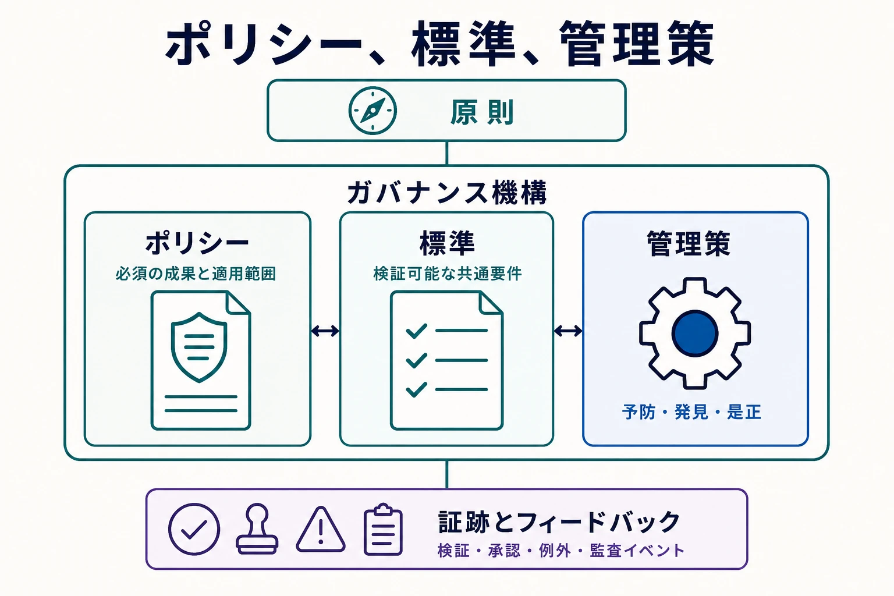

ガバナンスは、相互に関係するポリシー、標準、管理策の仕組みによって、意図を観測可能な振る舞いへ結び付けます。

この接続は、実装できない抽象的な方針と、目的が不明な技術管理策という二つの問題を防ぎます。それぞれの要素は、目的との追跡可能性を保ちながら、対象読者に適した内容である必要があります。経営層とポリシーオーナーが必須成果を示し、ドメインと技術の専門家が共通要件へ変換し、デリバリー・プラットフォームチームが管理策を運用します。

## 方向性から運用まで

| 要素                   | 目的                           | 例                                               |
| ---------------------- | ------------------------------ | ------------------------------------------------ |
| **原則（Principle）**  | 判断のための安定した方向性     | 正当な目的があるデータだけを収集する             |
| **ポリシー（Policy）** | 必須の成果と適用範囲           | 個人データには承認済みの目的と保持期間を設定する |
| **標準（Standard）**   | 検証可能な共通要件             | 定義済みの値で目的と保持カテゴリを記録する       |
| **管理策（Control）**  | 逸脱を予防、検知、是正する機構 | 必須メタデータがなければ公開を停止する           |
| **証跡（Evidence）**   | 設計と作動を実証する記録       | 検証結果、承認、例外、監査イベント               |

これらの要素は追跡可能な関係を形成しますが、すべてが同じ種類の階層ではなく、必ず一対一に対応するものでもありません。原則はガバナンスの仕組み全体へ方向性を与え、詳細なルールがない場合の判断を導きます。ポリシーは定義された範囲で成果を必須にします。標準は検証可能な共通要件を示し、不要なばらつきを減らします。管理策はその要件に対して動作する行為または機構であり、別の文書ではありません。証跡は設計と作動を実証するために保持される結果です。その証跡をレビューして得たフィードバックが、ポリシー、標準、管理策、またはその実装の改善に戻されます。

**統制目標（Control Objective）** は、一つの実装方法を指定せず、管理策が達成すべき結果を示します。予防的管理策は許容できない操作を止め、発見的管理策は逸脱を明らかにし、是正的管理策は許容状態へ戻します。いずれも手動または自動で実行できます。

たとえば、制限対象データには承認された目的でのみアクセスできるというポリシーがあるとします。統制目標は、アクセスが承認され、定期的にレビューされることを求めます。あるシステムではグループ所属と四半期ごとの棚卸しで実装し、別のシステムでは期限付き権限と継続監視で実装できます。実装は異なっても、共通の目標を満たしたことを証跡で示します。

## 管理策の設計と運用

管理策の設計では、オーナー、起動条件、入力、期待結果、失敗時の動作、頻度、証跡、是正経路を特定します。失敗を報告しても是正責任が割り当てられていなければ、可視性は高まってもリスクは低減しません。同様に、例外経路のない予防的管理策は正当な業務を妨げ、統制された経路の回避を招く可能性があります。

解釈が不可欠な場合や発生頻度が低い場合は、手動管理策が適しています。信頼できる入力に基づく大量で反復可能な判断には、自動管理策が有効です。多くの運用モデルでは両者を組み合わせ、定型ケースを自動処理し、曖昧または影響の大きなケースを説明責任のある人へ送ります。

ポリシーコード化（Policy as Code）は、検証可能な部分をバージョン管理された実行可能ルールで表現します。一貫性と速度を高めますが、文脈依存の判断をすべて符号化することはできません。ルールのオーナー、入力品質、説明、上書き権限、証跡保持は引き続きガバナンス上の論点です。

したがって、ポリシーコード化はポリシーの唯一の意味源ではなく、管理された表現として扱います。実行可能ルールの変更には、レビュー、テスト、バージョン管理、デプロイ管理策、承認済み要件へのリンクが必要です。機械による判断は、どのルールと入力が結果を生んだかをオーナー、影響を受けるチーム、レビュー担当者が理解できる程度に説明可能でなければなりません。

## 隣接領域との接点

[メタデータ](/ja/docs/data/metadata/) は資産、分類、所有、リネージ、ルール結果を表現します。セキュリティは保護機構を実装します。 [データプライバシー](/ja/docs/data/privacy/) は人に関する情報の処理条件を定義します。 [データマネジメント](/ja/docs/data/management/) は品質とライフサイクルの実践を運用します。プラットフォームは共通管理策を自動化します。ガバナンスは専門業務を取り込まず、それらの目標を調整します。

例外には、対象要件、理由、リスク受容、代替管理策、承認者、期限を記録します。証跡は、管理策が存在することと、対象期間に作動したことの両方を示す必要があります。

ポリシー、標準、管理策には、レビュー条件と廃止条件も必要です。古いルールを残すことは、ルールがないことと同様に有害になり得ます。すでにリスクに対応しない要件へ従い続けたり、管理策同士が競合したりするためです。レビューでは、インシデント、例外、運用コスト、誤検知、統制対象環境の変化を考慮します。
