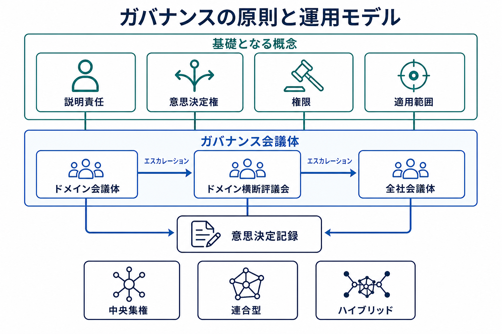

データガバナンスは、組織の意図をデータに関する反復可能な意思決定へ変換します。運用モデルは、適用範囲、権限、会議体、エスカレーション経路、ルールの提案・承認・適用・レビュー・廃止のライフサイクルを定義します。

運用モデル（Operating Model）とは、ガバナンス業務を実際に遂行するための役割と仕組みの組み合わせです。一つの組織図を前提とするものではありません。小規模な組織では、指名されたオーナーと既存の経営会議で十分な場合があります。大規模な組織では、専任の役割や複数の意思決定会議体が必要になることがあります。形態にかかわらず、何について判断が必要か、誰が判断できるか、誰と協議するか、判断をどう記録するか、未解決の問題をどこへ持ち込むかを明らかにする必要があります。

## 基礎となる概念

- **説明責任（Accountability）** は、成果について最終的に答える人または組織を示す
- **意思決定権（Decision Rights）** は、役割がどの範囲で何を判断できるかを定める
- **権限（Authority）** は、その意思決定権を行使する正式な根拠である
- **適用範囲（Scope）** は、対象となるドメイン、資産、用途、義務を示す

説明責任は意味を失わない程度に一元化し、実務責任は分散できます。たとえば、データスチュワードが定義を維持し、プラットフォームチームがアクセス管理策を実装し、プライバシー専門家が処理条件を助言していても、顧客データの適切な利用についてデータオーナーが説明責任を持ち続ける場合があります。多くの参加者を挙げるだけで成果を引き受ける主体を示さなければ、説明責任は曖昧なままです。

## 意思決定会議体とエスカレーション

**ガバナンス会議体（Governance Forum）** とは、一つの役割が既存の権限だけでは解決できない事項を判断するための継続的な仕組みです。必ずしも新しい委員会を設置する必要はなく、既存の経営会議に定例議題を設ける形でも構いません。名称や形式より、責務、参加者、判断範囲、判断記録が定義されていることが重要です。

扱う範囲に応じて、会議体には次の機能があります。

- **ドメイン会議体** は、オーナー、スチュワード、データ提供側、データ利用側、関連する専門家が参加し、指標の意味や品質課題の優先順位など、業務文脈に依存する事項を判断する
- **ドメイン横断評議会** は、共通識別子、定義の対立、交換標準など、複数ドメインに影響する事項を調整する。評議会は意思決定と調整の主体であり、すべてのデータ資産の名目的なオーナーにはならない
- **全社会議体** は、組織全体の最低要件を定め、不整合が許容できない法務、セキュリティ、財務、相互運用性のリスクを生む事項を判断する

これらは機能を表す説明であり、必須の名称や組織階層ではありません。小規模な組織では、一つの会議体が複数の機能を担えます。問題が現在の役割の権限を超える、別の説明責任範囲へ影響する、または明示的なリスク受容を必要とする場合にエスカレーションします。エスカレーションは判断範囲の移管であり、現場での問題解決を代替するものではありません。

## 意図から証跡へ

戦略は原則となり、原則はポリシーを導き、ポリシーは標準と統制目標で具体化されます。管理策はプロセスとプラットフォーム上で作動し、証跡が実際に起きたことを示します。レビューでは証跡を用いて、効果のないポリシーや管理策を変更します。

この流れは一方向の文書発行ではなく、フィードバックループです。証跡は管理策が機能していないことだけでなく、標準が実行困難であることや、ポリシーが当初のリスクに合わなくなったことも示します。そのため、ルールへの適合だけでなく、ルール自体が引き続き目的に適しているかもレビューします。

各ポリシーには、オーナー、適用範囲、承認権限、発効日、レビュー周期、廃止条件が必要です。例外には、理由、リスクオーナー、代替管理策、期限、エスカレーション経路が必要です。これらがなければ、例外は文書化されていない別のポリシーになります。

## 中央と分散の責任

中央集権、連合型、ハイブリッドはいずれも有効なモデルです。判断をどこに置くかは、リスク、必要な一貫性、利用可能な文脈、組織能力によって決まります。不整合が許容できない全社リスクや相互運用性の破壊につながる判断は中央に置きます。権限を委譲する場合は、データと利用方法の文脈が必要な判断をドメインに置きます。共通プラットフォームは、基礎となる業務判断のオーナーシップを奪わずに、再利用可能な適用機構と証跡収集を提供できます。

明確な判断境界、安全な既定値、標準経路を提供し、曖昧さを迅速に解消するとき、ガバナンスは活用を促進します。会議体が文脈、説明責任、リスク低減を加えずに定型業務を承認するだけなら、ゲートキーピングになります。

定型的な判断が意図した層で行われ、例外が可視化され、境界を越える対立に信頼できる解決経路があり、証跡が将来のポリシーや管理策の変更につながるとき、運用モデルは機能しています。会議体やポリシーの数だけでガバナンスの有効性を測ることはできません。

役割ごとの意思決定権は [オーナーシップとスチュワードシップ](../ownership-and-stewardship/) 、ルールの階層は [ポリシー、標準、管理策](../policies-standards-and-controls/) を参照してください。
