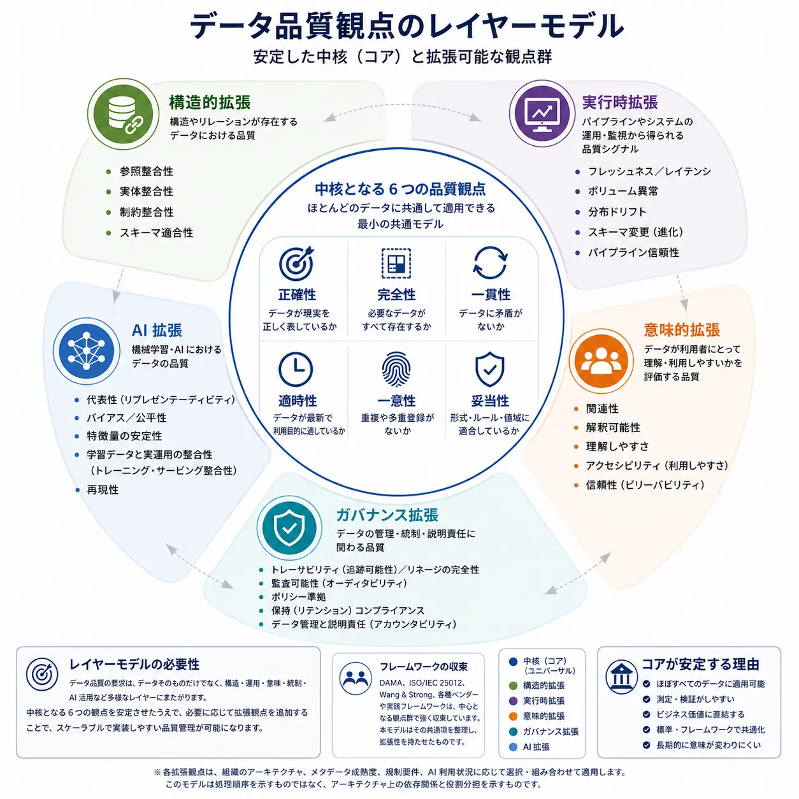
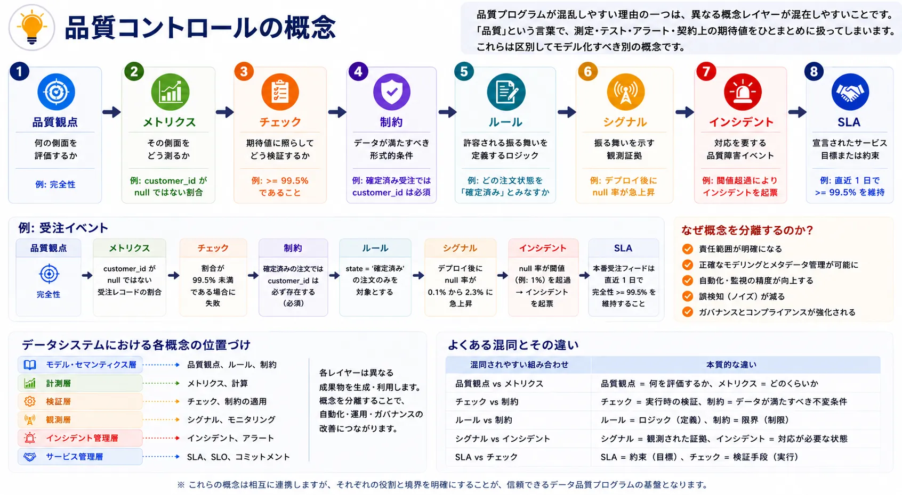

データ品質は、正確性、完全性、適時性といった「属性の一覧」として語られることが多くあります。
その整理自体は有用ですが、それだけでは現在のデータ基盤を十分に説明できません。
現代のデータプラットフォームは、バッチ／ストリーミング処理、メタデータシステム、セマンティックレイヤー、ガバナンス統制、AI ワークロードをまたいで運用されています。
この環境において、品質は単なるチェックリストではなく、アーキテクチャ上のモデルとして捉える必要があります。

## 要約

多くの業界フレームワークは、正確性、完全性、一貫性、適時性、一意性、妥当性という 6 つの中核品質観点に集約されます。
これらの品質観点が有用であり続けるのは、多様なドメインや技術スタックにまたがって評価でき、データそのものの性質を表しているためです。

その他の関心事を同じ一覧に押し込もうとすると難しさが生じ始めます。
参照整合性、更新鮮度アラート、解釈可能性、ポリシー準拠、モデルの公平性は、いずれも重要です。しかし、それらは同じレイヤーに属しているわけではありません。
あるものは関連データセットの構造的性質を表し、あるものは運用システムから得られる実行時シグナルであり、またあるものはメタデータや組織的統制に依存します。
さらに、機械学習や AI の文脈でのみ意味を持つ観点や特性もあります。

実務的なデータ品質アーキテクチャには、少なくとも次の 2 つが必要です。

- ほぼ普遍的に適用できる小さく安定したコアモデル
- 構造、実行時、意味、ガバナンス、AI に対応する拡張レイヤー

この考え方により、概念の明確さを維持したまま、実装しやすい品質モデルを設計できます。異なる性質の関心事を無理にひとつの分類へ押し込むことなく、測定可能な統制、メタデータ駆動のガバナンス、自動化された品質運用を両立できます。

## レイヤーモデルの必要性

初期のデータ品質論では、保存されたデータが業務上の実態を正しく表しているかどうかが主要な関心事でした。
この論点は今でも重要であり、実務では、顧客識別子が重複することもあれば、商品カテゴリが不正であることもあり、受注金額が誤っていることもあります。

現代のデータプラットフォームでは、そこにもう一つの問題が加わります。データは大規模に機械によって運用されるようになりました。パイプラインは自動的に判断し、契約はインターフェース上の期待値を定義し、メタデータシステムはリネージと責任主体を可視化します。品質インシデントは、人が中身を読む前に監視システムによって検知されます。さらに AI システムは、従来の 6 つの品質観点だけでは説明しきれない代表性やバイアスの問題を含む訓練データに依存します。

そのため、現代のデータ品質は複数の制御機構をまたぎます。

- データそのものが内在的に正しいか
- 関連データセットやスキーマが構造的に正しいか
- パイプラインや配信システムが運用上どのように振る舞っているか
- 利用者にとって意味的に理解し利用可能か
- 説明責任やポリシー適用に必要なガバナンス状態が整っているか
- AI システムに必要な統計的・運用的性質を満たすか

ここでの設計上の誤りは、これらをすべて同質のものとして扱うことです。相互に関連はしていても、同一ではありません。レイヤーモデルは、その境界を明示するための枠組みです。

## 共通モデルへの集約

業界文献で使われる用語や分類粒度は完全には一致しませんが、主要なフレームワークを比較すると、共通する中核的な品質観点をひとつのモデルとして整理できます。

[DAMA-DMBOK][1] と DAMA UK Data Quality Framework は、正確性、完全性、一貫性、適時性、妥当性、一意性といった品質観点を、エンタープライズで実践可能な統制観点として重視しています。[ISO/IEC 25012][2] は、データ品質を内在的特性とシステム依存特性に分けて捉えることで議論を広げました。[Wang and Strong][3] は、品質を内在的観点に限定せず、文脈的、表現的、アクセシビリティ上の観点まで含めて整理しました。IBM、Collibra、Atlan といったベンダーフレームワークも、古典的な品質観点群を踏襲しつつ、それらをガバナンス、メタデータ、運用ワークフローへ接続しています。さらに dbt や Soda のような現代的ツール群は、テスト、可観測性、実行時検知の方向へ品質実践を拡張しています。

これらのフレームワークは相互に矛盾しているわけではありません。抽象化のレベルが異なるのです。

現実的には、データそのものの品質観点については小さな共通コアモデルを抽出できる一方で、その周辺実務はデータプラットフォームの自動化と運用複雑性の高まりに応じて拡張し続けている、という点が重要です。

## 中核となる 6 つの品質観点

コアモデルには、プラットフォームの形態、ストレージ方式、組織構造を問わず、ほぼすべてのデータセットに適用できる品質観点を置くべきです。

### 正確性

正確性（Accuracy）は、データが対象とする実世界の対象、事象、状態を正しく表現しているかを問います。これはもっとも古典的で直感的な品質観点の一つであり、DAMA 系のフレームワークや各種ガイダンスでも一貫して現れます。

正確性が安定した概念であり続けるのは、その中心的な問いがアーキテクチャによって変わらないためです。測定値、口座残高、ステータスコードは、パイプラインが完全に安定していても誤っている可能性があります。

代表的な測定例は次のとおりです。

- 信頼できる参照元システムとの照合
- 権威あるソース間での集計値の突合
- 既知の業務範囲に基づく閾値検証

正確性は、外部の真実源を必要とすることがあるため、完全自動化が難しい場合があります。しかしそれは、重要性が低いことを意味しません。測定コストが他の品質観点より高くなりやすいというだけです。

### 完全性

完全性（Completeness）は、必要なデータが存在しているかを評価します。対象はレコード、属性、時間区間、あるいは期待される母集団のカバレッジです。

この品質観点が中核に留まり続けるのは、あらゆるシステムが何らかの「必要な値が存在する」という前提に依存しているためです。顧客区分の欠損、取引日の null、日次パーティションの欠落は、存在している値が正しかったとしても、そのデータの有用性を損ないます。

代表的な測定例は次のとおりです。

- 必須項目に対する null 率の閾値設定
- 業務イベントや時間窓に対する期待件数の充足確認
- 必須パーティション、ファイル、キーの存在確認

完全性は正確性と混同されがちですが、両者は別です。値は存在していても誤っていることがあり、逆に存在しないために不完全であることもあります。

### 一貫性

一貫性（Consistency）は、レコード間、データセット間、定義間、システム間でデータが整合しているかを評価します。同じ業務状態を表すはずの顧客ステータスが、ウェアハウステーブルと下流 API のペイロードで別の意味を持っていてはなりません。

この品質観点が重要であり続けるのは、現代のプラットフォームが本質的に分散しているからです。データを公開し、変換するシステムが増えるほど、矛盾が生じる可能性は高くなります。

代表的な測定例は次のとおりです。

- 共通フィールドや集計値のクロスシステム突合
- 同じ業務ルールから導出される結果が複数パイプラインで一致するかの検証
- コード体系、分類、ステータスマッピングの比較

一貫性は、すべての値が完全に同一であることを意味しません。差異が説明可能で、統制されていることが重要です。

### 適時性

適時性（Timeliness）は、データが想定された利用時点に間に合って利用可能であるかを評価します。情報が技術的には正しくても、到着が遅すぎれば業務上無価値になり得るため、この品質観点は長く企業フレームワークに含まれてきました。

適時性がコアに含まれるのは、多くのデータ資産が暗黙のうちに意思決定に関する時間範囲を持つためです。不正検知、需給計画、規制報告は、いずれも業務上の期限に対してデータが間に合うことに依存します。
更新鮮度はその適時性を測る代表的な運用メトリクスですが、適時性そのものと同義ではありません。

代表的な測定例は次のとおりです。

- ソースイベントから公開データセットまでの最大許容遅延
- 時間単位、日次、随時更新といった配信頻度への準拠確認
- 最新成功レコードの時刻と期待ウィンドウとの差分測定

適時性は、時間制約のある用途に対するデータの適合性を表すという意味で、内在的な性質に近い概念です。ただし、すべての実行時遅延アラートと同一視すべきではありません。

### 一意性

一意性（Uniqueness）は、重複が意図されない場合に、エンティティまたはイベントが一度だけ表現されているかを評価します。重複は件数、関係性、業務アクションを歪めるため、多くの品質モデルに含まれます。

この品質観点が安定しているのは、重複がツール固有の問題ではなく、表現上の根本問題であるためです。顧客、注文、請求書が重複して表現されれば、分析と業務判断の両方が劣化します。

代表的な測定例は次のとおりです。

- 一意であるべき識別子に対する重複キー検知
- MDM で用いられる決定的またはあいまい一致ルール
- 複合自然キーの衝突確認

一意性の評価には業務文脈が必要です。スナップショットや Slowly Changing Dimensions のように、見かけ上の重複が正当な場合もあります。どの境界で同一エンティティとみなすかを明確にする必要があります。

### 妥当性

妥当性（Validity）は、データが定義済みのルール、形式、値域、制約に適合しているかを評価します。ツールによっては conformity と表現されることもありますが、根底にある考え方は同じです。値は、それが許容されると定義したモデルに従っていなければなりません。

妥当性が普遍的なコアに含まれるのは、あらゆる運用システムが、スキーマ、契約、アプリケーションロジック、業務ルールのいずれかを通じて明示的または暗黙的な制約に依存しているためです。

代表的な測定例は次のとおりです。

- 識別子、日付、コードに対するパターン検証
- 列挙値や参照表に対する値域適合性確認
- 範囲、単位、形式に関するルールベース検証

妥当性は自動テストに落とし込みやすいため、多くの品質管理はここから始まります。しかし、それだけでデータ品質全体を代表するわけではありません。

## コアが安定する理由

この 6 つの品質観点がもっとも妥当な普遍コアといえる理由は 3 つあります。

第一に、これらはデータそのものの内在的性質を記述しており、データを取り巻く組織的ワークフローを直接表していません。第二に、ウェアハウス、レイクハウス、業務ストア、データ契約など、さまざまな実装形態に対して測定可能なチェックへ落とし込みやすいことです。第三に、特定ベンダーの分類体系へ依存せず、DAMA 系の実務フレームワークと整合しやすいことです。

もちろん、他の品質特性が不要という意味ではありません。ただし、それらの多くは構造、実行時文脈、意味解釈、ガバナンス義務、AI 利用に条件づけられます。そのため、コアの置き換えではなく拡張として扱う方が適切です。

## 構造的拡張

構造的拡張は、データセットに明確な関係、キー、スキーマ、契約境界が存在し、構造的な正しさ自体が品質の一部となる場合に適用されます。

代表例として、参照整合性、エンティティ整合性、制約整合性、適合性が挙げられます。これらはリレーショナルモデリングから自然に導かれる概念ですが、イベントスキーマ、契約駆動インターフェース、データプロダクトの境界にも関係します。

参照整合性は、データセット間の関係が有効かどうかを問います。たとえば注文データが顧客 ID を参照しているにもかかわらず、その ID が顧客ドメインに存在しなければ、フィールド単位では完全であっても構造的には壊れています。

エンティティ整合性は、エンティティが安定したキーや識別規則によって一意に表現できるかを扱います。制約整合性は、複合キー上の一意性、主識別子の not null 制約、状態遷移の許容条件など、より広い制約の適用を表します。適合性は、値、構造、命名が共有標準に準拠しているかを示す概念として用いられることがあります。

ただし、これらが常に普遍的とは限りません。疎結合なログストリームには参照整合性が不要な場合がありますし、非正規化された分析用抽出では、構造的制約を強く意味づけられないこともあります。そのため、構造的品質特性は、関係や契約構造が存在する場合に適用する任意拡張として扱うのが妥当です。

現代のプラットフォームでは、構造品質はデータ契約とも強く重なります。契約がスキーマ進化ルール、必須項目、識別子意味論、互換性制約を定義するなら、構造品質は単なるデータベース設計上の話ではなく、統制可能なインターフェース特性になります。

## 実行時拡張

実行時拡張は、保存済みレコードの内在的性質ではなく、データシステムの運用挙動に焦点を当てます。代表例には、更新鮮度、ボリューム異常、分布ドリフト、スキーマ進化インシデント、パイプライン信頼性があります。

これらが重要なのは、データ自体の品質が高くても、届かない、部分的にしか届かない、予期せず形が変わるといった事態が起きれば、実務上は利用不可能になるためです。そのため可観測性ツールは、こうしたシグナルを品質関連の問題として扱います。dbt は変換ワークフローにおけるテスト駆動の品質管理と明示的アサーションを広めました。Soda のようなツールは、継続監視、異常検知、運用アラートへとモデルを拡張しています。

ここで重要なのは、アーキテクチャ上の区別です。更新鮮度違反は、しばしば配信システムについての証拠です。ボリューム異常は、ソース挙動、取り込みロジック、業務活動のどこかに異変がある可能性を示すシグナルです。分布ドリフトは、文脈次第で無害な場合も有害な場合もある変化を示します。パイプライン信頼性は、システムが期待どおりに出力を継続的に生成できているかを測ります。

そのため、これらはデータの内在的品質を置き換えるものではなく、実行時拡張としてモデル化すべきです。インシデント対応、SLO 管理、予防的検知には重要ですが、データそのものを説明するコア品質観点とは分けて扱う必要があります。


適時性（Timeliness）は、データが利用目的に対して十分なタイミングで利用可能であることを表す品質観点です。一方、更新鮮度（Freshness）は、データが最後に更新されてからの経過時間を表す運用メトリクスであり、適時性を評価する代表的な測定手段の一つです。


## 意味的拡張

意味的拡張は、利用者がデータを正しく解釈し、使えるかどうかを扱います。[Wang and Strong の研究][3] は、品質を内在的観点だけでなく、関連性、解釈可能性、理解容易性といった文脈的・表現的観点へ広げた点で、ここでも有用です。さらに [AIMQ: A Methodology for Information Quality Assessment][4] のような後続研究は、それらの観点を評価へ落とし込む方法論を示しました。

代表的な意味的品質特性には、関連性、解釈可能性、アクセシビリティ、理解容易性、信憑性があります。

関連性は、そのデータが意思決定や分析目的に本当に適しているかを問います。解釈可能性と理解容易性は、そのデータが何を意味し、指標がどのように導出され、どのような前提や注意点があるかを利用者が把握できるかを問います。アクセシビリティは、権限を持つ利用者が発見し取得できるかを示します。信憑性は、利用者がそのデータを信頼するだけの根拠を持てるかを表します。

これらの観点はメタデータに強く依存します。カタログ記述、リネージ、セマンティックレイヤー、責任主体、品質履歴、ポリシー文脈は、利用者がデータを正しく使えるかどうかに直接影響します。値自体は完全に妥当でも、業務上の意味が不明確で、指標定義が一貫していなければ、そのデータは利用者にとって低品質になり得ます。

したがって、意味品質はメタデータ、知識管理、セマンティックレイヤー設計の近くで扱うべきです。これは単なる文書整備の問題ではなく、意味を運用可能にするための基盤です。

## ガバナンス拡張

ガバナンス拡張は、統制、説明責任、準拠性に関わる品質観点です。代表例として、トレーサビリティ、リネージ完全性、監査可能性、ポリシー準拠、保持期間準拠が挙げられます。

これらが重要なのは、現代のデータマネジメントが単に正しいデータを保持するだけでなく、どのように生成されたか、誰が責任を持つか、規制や内部ルールに従って扱われたか、保持や削除義務が満たされたかを示す必要があるためです。

ここでもメタデータシステムが中心的役割を果たします。リネージグラフ、責任者情報、分類タグ、ポリシー紐付け、統制証跡があることで、ガバナンスは自動化可能になります。メタデータがなければ、ガバナンスは手続き的で手作業中心のままです。メタデータがあれば、ポリシー適用、例外検知、証跡生成を継続的に行うコントロールプレーンとして機能します。

そのため、ガバナンス拡張は内在的コアから分ける必要があります。ポリシー準拠は重要ですが、それは正確性や完全性と同じ種類の性質ではありません。データライフサイクル全体を組織が統制できているかを示す性質です。

## AI 拡張

AI ワークロードは、従来の企業データ品質モデルだけでは十分に表現できない関心事を持ち込みます。訓練データセット、特徴量パイプライン、ベクトルストア、モデル提供インターフェースは、代表性、バイアス、公平性、特徴量安定性、学習時と提供時の整合性、再現可能性といった性質に依存します。

代表性は、データが実際にモデルが直面する母集団や運用条件を十分に反映しているかを問います。バイアスと公平性は、データまたはその利用が体系的な歪みや望ましくない結果を生み出していないかを扱います。特徴量安定性は、特徴量の統計的意味が時間とともに崩れていないかを問います。学習時と提供時の整合性は、訓練時に用いた変換が本番時にも同じ形で適用されるかを意味します。再現可能性は、バージョン化されたデータ、特徴量、コード、設定を用いてモデル結果を再構築できるかを指します。

AI システムでも正確性や完全性は依然として重要です。しかしそれだけでは十分ではありません。データセットが正確で完全であっても、重要な母集団を過少代表していたり、本番環境の分布から乖離していたりすれば、モデル学習には不適切です。

したがって、AI 品質は後付けではなく拡張レイヤーとして扱うべきです。古典的データ品質の上に成り立ちながら、統計的、運用的、倫理的な追加制約を必要とします。

## 品質統制の概念

品質プログラムが混乱しやすい理由の一つは、品質観点、メトリクス、チェック、制約、ルール、シグナル、インシデント、SLA といった異なる概念レイヤーが混在しやすいことです。組織はしばしば「品質」という言葉で、測定、テスト、アラート、契約上の期待値をひとまとめに扱ってしまいます。しかし、これらは区別してモデル化すべき別の概念です。

| 概念         | 役割                                           |
| ------------ | ---------------------------------------------- |
| 品質観点     | 何の側面を評価するか                           |
| メトリクス   | その側面をどう測るか                           |
| チェック     | 期待値に照らしてどう検証するか                 |
| 制約         | データが満たすべき形式的条件                   |
| ルール       | 許容される振る舞いを定義する業務・技術ロジック |
| シグナル     | 振る舞いを示す観測証拠                         |
| インシデント | 対応を要する品質障害イベント                   |
| SLA          | 宣言されたサービス目標または約束               |

たとえば受注イベントを考えてみます。

品質観点は完全性かもしれません。メトリクスは `customer_id` が null ではない受注レコードの割合です。チェックは、その割合が 99.5% を下回ったときに失敗すると定義できます。制約は、確定済みの注文では `customer_id` が常に必須である、という形式条件です。ルールは、どの注文状態を「確定済み」とみなすかを定義します。シグナルは、デプロイ後に null 率が急上昇したことかもしれません。インシデントは、そのシグナルが運用上の閾値を超えて対応が必要になった時点で発生します。SLA は、本番の受注フィードが直近 1 日間で 99.5% 以上の完全性を維持する、といった宣言になります。

同じ区別は実行時品質にも当てはまります。更新鮮度はツール上は品質観点として扱われることがありますが、運用上は適時性に結びついたシグナルや SLA を裏付けるメトリクスとして扱う方が整理しやすい場合があります。この区別により、アーキテクチャはより明瞭になります。品質観点は意味を整理し、メトリクスは定量化し、チェックは検証し、シグナルは観測し、インシデントは対応を開始します。

## メタデータ駆動設計

このレイヤーモデルが実務的になるのは、メタデータを統制面として使うときです。

コア品質観点は、データセット、フィールド、データプロダクトに紐づく測定可能な期待値として表現すべきです。構造的拡張は、契約、スキーマレジストリ、関係定義に埋め込むべきです。実行時拡張は、可観測性ツールによって生成され、影響を受ける統制対象資産へ結びつけるべきです。意味的拡張は、カタログ、セマンティックレイヤー、責任主体メタデータ、リネージによって支えるべきです。ガバナンス拡張は、分類、ポリシー紐付け、保持ルール、監査可能な統制証跡によって駆動されるべきです。AI 拡張は、特徴量ストア、モデルレジストリ、データのバージョニング、評価パイプラインと接続されるべきです。

ここでの実務的含意は明確です。品質は、孤立したダッシュボードや、分断された SQL テストの集合として扱うべきではありません。品質は、機械が評価し、インシデントを振り分け、影響を説明し、統制を一貫して適用できる、メタデータ駆動のシステムであるべきです。

そのことは責任分担の考え方も変えます。

- データ提供側はインターフェース境界で品質期待値を定義する
- プラットフォームチームは測定、監視、インシデント処理基盤を提供する
- ガバナンス機能はポリシー準拠の統制と証跡要件を定義する
- メタデータシステムは品質観点、メトリクス、責任主体、リネージ、運用状態を接続する

これらのレイヤーが明示されると、組織は用語論争に終始せず、品質をスケールさせられるようになります。

## まとめ

データ品質の観点は、アーキテクチャ上の規律を伴って整理されてこそ有用に機能します。
普遍的なコアは依然として小さく、正確性、完全性、一貫性、適時性、一意性、妥当性の 6 つに集約されます。
このコアは、主要な品質フレームワークを比較したときに見えてくる共通モデルであり、広範な実装に対するもっとも実務的な基盤です。

現代のプラットフォームの複雑性は、このコアを捨てる理由にはなりません。必要なのは、構造、実行時、意味、ガバナンス、AI の拡張レイヤーで取り囲むことです。このレイヤー化により、どの性質がデータそのものに属し、どれがシステム運用に属し、どれがメタデータやポリシーに依存し、どれが AI 文脈で新たに現れるかを区別できます。

現代的なデータプラットフォームを設計する組織にとって、この区別は学術的な整理にとどまりません。実装可能な品質アーキテクチャを作るための前提です。明確なモデルがあれば、メトリクス、チェック、シグナル、SLA、ガバナンス統制を適切なレイヤーへ接続でき、メタデータを通じて品質を観測可能、強制可能、拡張可能なものにできます。

[1]: https://www.dama.org/cpages/body-of-knowledge "DAMA Data Management Body of Knowledge (DAMA-DMBOK)"
[2]: https://www.iso.org/standard/35736.html "ISO/IEC 25012:2008 Data quality model"
[3]: https://doi.org/10.1080/07421222.1996.11518099 "Beyond Accuracy: What Data Quality Means to Data Consumers"
[4]: https://doi.org/10.1016/S0378-7206(02)00043-5 "AIMQ: A Methodology for Information Quality Assessment"
