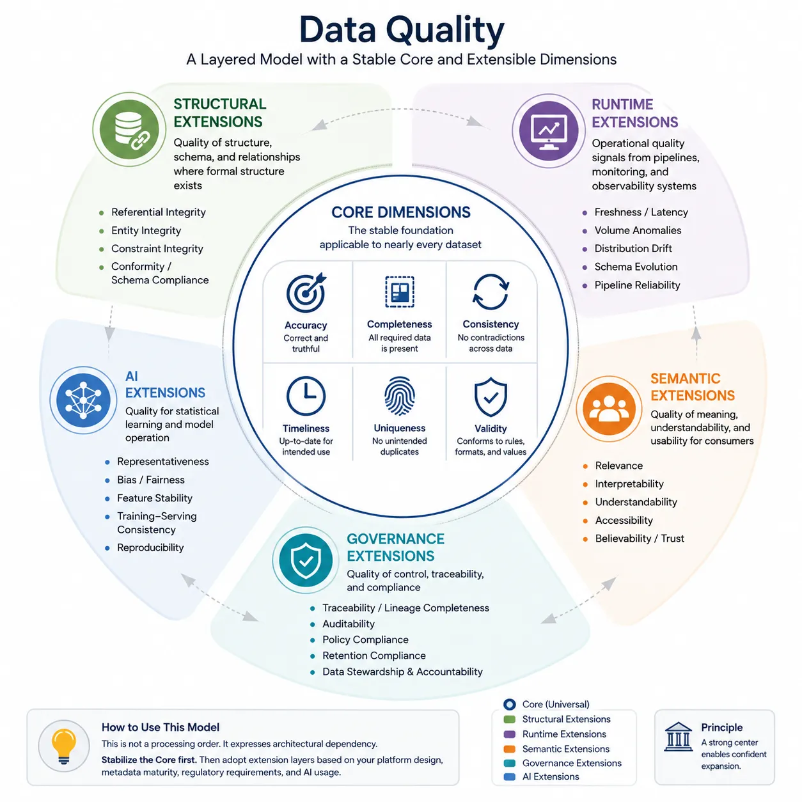
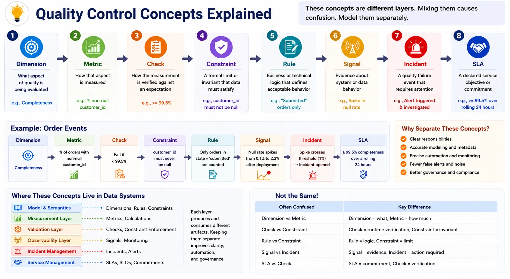

Data quality is often discussed as a flat list of attributes such as accuracy, completeness, and timeliness. That list is useful, but it is no longer sufficient on its own. Modern data platforms operate across batch and streaming pipelines, metadata systems, semantic layers, governance controls, and AI workloads. In that environment, quality is not a single checklist. It is an architectural model.

## Executive Summary

Most industry frameworks converge on a stable core of six dimensions: accuracy, completeness, consistency, timeliness, uniqueness, and validity. These dimensions remain useful because they describe intrinsic properties of data that can be evaluated across many domains and technologies.

The difficulty begins when organizations try to force every other concern into that same core list. Referential integrity, freshness alerts, interpretability, policy compliance, and model fairness are all important, but they do not operate at the same layer. Some describe structural properties of related datasets. Some are runtime signals from operating systems. Some depend on metadata and organizational control. Some exist only in machine learning or AI contexts.

A practical data quality architecture therefore needs two things:

- a small stable core model for universal dimensions
- extension layers for structural, runtime, semantic, governance, and AI-specific concerns

This approach preserves conceptual clarity while making implementation more realistic. It supports measurable controls, metadata-driven governance, and automated quality operations without collapsing fundamentally different concerns into one overloaded taxonomy.

## Why Modern Platforms Need a Layered Model

Traditional data quality discussions emerged in a world where the main concern was whether stored data correctly represented business reality. That concern still matters. A customer identifier can still be duplicated, a product category can still be invalid, and an order amount can still be wrong.

Modern platforms add a second problem. Data is now operated by machines at scale. Pipelines make decisions automatically. Contracts define interface expectations. Metadata systems expose lineage and ownership. Quality incidents are detected by monitors before humans inspect the underlying records. AI systems depend on training data whose representativeness or bias cannot be explained by the classical six dimensions alone.

This means data quality now spans multiple control surfaces:

- the intrinsic correctness of the data itself
- the structural correctness of related datasets and schemas
- the runtime behavior of pipelines and delivery systems
- the semantic usability of the data for consumers
- the governance state required for accountability and policy enforcement
- the statistical and operational properties needed by AI systems

The architectural mistake is to treat all of these as if they were interchangeable. They are related, but they are not identical. A layered model makes the boundary explicit.

## A Shared Core Model

Industry literature does not use identical terminology or the same level of granularity, but when the major frameworks are compared, a shared set of core quality dimensions can be extracted as a common model.

[DAMA-DMBOK][1] and the DAMA UK Data Quality Framework both emphasize dimensions such as accuracy, completeness, consistency, timeliness, validity, and uniqueness as practical enterprise controls. [ISO/IEC 25012][2] broadens the conversation by distinguishing inherent and system-dependent quality characteristics. [Wang and Strong][3] introduced a wider view that included not only intrinsic quality, but also contextual, representational, and accessibility concerns. Vendor frameworks from IBM, Collibra, and Atlan commonly restate the classic dimensions while connecting them to governance, metadata, and operational workflows. Modern data tooling such as dbt and Soda extends quality practice further into testing, observability, and runtime detection.

These frameworks are not contradictory. They operate at different levels of abstraction.

The most durable conclusion is that a small common core of intrinsic dimensions can be identified, while the surrounding practice continues to expand as data platforms become more automated and more operationally complex.

## The Core Six Dimensions

The core model should contain the dimensions that apply to nearly every dataset regardless of platform style, storage engine, or organizational model.

### Accuracy

Accuracy asks whether data correctly represents the real-world object, event, or state it is intended to model. This is one of the oldest and most intuitive quality dimensions, and it appears consistently across DAMA-derived frameworks and vendor guidance.

Accuracy is stable because the central question does not change with architecture. A measured value, account balance, or status code can still be wrong even if the pipeline is perfectly reliable.

Typical measurable checks include:

- comparison against trusted reference systems
- reconciliation of totals across authoritative sources
- threshold-based validation of known business ranges

Accuracy is often difficult to automate fully because it may require an external truth source. That limitation does not make it less fundamental. It simply means the measurement strategy is sometimes more expensive than for other dimensions.

### Completeness

Completeness evaluates whether required data is present. It applies to records, attributes, time periods, and expected coverage of populations.

This dimension remains central because every system depends on some assumption of presence. Missing customer segments, null transaction dates, or absent daily partitions all reduce the usefulness of the data even when the values that do exist are correct.

Typical measurable checks include:

- null-rate thresholds on mandatory fields
- expected record-count coverage for a business event or time window
- existence checks for required partitions, files, or keys

Completeness is often confused with accuracy. They are related but distinct. A value can be present and wrong, or absent and therefore incomplete.

### Consistency

Consistency evaluates whether data remains aligned across records, datasets, definitions, and systems. A customer status should not mean one thing in a warehouse table and another in a downstream API payload if both claim to represent the same business state.

The dimension has persisted because modern platforms are inherently distributed. The more systems that publish or transform data, the more likely contradictions become.

Typical measurable checks include:

- cross-system reconciliation of shared fields or aggregates
- validation that equivalent business rules produce the same derived result in different pipelines
- comparison of code sets, classifications, or status mappings across domains

Consistency does not require values to be identical everywhere. It requires differences to be explainable and governed.

### Timeliness

Timeliness evaluates whether data is available at the time it is needed for its intended use. This dimension has long existed in enterprise frameworks because information can be technically correct and still operationally useless if it arrives too late.

Timeliness remains part of the core because many data assets have an implicit decision window. Fraud detection, supply planning, and regulatory reporting all depend on data arriving in time for a business deadline. Freshness is a common operational metric for evaluating that timeliness, but it is not identical to timeliness itself.

Typical measurable checks include:

- maximum allowable latency from source event to published dataset
- conformance to update cadence such as hourly, daily, or intraday delivery
- age of the latest successful record relative to the expected window

Timeliness is intrinsic in the sense that it describes the fitness of the data for time-bound use. It is related to freshness monitoring, but not identical to every runtime alert about pipeline delay.

### Uniqueness

Uniqueness evaluates whether an entity or event is represented only once when duplicates are not intended. It appears in many enterprise quality models because duplicates distort counts, relationships, and operational actions.

The dimension remains stable because duplication is a fundamental representation problem, not a tooling artifact. Duplicate customer identities, orders, or invoices degrade both analytics and operational decisioning.

Typical measurable checks include:

- duplicate-key detection on identifiers expected to be unique
- fuzzy or deterministic matching rules in master data processes
- collision checks for compound natural keys

Uniqueness often requires business context. Some duplicates are legitimate snapshots or slowly changing records. The check must reflect the modeled entity boundary.

### Validity

Validity evaluates whether data conforms to defined rules, formats, domains, or constraints. It is sometimes described as conformity in enterprise tooling, but the underlying idea is stable: values must fit the model that declares them acceptable.

Validity belongs in the universal core because every operational system depends on explicit or implicit constraints, whether they are enforced in schemas, contracts, application logic, or business rules.

Typical measurable checks include:

- pattern validation for identifiers, dates, or codes
- domain membership validation against enumerations or reference tables
- rule-based checks for acceptable ranges, units, and formats

Validity is where many automated tests begin because it is comparatively easy to encode, but it should not be mistaken for the whole of data quality.

## Why the Core Is Stable

These six dimensions remain the most defensible universal core for three reasons.

First, they describe intrinsic properties of data rather than organizational workflows around data. Second, they are broadly measurable with checks that can be implemented across warehouses, lakehouses, operational stores, and contracts. Third, they align well with DAMA-style enterprise practice without requiring a commitment to any specific vendor taxonomy.

Other dimensions may be essential in specific environments, but they are usually conditional on structure, runtime context, semantic interpretation, governance obligations, or AI usage. That makes them extensions, not replacements.

## Structural Extensions

Structural extensions apply when datasets have formal relationships, keys, schemas, or contract boundaries that make structural correctness part of quality.

Representative structural dimensions include referential integrity, entity integrity, constraint integrity, and conformity. These emerge naturally from relational modeling, but they also matter in event schemas, contract-driven interfaces, and data product boundaries.

Referential integrity asks whether relationships between datasets are valid. If an order references a customer identifier that does not exist in the corresponding customer domain, the dataset may still be complete at the field level, yet structurally broken.

Entity integrity addresses whether the entity itself can be represented unambiguously, often through stable keys and identification rules. Constraint integrity generalizes the idea to imposed rules such as uniqueness across compound keys, not-null requirements on primary identifiers, or permitted state transitions. Conformity often describes whether values, structures, or naming patterns comply with shared standards.

These are not always universal. A loosely structured log stream may not need referential integrity. A denormalized analytical extract may not expose entity relationships in a way that makes structural enforcement meaningful. That is why structural dimensions are best treated as optional extensions applied where relational or contractual structure exists.

In modern platforms, structural quality increasingly overlaps with data contracts. A contract can specify schema evolution rules, required fields, identifier semantics, and compatibility constraints. When it does, structural quality becomes a governable interface property rather than just a database design concern.

## Runtime Extensions

Runtime extensions focus on the operating behavior of data systems rather than the intrinsic properties of stored records. Common examples include freshness, volume anomalies, distribution drift, schema evolution incidents, and pipeline reliability.

These matter because a high-quality dataset that fails to arrive, arrives partially, or changes shape unexpectedly is still unusable in practice. Observability platforms therefore treat these signals as quality-related. dbt popularized test-first analytical quality controls and explicit assertions in transformation workflows. Soda and similar systems extended the model with continuous monitoring, anomaly detection, and operational alerts.

The important distinction is architectural. A freshness breach is often evidence about the delivery system. A volume anomaly is a signal that something may be wrong in source behavior, ingestion logic, or business activity. Distribution drift indicates a change pattern that may be benign, expected, or harmful depending on context. Pipeline reliability measures whether the system repeatedly produces outputs as promised.

These concerns should be modeled as runtime extensions because they are not always intrinsic data properties. They are signals from the operation of the data system. They support incident response, SLO management, and proactive detection, but they should not replace the core dimensions that describe the data itself.

<!-- deno-fmt-ignore-start -->


Timeliness is a quality dimension about whether data is available early enough for its intended use. Freshness is an operational metric that describes how much time has elapsed since the data was last updated, and it is one of the most common ways to evaluate timeliness.


<!-- deno-fmt-ignore-end -->

## Semantic Extensions

Semantic extensions address whether consumers can interpret and use data correctly. [Wang and Strong's work][3] is especially helpful here because it distinguished intrinsic quality from contextual and representational concerns such as relevance, interpretability, and understandability. Later academic work such as [AIMQ: A Methodology for Information Quality Assessment][4] helped operationalize those ideas for assessment.

Representative semantic dimensions include relevance, interpretability, accessibility, understandability, and believability.

Relevance asks whether the data is suitable for the decision or analysis at hand. Interpretability and understandability ask whether consumers can determine what the data means, how metrics are derived, and what assumptions or caveats apply. Accessibility evaluates whether authorized users can discover and retrieve the data. Believability concerns whether users have enough evidence to trust what they are seeing.

These concerns depend heavily on metadata. Catalog descriptions, lineage, semantic layers, ownership fields, quality history, and policy context all influence whether a consumer can use data correctly. A table with perfectly valid values may still be low quality for a consumer if the business meaning is opaque or the metric definitions are inconsistent.

For that reason, semantic quality belongs close to metadata, knowledge management, and semantic-layer design. It is not merely a documentation issue. It is part of how platforms make meaning operational.

## Governance Extensions

Governance extensions focus on control, accountability, and compliance. Common examples include traceability, lineage completeness, auditability, policy compliance, and retention compliance.

These dimensions matter because modern data management is not only about correctness. It is also about proving how data was produced, who is responsible for it, whether regulated handling rules were followed, and whether retention or deletion obligations were met.

Metadata systems are central here. Lineage graphs, ownership assignments, classification tags, policy bindings, and control evidence make governance automatable. Without metadata, governance remains largely procedural and manual. With metadata, it becomes a control plane: policies can be applied, exceptions can be detected, and evidence can be generated continuously.

This is why governance extensions should be separated from the intrinsic core. Policy compliance is essential, but it does not describe the same kind of property as accuracy or completeness. It describes whether the organization can demonstrate controlled operation over the data lifecycle.

## AI Extensions

AI workloads introduce quality concerns that classical enterprise models do not fully capture. Training datasets, feature pipelines, vector stores, and model-serving interfaces depend on properties such as representativeness, bias, fairness, feature stability, training-serving consistency, and reproducibility.

Representativeness asks whether the data reflects the population or operating conditions the model will encounter. Bias and fairness concern whether the data or its use creates systematic distortion or harmful outcomes. Feature stability examines whether the statistical meaning of features remains reliable across time. Training-serving consistency asks whether the transformations used in model training match those applied in production. Reproducibility asks whether a model result can be reconstructed from versioned data, features, code, and configuration.

Traditional dimensions such as accuracy and completeness still matter in AI systems, but they are not sufficient. A dataset can be accurate and complete yet still be unfit for model training because it underrepresents key populations or drifts away from live production conditions.

This is why AI quality should be treated as an extension layer rather than an afterthought. It builds on classical data quality, but it introduces statistical, operational, and ethical constraints that require different controls.

## Quality Control Concepts

One reason quality programs become confusing is that organizations mix conceptual layers such as dimensions, metrics, checks, constraints, rules, signals, incidents, and SLAs. They use the word "quality" to refer interchangeably to measurements, tests, alerts, and contractual commitments. These are different things and should be modeled separately.

| Concept    | Purpose                                                          |
| ---------- | ---------------------------------------------------------------- |
| Dimension  | What aspect of quality is being evaluated                        |
| Metric     | How that aspect is measured                                      |
| Check      | How the measurement is verified against an expectation           |
| Constraint | A formal limit or invariant that data must satisfy               |
| Rule       | The business or technical logic that defines acceptable behavior |
| Signal     | Evidence about system or data behavior                           |
| Incident   | A quality failure event that requires attention                  |
| SLA        | A declared service objective or commitment                       |

Consider a simple example involving order events.

The dimension might be completeness. The metric could be the percentage of order records with a non-null `customer_id`. The check might fail if that percentage drops below 99.5 percent. The constraint could state that `customer_id` must never be null for submitted orders. The rule could define which order states count as submitted. A signal might be a sudden spike in null rates after a deployment. An incident begins when that signal crosses an operational threshold and triggers response. The SLA could specify that production order feeds maintain at least 99.5 percent completeness over a rolling day.

The same distinction appears in runtime quality. Freshness may be treated as a dimension in some tooling, but operationally it is often better modeled as a signal or SLA-backed metric tied to timeliness and delivery behavior. Separating the concepts improves architecture because it allows platforms to manage controls precisely: dimensions organize meaning, metrics quantify, checks enforce, signals observe, and incidents trigger response.

## Designing a Metadata-Driven Quality System

The layered model becomes practical when metadata is used as the control surface.

Core dimensions should be expressed as measurable expectations attached to datasets, fields, and data products. Structural extensions should be encoded in contracts, schema registries, and relationship definitions. Runtime extensions should be produced by observability tooling and tied back to the governed asset they affect. Semantic extensions should be supported by catalogs, semantic layers, ownership metadata, and lineage. Governance extensions should be driven by classification, policy bindings, retention rules, and auditable control evidence. AI extensions should be connected to feature stores, model registries, data versioning, and evaluation pipelines.

This is the practical implication of a modern data management perspective: quality should not be an isolated dashboard or a disconnected set of SQL tests. It should be a metadata-driven system that allows machines to evaluate quality, route incidents, explain impact, and enforce control consistently.

That also changes how teams implement responsibility.

- data producers define quality expectations at the interface boundary
- platform teams provide measurement, monitoring, and incident workflows
- governance functions define policy-backed controls and evidence requirements
- metadata systems connect the dimensions, metrics, ownership, lineage, and operational state

When these layers are explicit, organizations can scale quality without turning every discussion into a debate about terminology.

## Summary

Data quality dimensions remain useful, but only when they are organized with architectural discipline. The universal core is still small: accuracy, completeness, consistency, timeliness, uniqueness, and validity. That core is the common model that becomes visible when major quality frameworks are compared, and it remains the most practical baseline for broad implementation.

The complexity of modern platforms does not require abandoning that core. It requires surrounding it with extension layers for structural, runtime, semantic, governance, and AI concerns. This layered approach clarifies which properties belong to the data itself, which belong to system operation, which depend on metadata and policy, and which emerge only in AI contexts.

For organizations building modern data platforms, that distinction is not academic. It is what makes a quality architecture implementable. A clear model allows metrics, checks, signals, SLAs, and governance controls to be attached to the right layer, and it makes metadata the mechanism through which quality becomes observable, enforceable, and scalable.

[1]: https://www.dama.org/cpages/body-of-knowledge "DAMA Data Management Body of Knowledge (DAMA-DMBOK)"
[2]: https://www.iso.org/standard/35736.html "ISO/IEC 25012:2008 Data quality model"
[3]: https://doi.org/10.1080/07421222.1996.11518099 "Beyond Accuracy: What Data Quality Means to Data Consumers"
[4]: https://doi.org/10.1016/S0378-7206(02)00043-5 "AIMQ: A Methodology for Information Quality Assessment"
