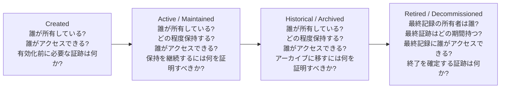

データライフサイクル管理（Data Lifecycle Management）は、データセットが作成されてから廃止されるまでに、どのような状態変化を経るのかを明確にし、各段階で何を管理すべきかを定義する実務です。単なるストレージ管理ではありません。データの所有者、アクセス制御、保持義務、アーカイブ戦略、計画的な廃棄、そして移行時の証跡がひとつの運用体系として結びついています。

重要なのは、データを“とにかく長く保管する”ことではありません。どの時点で、あるデータセットがアクティブなのか、履歴として保管されているのか、廃止済みなのかを、組織が説明できることです。その説明は、業務上の目的、法的義務、運用上の必要性、そして証跡に基づいて行われる必要があります。

このページでは、次の状態遷移を整理するモデルを使って説明します。

ライフサイクルは、後から整理するものではなく、継続的に管理するべきプロセスです。データセットは通常、業務や運用上の目的を満たすために作成され、その価値や必要性が続く間は維持されます。その後、履歴上の価値が残るならアーカイブへ移し、十分な目的がなくなれば廃止されます。どの状態へ移る場合でも、所有者と証跡は明確である必要があります。

[データガバナンス](/ja/docs/data/governance/) はポリシー、責任、例外の扱いを定義します。データライフサイクル管理は、そのポリシーを実際の運用に落とし込み、あるデータセットがどの状態にあるのか、いつアーカイブに入るのか、いつ廃止するべきか、どの証跡が必要なのかを判断する役割を担います。

## Created（作成）

データセットは、業務処理、レポート、統合、モデル、規制対応といった目的を持って始まります。この段階で、所有者、利用目的、アクセス範囲、想定保持期間を明確にしておく必要があります。

新しいデータセットに対しては、次の問いが重要です。

- 誰がデータセットの所有者で、残すか廃止するかを判断できるのか
- 作成中や検証中に、誰がアクセスできるのか
- データが目的に適していると判断できる基準は何か
- 運用可能な状態とみなす前に、どの証跡が必要なのか

作成時のチェックリストには、次のような項目が含まれます。

- 何を表すデータなのかを明確にする
- ソースと利用目的が分かるようにメタデータとリネージを整備する
- 業務とセキュリティ要件に合わせてアクセスルールを定義する
- 想定期間や法務上の義務に応じて保持分類を設定する
- 後の状態遷移を承認できる明確なオーナーを定義する

この段階で曖昧さを減らしておかなければ、後の状態遷移が安定しません。所有者が不明で、目的が不明なデータセットは、次の段階に進む基盤としては弱いです。

## Active / Maintained（アクティブ／維持）

アクティブ状態は、データセットが現在の業務に必要であり、通常の保守運用を受け続けている期間です。この段階では、特に保持ポリシーが重要になります。保持ポリシーは、業務利用、法令対応、コストを踏まえて、どの程度の期間データを通常運用上保持するかを決めます。

アクティブ中のデータセットは、次の点を定期的に見直す必要があります。

- 現在の業務にとって依然として有用か
- データ品質やスキーマが安定しているか
- アクセスパターンと下流依存関係に問題がないか
- 作成時の目的に対して適合し続けているか

データセットが頻繁に利用されている、法定期間に基づいて保持が必要な、または現在の規制・運用プロセスに関係している、などの理由で継続的にアクティブである場合があります。だが、その状態は自動的に維持されるものではなく、明示的に管理されるべきです。

アクティブなデータセットでも、古くなっている、重複している、利用頻度が低い場合には、無期限の保持ではなくアーカイブへ移るべきです。したがってライフサイクル管理は一度きりの分類ではなく、継続的な運用活動です。

## Historical / Archived（履歴／アーカイブ）

データセットが通常の業務運用では不要になったが、過去の比較、分析、コンプライアンス、証跡などの価値が残る場合、履歴またはアーカイブ状態へ移行します。この段階では、アーカイブ戦略が重要になります。アーカイブは、データをコスト効率よく保全し、必要に応じて回復できるようにし、通常の運用環境より低コストで適切に保護するための手段です。

アーカイブされたデータセットは、アクティブなデータよりもアクセス範囲が小さくなるのが普通です。一部の権限を持つ利用者だけが参照できるようにし、通常の分析基盤から分離します。ここでの重要な問いは「長く保管できるか」ではなく、「この形式で、どの条件下で取り出す必要があるのか」です。

アーカイブ状態では、次のような管理が必要です。

- データが適切な形式と保存先に置かれていること
- リネージ、メタデータ、保持ルールが保持されていること
- 専用の権限を持つ利用者だけがアクセスできること
- どの理由でアーカイブに移したのか、どのように管理されるのかについて証跡が残っていること

この状態は、単に本番テーブルから古いデータを削除することと同じではありません。アーカイブは、ビジネス上の正当性と運用上の妥当性を伴う、明示的な保存判断です。

## Retired / Decommissioned（廃止／終了）

データセットはやがて利用価値を失います。統制された廃棄は、データセット、インターフェース、パイプライン、アプリケーションコンポーネントに対して、事実上の利用目的がなくなったときに行う正式な終了プロセスです。これは静かな清掃ではなく、明示的な閉鎖です。

廃棄の判断は証跡に基づいて行うべきです。

- 保持期間や業務上の有効期限に達した
- 既存の下流依存がなくなった、または代替済みである
- アクセスを見直し、必要に応じて終了させた
- 最終的な保持記録、削除記録、またはアーカイブ移管の結果が承認され記録されている

この段階では、技術的な削除だけでなく、廃止を正当化する運用とガバナンスの作業も必要です。組織は、誰が判断し、何をもとに承認し、どのような防御策を残したかを示せる必要があります。

ガバナンスがポリシーと例外の枠組みを定義するなら、ここでは管理側が、そのポリシーが守られたことを証明します。たとえば、データオーナーが最終廃棄を承認し、法務やコンプライアンスが保持停止の要件を確認し、基盤担当者が保存場所とアクセス経路を閉じる、という流れです。

## 実務上の例

ある日次の「顧客注文イベント」データセットを例に考えてみましょう。

- 受注パイプラインの導入時に作成され、収益管理チームがオーナーになります。データセットは業務に必要な運用データとしてアクティブに分類され、分析、顧客対応、財務の各役割に限定してアクセスされます。初期の証跡には、ソースから各利用先までのリネージ、データ品質チェック、保持分類が含まれます。
- このデータセットは、業績レポート、顧客課題分析、照合業務に使われるため、2 年間はアクティブのままです。その間、保持ポリシーが適用され、アクセスは統制された状態で維持され、現状がアクティブであることを示す証跡が残されます。
- 通常利用に必要な期間が終了すると、データセットは履歴アーカイブへ移行します。日常のレポート層からは外れますが、監査や規制対応のために長期間保全されます。アクセス範囲は絞られ、アーカイブ検証の記録が残されているため、データが完全に保持されている状態が確認できます。
- 最終的な法務・業務上の保持期間が終了した時点で、データセットは統制された廃棄プロセスで終了されます。下流の配信は停止され、アクセスは閉じられ、最終処分の記録が残されます。これによって、終了が承認され、完了したことを証明できる状態になります。

この例の本質は、すべての状態が大きなイベントとしてではなく、段階的・証跡ベースで管理されることです。作成と活用、保持、アーカイブ、廃棄という流れは、単独の技術操作ではなく、責任と記録を伴う運用判断です。

## ライフサイクル管理が重要な理由

ライフサイクル管理なしでは、組織は不要なデータを無制限に蓄積し、どのデータセットが権威ある情報かを見失い、不要なストレージやアクセス、コンプライアンスのリスクを増やします。ライフサイクル管理は単なるコスト削減手段ではなく、信頼を支える運用基盤です。

データの状態が明示されていれば、利用者は当該データが現行なのか履歴なのか廃止済みなのかを把握できます。これにより、古い情報の誤利用が減り、例外の運用がしやすくなり、責任範囲も明確になります。所有者が保持判断、アクセス境界、最終処分まで責任を持つことで、データの利用はより持続可能になります。

運用上の原則はシンプルです。すべてのデータセットは、生存期間のあいだ、状態、証跡、責任あるオーナーを持っているべきです。これこそが、長期にわたるデータマネジメントを持続可能にする要件です。
