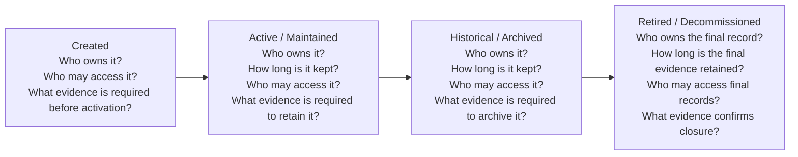

Data Lifecycle Management is the operational discipline of deciding what happens to a dataset as it moves from creation to retirement. It is not solely a storage problem. It is a combination of ownership, access control, retention obligations, archival strategy, and controlled decommissioning.

The practical question is not whether data should be kept forever. The practical question is whether the organization can explain why a dataset is active, historical, or retired at any given time. That explanation must be grounded in business purpose, legal obligation, operational need, and evidence.

This page uses a simple state model as the organizing structure:

The lifecycle should be managed as a progression, not as an afterthought. A dataset is usually created to satisfy a business or operational purpose, then maintained while it remains useful and required, then either archived for historical value or retired when it no longer has a valid purpose. At each transition, the organization still needs clear ownership and traceable evidence.

[Data Governance](/docs/data/governance/) defines policy, accountability, and exception handling. Data Lifecycle Management performs the ongoing work: deciding when a dataset is still active, when it should be archived, when it should be retired, and what evidence proves each decision was executed properly.

## Created

A dataset begins with a purpose: a business process, report, integration, model, or regulatory obligation. At this stage, the organization should identify the owner, the intended use, the access boundary, and the expected retention period.

For a new dataset, the key questions are straightforward but important:

- Who owns the dataset and the decision to keep or discard it?
- Who may access it while it is being created and validated?
- How will the organization know whether the data is still fit for purpose?
- What evidence is required before the dataset is treated as operationally usable?

A useful creation checklist includes:

- clear definition of what the dataset represents
- metadata and lineage so the source and intended use are discoverable
- access rules aligned with business and security needs
- a retention classification that reflects the likely duration and business obligation
- a named owner who can approve changes in status later in the lifecycle

This stage is where the organization reduces ambiguity. If a dataset has no clear owner or no understandable purpose, it cannot reliably move through later lifecycle states.

## Active / Maintained

The active state is the period when the dataset is still current, operationally useful, and subject to normal maintenance. This is where retention policies matter most. Retention policy determines how long a dataset should remain available under normal operating conditions, based on business use, legal requirements, and cost considerations.

During active use, the dataset should be monitored for:

- relevance to current business operations
- data quality and schema stability
- access patterns and downstream dependencies
- suitability for the purpose it was created to support

A dataset may remain active because it is still used frequently, because the organization must retain it for a defined period, or because it supports a current regulatory or operational process. That active status should be explicit, not assumed.

An active dataset should still be reviewed periodically. If it has become stale, redundant, or seldom used, it may be a candidate for archival rather than indefinite retention. Lifecycle management is therefore not a one-time classification. It is a recurring operating discipline.

## Historical / Archived

Once a dataset is no longer needed for active operations but still has value for history, analysis, comparison, compliance, or evidence, it enters the historical or archived state. This is where archival strategy becomes important. Archival preserves the data in a way that is cost-conscious, recoverable, and appropriately protected, without keeping it in an operationally expensive or freely accessible environment.

An archived dataset usually has a smaller access footprint than an active one. It may still be queryable for designated users, but it is no longer part of the normal working data platform. The key practical question is not simply “Can we keep it?” but “Why do we still need it in this form, and under what conditions should it be retrieved?”

The archived state requires deliberate controls:

- data is stored in a suitable format and environment
- lineage, metadata, and retention rules are preserved
- access is restricted to authorized users or defined investigative roles
- evidence exists showing why the dataset was moved into archive and how it remains governed

This state is often confused with simply deleting older data from a production table. That is not archival. Archival is a controlled preservation decision with explicit business and operational justification.

## Retired / Decommissioned

A dataset eventually reaches the end of its useful life. Controlled decommissioning is the formal process of retiring a dataset, interface, pipeline, or application component when no valid business, operational, or legal purpose remains. This is a deliberate closure process, not a silent cleanup.

A decommissioning decision should be grounded in evidence:

- the dataset has reached the end of its retention window or business life
- no active downstream dependency remains, or those dependencies have been replaced
- access has been reviewed and closed where appropriate
- the final retention record, deletion record, or archive disposition has been approved and recorded

This stage includes more than technical removal. It also covers the operational and governance work required to make the retirement defensible. The organization should be able to show that a decision was made, who approved it, what evidence was reviewed, and what safeguards remained in place during the transition.

If governance defines the policy and exception framework, this stage is where the management team demonstrates that the policy was followed. For example, a data owner may approve final retirement, a legal or compliance function may confirm a retention hold has expired, and a platform team may confirm the storage and access paths have been closed.

## A practical example

Consider a daily customer order events dataset used for operational reporting and customer service analysis.

- It is created when the order pipeline is deployed. The owner is the Revenue Operations team, and the dataset is classified as active operational data. Access is limited to analytics, customer support, and finance roles. The initial evidence package includes source-to-destination lineage, data quality checks, and a retention classification.
- It remains active for two years because it supports performance reporting, customer issue analysis, and reconciliation. During that period, retention policy applies, access remains governed, and evidence is maintained to show the dataset is still in active use.
- After the retention window ends for routine operational use, the dataset is moved into historical archive. It is still preserved for a longer regulatory or audit period, but it is no longer part of the everyday reporting layer. Access is narrowed, and archive validation records show that the data remains intact and retrievable.
- When the final legal and business retention period ends, the dataset is retired through a controlled decommissioning process. The team removes the downstream feeds, closes access, records the final disposition, and stores the evidence that closure was approved and completed.

This example shows the essential lifecycle pattern: creation and active use lead to deliberate retention, then archival, and ultimately retirement. The important thing is not that each phase is dramatic. It is that each phase is evidenced, owned, and defensible.

## Why lifecycle management matters

Without lifecycle discipline, organizations accumulate data they no longer need, lose track of which datasets are authoritative, and create unnecessary storage, access, and compliance risk. Good lifecycle management does not simply reduce cost. It also improves trust.

When data states are explicit, downstream users know whether a dataset is current, historical, or retired. This reduces confusion, prevents accidental use of outdated information, and makes exceptions easier to govern. It also makes ownership visible: someone is accountable for retention decisions, access boundaries, and final disposition.

The operational principle is simple: every dataset should carry its own status, evidence, and accountable owner throughout its life. That is what makes data management sustainable over time.
