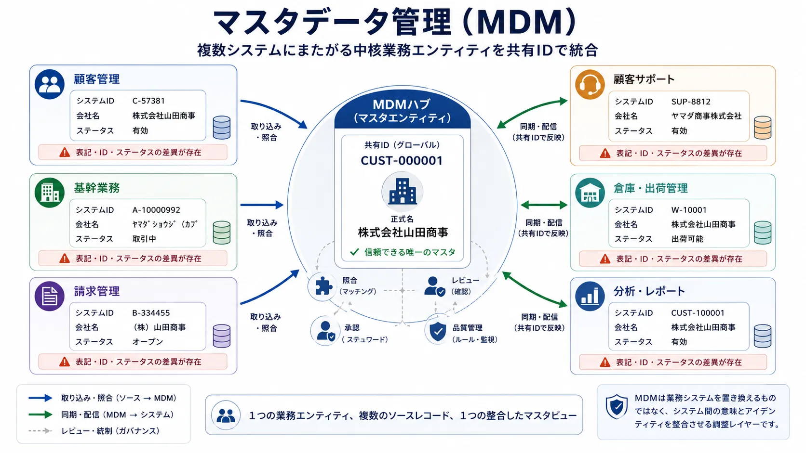
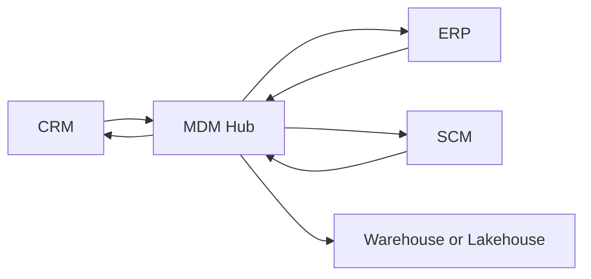
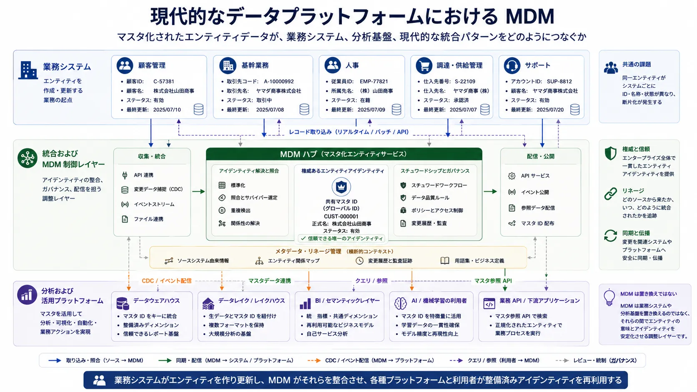

マスタデータ管理（Master Data Management、MDM）は、組織内の複数システムにまたがる中核的な業務エンティティについて、正となる一貫したデータ表現を維持するための取り組みです。企業は単一のアプリケーションの上で動いているわけではありません。顧客、製品、サプライヤー、従業員、店舗・倉庫・オフィス・事業所といった業務拠点は、それぞれ複数の業務システムで作成、更新、参照されることが多く、識別子、検証ルール、更新タイミング、品質状態も一致しないのが普通です。MDM は、企業全体を1つのデータベースで置き換えることなく、複数システムの断片化を調整するための仕組みです。

## 概要

MDM が必要になるのは、同じ業務エンティティがシステムごとに異なる形で表現されていることを、組織が許容できなくなったときです。問題はレポーティングに限りません。一貫しないマスタデータは、受発注、コンプライアンス、顧客対応、調達、システム統合の信頼性、さらには安定したエンティティアイデンティティに依存する AI システムにも影響します。

中心となる考え方は単純です。中核エンティティをどのように識別、照合、統制、同期するのかを定義することで、企業全体が共有された意味のもとで業務を行えるようにすることです。ただし実装は単純ではありません。MDM は、データモデリング、データ品質、ガバナンス、業務上の責任分担、アプリケーション統合が交差する地点に位置するからです。

優れた MDM の取り組みは、次の3つを組み合わせます。

- 何をマスタデータとみなすかについての明確なモデル
- スチュワードシップと責任分担のための運用モデル
- 既存のシステム構成に適したアーキテクチャパターン



## マスタデータとは何か

マスタデータは、複数の業務プロセスやシステムで共有される、比較的安定した業務エンティティを表すデータです。これはストレージ技術によって定義されるものではありません。企業における重要性と、システム横断で再利用される性質によって定義されます。

代表的なマスタデータのドメインには、次のようなものがあります。

- 顧客
- 製品、商品
- サプライヤー
- 従業員
- 設備や施設などの物理資産
- 店舗、倉庫、オフィス、事業所などの業務拠点
- 組織単位

これらのエンティティは、トランザクション処理、分析処理、業務ワークフローのいずれからも参照されます。そのため、表現の不一致は広い範囲へ波及します。

| データ種別             | 例                               | 主な目的                                       |
| ---------------------- | -------------------------------- | ---------------------------------------------- |
| マスタデータ           | 顧客、製品、サプライヤー         | 中核業務エンティティの共有表現                 |
| トランザクションデータ | 注文、支払い、出荷               | 業務上の出来事や処理を記録する                 |
| 参照データ             | 国コード、通貨コード、状態コード | 制御された語彙や分類を提供する                 |
| 分析データ             | 日次売上集計、解約予測用特徴量   | レポーティング、モデリング、意思決定を支援する |

マスタデータは参照データと混同されがちですが、実務ではこの違いは重要です。参照データは、許容される値や共有コード体系を管理します。一方、マスタデータはエンティティそのものを表します。たとえば製品カテゴリコードは参照データですが、そのカテゴリに属する製品自体はマスタデータです。

## MDM の重要性

分断されたデータに起因する業務コストが顕在化し始めると、組織は MDM の導入を検討することがよくあります。

典型的には次のような課題が挙げられます。

- 同じ顧客が CRM、請求、サポートの各システムで異なる識別子のもとに存在している
- 製品定義が EC、ERP、倉庫システムのあいだで食い違っている
- サプライヤー情報が調達系と財務系のシステムで一致していない
- 分析チームが分析そのものよりもエンティティの突合に時間を費やしている
- 下流の API やイベント利用側が、システム横断でレコードを安定的に結合できない

影響は分析にとどまりません。小売業では、製品レコードの重複が在庫や価格の誤りを生みます。金融機関では、顧客アイデンティティの不整合がリスク集計やコンプライアンス統制を弱めます。医療現場では、患者や提供者の記録の断片化が、安全性や連携品質に影響します。SaaS 企業では、アカウントアイデンティティのずれが従量課金やカスタマーサクセス運用をゆがめます。

さらに近年では、AI システムが新たな圧力を加えています。エンティティの不整合は、特徴量設計、学習データセットの構築、カスタマー360（統合された顧客ビュー）、検索基盤、ガバナンス自動化の品質を損ないます。アイデンティティが安定しなければ、その上に構築される高度な処理も安定しません。

## 中核となる概念

### ゴールデンレコードと信頼できる単一の参照元

ゴールデンレコードとは、照合、統合、サバイバーシップルールの適用を経て得られる、あるエンティティの最良の正となる表現です。これは1つのシステム内の1行の物理レコードとは限らず、しばしば論理的な構成物です。

一方、信頼できる単一の参照元（Single Source of Truth）は、より広い概念です。ある業務概念について、信頼して参照すべき正となる起点を指します。実務では、ゴールデンレコードと信頼できる単一の参照元が重なる場合もありますが、常に同一ではありません。たとえば、顧客のゴールデンレコードを MDM 基盤に持ちながら、法的な口座状態は別の規制対応システムが正本として管理することがあります。

### エンティティ解決と照合

エンティティ解決（Entity Resolution / Identity Resolution）は、異なるシステムに存在する複数のレコードが、同じ実世界のエンティティを表しているかどうかを判断する活動です。照合には、決定論的な方法と確率論的な方法があります。

- 決定論的な照合は、税に関する法人番号、メールアドレス、合意済みの複合キーなど、厳密一致またはルールベースの条件を用います。
- 確率論的な照合は、強い識別子が信頼できない場合に、氏名、住所、電話番号などの類似度を重みづけして判断します。

強い識別子が常に存在するわけではないため、多くの企業では両方が必要です。なお、曖昧一致を強くかけすぎると、本来別のエンティティまで誤って統合してしまうため、バランスの調整が必要です。

### サバイバーシップルールとスチュワードシップ

サバイバーシップルール（Survivorship Rules）とは、複数の候補値が競合したときに、どの値を採用するかを決めるルールです。たとえば配送先住所は CRM、税務上の状態は ERP、信用区分は財務システムから採用する、といった判断がこれに当たります。こうした判断は、技術的な都合ではなく、業務上どのシステムや部門を正とみなすかという関係を反映している必要があります。

スチュワードシップは、そうしたルールを運用するための人的な体制です。データスチュワードは、例外の確認、未解決の重複候補の管理、重要属性の変更承認、そして自動化だけでは解決できない曖昧性についての業務部門との調整を担います。

```json
{
  "customerId": "CUST-10042",
  "sourceRecords": [
    { "system": "crm", "sourceId": "CRM-88271" },
    { "system": "billing", "sourceId": "BILL-44019" },
    { "system": "support", "sourceId": "SUP-11804" }
  ],
  "goldenRecord": {
    "legalName": "Northwind Industrial Ltd.",
    "legalNameSource": { "system": "billing", "sourceId": "BILL-44019" },
    "billingCountry": "JP",
    "billingCountrySource": { "system": "billing", "sourceId": "BILL-44019" },
    "supportTier": "enterprise",
    "supportTierSource": { "system": "support", "sourceId": "SUP-11804" }
  }
}
```

この例が重要なのは、ゴールデンレコードが単一のアプリケーションから丸ごとコピーされたものではなく、複数のソースシステムから組み立てられていること、さらに各属性がどのソースシステムのどのレコードに由来するかを追跡できることを示しているためです。

## アーキテクチャパターン

MDM のアーキテクチャは、対象となるシステム構成と、組織が実際に維持できる運用統制の強さに合わせて選ぶ必要があります。万能なパターンが存在するわけではありません。

| パターン           | 仕組み                                                                       | 強み                                         | 弱み                                   | 向いている状況                             |
| ------------------ | ---------------------------------------------------------------------------- | -------------------------------------------- | -------------------------------------- | ------------------------------------------ |
| レジストリ型       | 識別子と相互参照を保持し、詳細データの大部分は元システムに残す               | 導入が最も速く、既存システムへの影響が小さい | 標準化が限定的で、中央統制も弱い       | 元システムの自律性が高い大規模なシステム群 |
| 統合型             | ソースレコードを MDM ハブへ集約し、照合や分析利用を行う                      | エンティティ解決と分析上の一貫性を高めやすい | 業務システム側の不一致が残ることがある | レポーティングの整合を優先する組織         |
| 共存型             | MDM ハブで統合した値を、必要に応じて各システムへ戻す                         | 分析と業務運用の両方で整合を取りやすい       | 統合の複雑性と変更管理の負荷が増える   | 業務利用と分析利用の双方で再利用したい組織 |
| 集中型             | 1つの主要システムがマスタレコードの作成と維持を担う                          | 一貫性とガバナンスを最も強く保てる           | 異種混在環境では実現が難しい           | 新規開発、または強く標準化された環境       |
| フェデレーテッド型 | ドメインごとに正本管理とスチュワードシップを分担しつつ、共通ルールで同期する | 分散した責任分担モデルに適合しやすい         | 強いガバナンスとメタデータ統制が必要   | 複数ドメインで自律性を保ちたい大規模組織   |



この図は共存型モデルを示しています。各ソースシステムがハブへ情報を送り、ハブが中核エンティティのアイデンティティをマスタ化し、その整備済みレコードが業務系・分析系の両方へ同期されます。

## データモデルと品質への影響

MDM は、エンタープライズデータモデリングと密接に結びついています。難しいのは、テーブルスキーマそのものよりも、エンティティの意味的な境界をどのように定めるかです。

実務上のモデリング論点としては、次のようなものがあります。

- アプリケーションを横断して生き残れる正規の識別子
- 顧客グループ階層や製品カテゴリ階層のような階層構造
- サプライヤー、製品、拠点のようなドメイン同士の関係の表現
- 状態、分類、コード体系を支える参照データとの関係
- 有効、統合済み、廃止、ブロック済みといったライフサイクル状態

このため MDM は、[データ品質の観点](/docs/data/management/data-quality-dimensions/) で説明されている中核的な品質観点のいくつかを直接的に支えます。

- **正確性（Accuracy）** は、正となるソースとスチュワードシップルールが明示されることで高まりやすくなります。
- **一貫性（Consistency）** は、複数システムが同じエンティティモデルへ整備されることで改善します。
- **妥当性（Validity）** は、コード、状態、構造ルールが標準化されることで高まりやすくなります。
- **一意性（Uniqueness）** は、重複検知と統合ルールが運用に組み込まれることで改善します。

単純なチェックでも、どこで MDM が必要になるかを可視化できます。

```sql
SELECT normalized_email, COUNT(*) AS duplicates
FROM customer_staging
GROUP BY normalized_email
HAVING COUNT(*) > 1;
```

この種のクエリだけでエンティティ解決そのものを実現できるわけではありませんが、重複管理を放置したときに、なぜそれが企業横断の問題へ発展するのかを示すには十分です。

## ガバナンスと運用モデル

MDM は、単なるソフトウェア導入プロジェクトとして扱われると失敗します。本当に難しいのは、正となるエンティティデータを、誰が定義、承認、修正、利用するかを決めることです。

効果的な運用モデルでは、次の役割が区別されます。

- **データオーナー**: 顧客や製品など、特定ドメインに対する説明責任を持つ人や組織
- **データスチュワード**: 例外処理、重複候補のレビュー、品質ルールの維持を担う人
- **プラットフォームまたは統合基盤チーム**: 技術的な同期、制御、統合メカニズムを運用するチーム
- **アプリケーションオーナー**: マスタ化されたモデルに合わせて上流および下流のインターフェースを調整する責任を持つ人やチーム

承認ワークフローが重要になるのは、法的な名称、コンプライアンス状態、サプライヤー資格、規制対象製品の分類といった影響の大きい属性です。監査可能性も重要です。エンティティの変更は、請求、法定報告、権限管理、顧客向け業務へ直接影響することがあるからです。

ガバナンスに関する要点は明確です。MDM は、データと統合パターンを通じて実装される業務統制の仕組みです。だからこそガバナンスと重なりますが、ガバナンスそのものではありません。ガバナンスは方針、責任、統制期待を定義し、MDM はそのうち中核エンティティに関する統制を具体的に運用します。

## プラットフォームの位置付け

MDM は、業務アーキテクチャと分析アーキテクチャの両方と連携する必要があります。

業務側では、たとえば次のようなシステムと結びつきます。

- ERP: 財務、調達、製品構造
- CRM: 顧客獲得やアカウント文脈
- HR: 従業員や組織情報
- SCM: サプライヤー、在庫、拠点の連携
- API、イベント、CDC パイプライン: システム間同期

分析側では、MDM は、データウェアハウス、データレイク、レイクハウスに流れる前後でエンティティアイデンティティを安定化させることにより、下流モデルの信頼性を高めます。ただし、レイクハウスが MDM を置き換えるわけではありません。レイクハウスはデータを効率的に保存・処理する基盤であり、MDM は中核エンティティをどう識別し、どう整合させ、どう統制するかを決める仕組みです。



この境界は、隣接するアーキテクチャ概念との違いを理解するうえでも重要です。

| 隣接概念                                   | MDM との関係                                                     | 主な違い                                                                  |
| ------------------------------------------ | ---------------------------------------------------------------- | ------------------------------------------------------------------------- |
| データガバナンス                           | 方針、責任、統制期待を提供する                                   | ガバナンスはエンティティ統合より広い概念                                  |
| カスタマー360（統合された顧客ビュー）      | MDM のアイデンティティ統合やプロファイル統合に依存することが多い | カスタマー360はユースケースまたは解決策の見方であり、専門領域全体ではない |
| 製品情報管理                               | 製品ドメインでは MDM と重なることがある                          | よりコマースや製品コンテンツに寄った領域になりやすい                      |
| データメッシュ                             | ドメインやデータプロダクトの責任分担を分散できる                 | それ自体はエンティティ統合を自動的に提供しない                            |
| セマンティックレイヤーまたはナレッジグラフ | 意味づけや関係表現を豊かにできる                                 | それだけではマスタ化ルールを置き換えられない                              |

現代的なアーキテクチャにおいても、安定したエンティティアイデンティティは依然として調整の前提条件であり、そのため MDM は今でも必要です。

## 実装ガイダンスとよくある失敗

多くの組織では、断片化されたデータの不一致による業務コストが明確になっている単一のドメインから始めるのが現実的です。企業においては顧客や製品が多数の下流プロセスへ影響するため、典型的な出発点の候補になります。

実務的な進め方は、次のように考えていきます。

1. 業務上の課題が明確で、システム横断の断片化が顕在化しているドメインをひとつ選ぶ
2. 早い段階で、責任分担、スチュワードシップ、正となるソースの境界を定義する
3. 照合ルール、サバイバーシップルール、測定可能な品質期待値を定める
4. 現実的な課題を解決できる範囲で、もっとも影響範囲の少ないアーキテクチャパターンを選ぶ
5. 企業全体の一斉書き換えを狙わず、段階的に統合する

同期モデルを具体化するには、小さなインターフェース例で十分なことも多くあります。

```yaml
entity: supplier
authoritativeAttributes:
  - legal_name
  - tax_identifier
  - payment_status
syncMode: coexistence
stewardGroup: procurement-data-stewards
```

よくある失敗も比較的はっきりしています。

- MDM を運用モデルではなくベンダー製品の導入として扱う
- 1つの物理データベースがすべての信頼できる単一の参照元になると期待する
- 曖昧な一致候補や例外処理に必要なスチュワードシップの工数を過小評価する
- 現場に必要な自律性を無視して過度に中央集権化する
- 連携元システムやインターフェース側の業務変更を軽視する

こうした失敗の多くは、アーキテクチャ上の理想と、組織上の現実を混同することから生じます。良い MDM 設計は、企業が技術的にも組織的にも分散システムであることを前提にします。

## まとめ

MDM は、企業が依存する中核エンティティについて、信頼できるシステム横断の表現を維持するための取り組みです。顧客、製品、サプライヤー、従業員、拠点といったデータの断片化が、業務、分析、ガバナンスのいずれにも直接的なコストを生むからこそ重要になります。

中核となる原則は長期にわたって変わりません。エンティティ境界を明確に定義し、システム横断でアイデンティティを解決し、透明性のあるサバイバーシップルールを適用し、スチュワードシップを割り当て、組織が実際に維持できる中央集権度に応じて適切なアーキテクチャパターンを選ぶことです。

現代的なプラットフォームの採用が、MDM の必要性をなくすわけではありません。データウェアハウス、レイクハウス、API、イベントストリーム、セマンティックレイヤー、AI システムはいずれも、整備されたエンティティアイデンティティから恩恵を受けますが、それ自体がその役割を自動的に果たすわけではありません。断片化した業務エンティティを、再利用可能な企業資産へ変えるための実践領域として、MDM は引き続き重要です。
