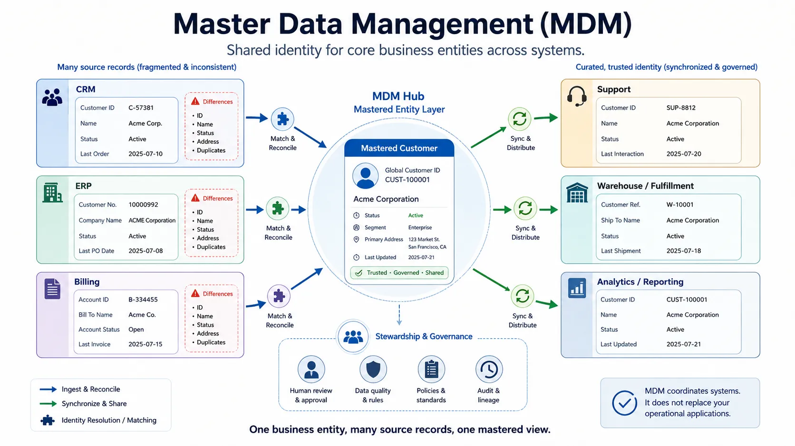
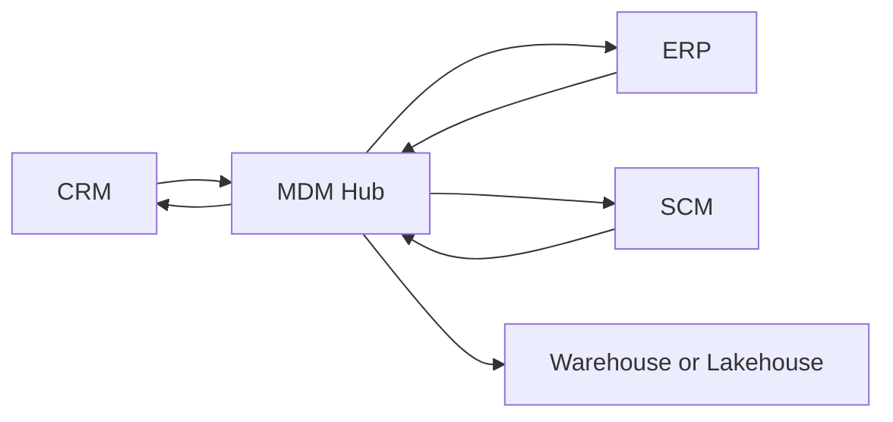
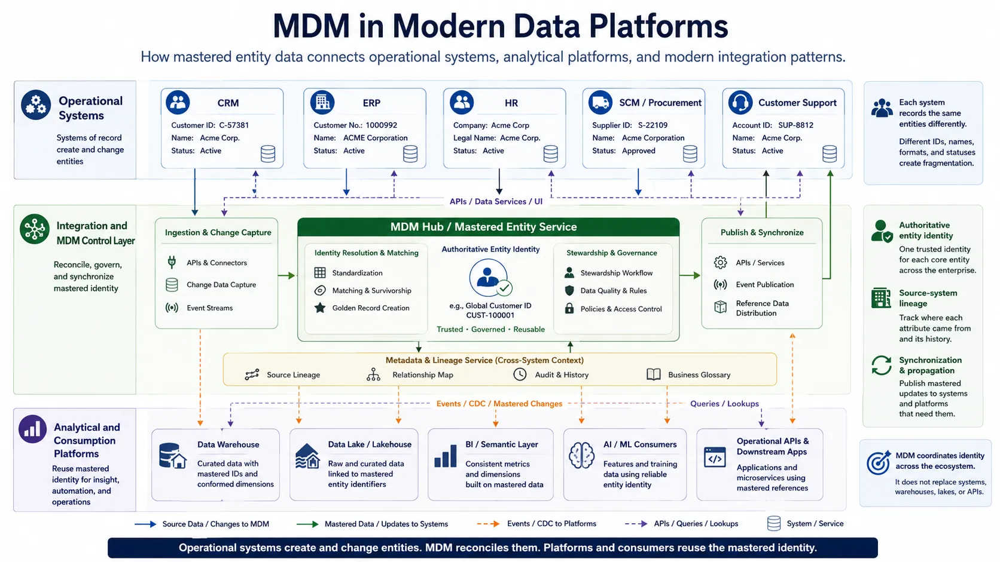

Master Data Management (MDM) is the discipline of maintaining authoritative, consistent representations of core business entities across systems. It exists because enterprises do not run on one application. Customers, products, suppliers, employees, and business locations such as stores, warehouses, offices, and sites are usually created and updated in multiple operational systems, each with its own identifiers, validation rules, timing, and data quality problems. MDM provides a way to reconcile that fragmentation without pretending that the enterprise is actually one database.

## Executive Summary

MDM becomes necessary when an organization can no longer tolerate inconsistent representations of the same business entity across applications. The problem is not only reporting. Inconsistent master data affects fulfillment, compliance, customer service, procurement, integration reliability, and increasingly AI systems that depend on stable entity identity.

The central idea is simple: define how core entities are identified, matched, governed, and synchronized so that the enterprise can operate with shared meaning. The implementation is not simple, because MDM sits at the intersection of data modeling, data quality, governance, business ownership, and application integration.

Good MDM programs therefore combine three things:

- a clear model of what counts as master data
- an operating model for stewardship and ownership
- an architecture pattern that fits the existing application landscape



## What Master Data Is

Master data describes relatively stable, shared business entities that are used across multiple processes and systems. It is not defined by storage technology. It is defined by enterprise significance and cross-system reuse.

Typical master data domains include:

- customers
- products
- suppliers
- employees
- physical assets such as equipment and facilities
- business locations such as stores, warehouses, offices, and sites
- organizational units

These entities are usually referenced by transactional systems, analytical systems, and operational workflows. Because they are reused broadly, inconsistency in their representation propagates widely.

| Data type        | Example                                | Main purpose                                        |
| ---------------- | -------------------------------------- | --------------------------------------------------- |
| Master data      | Customer, product, supplier            | Shared representation of core business entities     |
| Transaction data | Order, payment, shipment               | Record business events and operational activity     |
| Reference data   | Country code, currency, status code    | Provide controlled vocabularies and classifications |
| Analytical data  | Daily sales summary, churn feature set | Support reporting, modeling, and decision-making    |

Master data is often confused with reference data. The difference is practical. Reference data controls allowed values and shared code sets. Master data represents the entities themselves. A product category code is reference data. The product that uses that category is master data.

## Why MDM Matters

Organizations usually adopt MDM when fragmented data starts creating visible operational cost.

Common failure patterns include:

- the same customer exists in CRM, billing, and support platforms under different identifiers
- product definitions diverge between commerce, ERP, and warehouse systems
- supplier records differ between procurement and finance systems
- reporting teams spend more effort reconciling entity identity than analyzing outcomes
- downstream APIs and event consumers cannot reliably join records across systems

The impact is broader than analytics. In retail, duplicate product records can create inventory and pricing errors. In banking, inconsistent customer identities can weaken risk aggregation and compliance controls. In healthcare, fragmented provider or patient records can create safety and coordination problems. In SaaS businesses, account identity drift can distort usage-based billing and customer success workflows.

AI systems add a newer pressure. Entity inconsistency degrades feature engineering, training set construction, customer 360 models, retrieval layers, and governance automation. If identity is unstable, higher-level intelligence is also unstable.

## Core Concepts

### Golden record and single source of truth

A golden record is the best available authoritative representation of an entity after matching, consolidation, and survivorship rules are applied. It is often a logical construct, not a single physical row in one system.

Single source of truth is a broader claim. It refers to a trusted authoritative point of reference for a business concept. In practice, the golden record and the single source of truth may overlap, but they are not identical. An enterprise may maintain a golden customer record in an MDM platform while legal account status remains authoritative in a regulated operational system.

### Identity resolution and matching

Identity resolution determines when records from different systems represent the same real-world entity. Matching can be deterministic or probabilistic.

- Deterministic matching uses exact or rule-based logic such as tax ID, email, or an agreed compound key.
- Probabilistic matching uses weighted similarity across names, addresses, phone numbers, or other attributes when exact matches are unreliable.

In most enterprises, both are needed. Strong identifiers are not universal, and over-aggressive fuzzy matching can merge distinct entities incorrectly.

### Survivorship and stewardship

Survivorship rules determine which source values win when records conflict. A shipping address may come from CRM, tax status from ERP, and credit risk classification from a finance system. These decisions should reflect business authority, not only technical convenience.

Stewardship is the human operating model around those rules. Data stewards review exceptions, manage unresolved duplicates, approve changes to critical entity attributes, and coordinate with business owners when ambiguity cannot be resolved automatically.

```json
{
  "customerId": "CUST-10042",
  "sourceRecords": [
    { "system": "crm", "sourceId": "CRM-88271" },
    { "system": "billing", "sourceId": "BILL-44019" },
    { "system": "support", "sourceId": "SUP-11804" }
  ],
  "goldenRecord": {
    "legalName": "Northwind Industrial Ltd.",
    "legalNameSource": { "system": "billing", "sourceId": "BILL-44019" },
    "billingCountry": "JP",
    "billingCountrySource": { "system": "billing", "sourceId": "BILL-44019" },
    "supportTier": "enterprise",
    "supportTierSource": { "system": "support", "sourceId": "SUP-11804" }
  }
}
```

The example matters because it shows that the golden record is assembled from multiple source systems rather than copied wholesale from one application, and that each mastered attribute can still be traced back to a source system and source record.

## Architecture Patterns

MDM architecture should fit the system landscape and the degree of operational control the organization actually has. No pattern is universally best.

| Pattern       | How it works                                                                            | Strengths                                           | Weaknesses                                         | Best fit                                                 |
| ------------- | --------------------------------------------------------------------------------------- | --------------------------------------------------- | -------------------------------------------------- | -------------------------------------------------------- |
| Registry      | Keeps identifiers and cross-references, but most source data stays in origin systems    | Fastest to adopt, low disruption                    | Limited standardization, weak central control      | Large estates with strong source system autonomy         |
| Consolidation | Copies source records into an MDM hub for matching and reporting                        | Better entity resolution and analytical consistency | Source systems may still diverge operationally     | Organizations prioritizing harmonized reporting          |
| Coexistence   | MDM hub consolidates and also publishes mastered values back to systems                 | Better operational alignment across applications    | More integration complexity and change management  | Enterprises needing both analytics and operational reuse |
| Centralized   | One primary system owns creation and maintenance of master records                      | Strongest consistency and governance                | Hard to achieve in heterogeneous landscapes        | Greenfield or tightly standardized environments          |
| Federated     | Domain systems share stewardship and authority through common rules and synchronization | Works with distributed ownership models             | Requires strong governance and metadata discipline | Multi-domain enterprises with bounded autonomy           |



The diagram illustrates a coexistence model: source systems feed the hub, the hub masters core entity identity, and curated records are synchronized back to operational and analytical platforms.

## Data Model and Quality Implications

MDM is closely tied to enterprise data modeling. The harder problem is usually not the table schema. It is the semantic boundary of the entity.

Practical modeling concerns include:

- canonical identifiers that can survive across applications
- hierarchies such as parent-child customer groups or product category structures
- relationship modeling between domains such as supplier, product, and location
- reference data dependencies for statuses, classifications, and codes
- lifecycle state for active, merged, retired, or blocked entities

This is why MDM supports several of the core quality dimensions described in [Data Quality Dimensions](/docs/data/management/data-quality-dimensions/):

- **Accuracy** improves when authoritative sources and stewardship rules are explicit.
- **Consistency** improves when multiple systems align to the same entity model.
- **Validity** improves when codes, states, and structural rules are standardized.
- **Uniqueness** improves when duplicate detection and merge policies are operationalized.

Even simple checks can expose where MDM is needed.

```sql
SELECT normalized_email, COUNT(*) AS duplicates
FROM customer_staging
GROUP BY normalized_email
HAVING COUNT(*) > 1;
```

This kind of query does not solve identity resolution on its own, but it shows why unmanaged duplication becomes an enterprise problem quickly.

## Governance and Operating Model

MDM fails when it is treated as only a software deployment. The real challenge is deciding who is allowed to define, approve, correct, and consume authoritative entity data.

An effective operating model usually distinguishes:

- **data owners**, who are accountable for a domain such as customer or product
- **data stewards**, who manage exceptions, review merges, and maintain quality rules
- **platform or integration teams**, who operate the technical synchronization and control mechanisms
- **application owners**, who must adapt upstream and downstream interfaces to the mastered model

Approval workflows matter most for high-impact attributes such as legal identity, compliance status, supplier eligibility, or regulated product classification. Auditability matters because entity changes often affect billing, legal reporting, entitlement, and customer-facing operations.

The governance point is straightforward: MDM is a business control system implemented through data and integration patterns. That is why it overlaps with governance but is not identical to governance. Governance defines policies, accountability, and control expectations. MDM operationalizes those controls for specific core entities.

## Integration with Modern Platforms

MDM has to work with both operational and analytical architectures.

Operationally, MDM often integrates with:

- ERP for finance, procurement, and product structures
- CRM for customer acquisition and account context
- HR systems for worker and organizational data
- SCM platforms for supplier, inventory, and location coordination
- APIs, events, and CDC pipelines for synchronization across applications

Analytically, MDM improves the reliability of warehouses, lakes, and lakehouses by stabilizing entity identity before or during downstream modeling. This does not mean a lakehouse replaces MDM. A lakehouse stores and processes data efficiently. MDM decides how core entities are identified, reconciled, and governed.



The same boundary matters for adjacent architectural ideas.

| Adjacent concept                  | Relationship to MDM                                       | Key difference                                                                               |
| --------------------------------- | --------------------------------------------------------- | -------------------------------------------------------------------------------------------- |
| Data governance                   | Provides policy, accountability, and control expectations | Governance is broader than entity mastering                                                  |
| Customer 360                      | Often depends on MDM for identity and profile unification | Customer 360 is a use case or solution view, not the full discipline                         |
| Product information management    | May overlap for product domain data                       | PIM is usually commerce- and product-content-focused                                         |
| Data mesh                         | Can distribute ownership of domains and data products     | Mesh addresses operating model and platform decentralization, not entity mastering by itself |
| Semantic layer or knowledge graph | Can enrich access, semantics, and relationships           | They improve meaning and queryability but do not replace mastering rules                     |

In other words, MDM remains necessary even in modern architectures because stable entity identity is still a prerequisite for coordination.

## Implementation Guidance and Common Mistakes

Most organizations should begin with one domain where inconsistency has clear business cost. Customer and product are common starting points because they affect many downstream processes.

A pragmatic approach usually looks like this:

1. Pick one domain with visible operational pain and cross-system fragmentation.
2. Define ownership, stewardship, and authoritative source boundaries early.
3. Establish matching rules, survivorship logic, and measurable quality expectations.
4. Choose the least disruptive architecture pattern that still solves the real problem.
5. Integrate incrementally rather than attempting a simultaneous enterprise rewrite.

Small interface examples are often enough to make the synchronization model concrete.

```yaml
entity: supplier
authoritativeAttributes:
  - legal_name
  - tax_identifier
  - payment_status
syncMode: coexistence
stewardGroup: procurement-data-stewards
```

Common mistakes are predictable:

- treating MDM as a vendor installation rather than an operating model
- assuming one physical database will become the only truth for all systems
- underestimating stewardship effort for ambiguous matches and exceptions
- over-centralizing domains that still require local operational autonomy
- ignoring process changes needed in source applications and interfaces

These failures usually come from confusing architectural aspiration with organizational reality. Good MDM design accepts that enterprises are distributed systems, both technically and organizationally.

## Summary

MDM exists to maintain trustworthy, cross-system representations of the core entities that an enterprise depends on. It matters because fragmented customer, product, supplier, employee, and location data creates direct operational, analytical, and governance cost.

The core principles are stable: define the entity boundary clearly, resolve identity across systems, apply survivorship rules transparently, assign stewardship, and choose an architecture pattern that matches the degree of centralization the organization can sustain.

Modern platforms do not eliminate the need for MDM. Warehouses, lakehouses, APIs, event streams, semantic layers, and AI systems all benefit from mastered entity identity, but none of them automatically provide it. MDM remains the discipline that turns fragmented business entities into usable enterprise assets.
