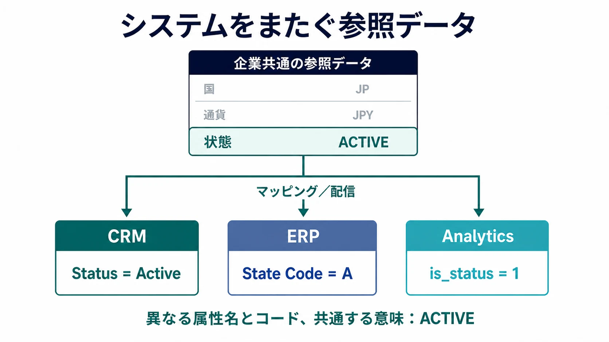

参照データ管理（Reference Data Management）は、システムがデータを分類するために使用する、統制された値を定義、管理、配信する取り組みです。国コード、通貨、アカウントの状態、製品カテゴリ、規制上の分類などが代表例です。参照データの量は通常それほど多くありませんが、意味や表現が一致しなければ、企業全体のシステム統合、統制、レポーティングに支障をきたします。

参照データ管理が確立するのは、共有された語彙です。すべてのシステムに同じ値を格納させることが目的ではありません。それぞれのローカル値を、合意された意味へ予測可能な形で対応付けることが重要です。

## マスタデータと参照データ

マスタデータは、顧客、製品、サプライヤー、拠点など、組織が一貫して識別する必要のある業務エンティティを表します。参照データは、それらのエンティティや活動を分類または説明するために使用できる値を定めます。

| 観点         | マスタデータ               | 参照データ                     |
| ------------ | -------------------------- | ------------------------------ |
| 何を表すか   | 業務エンティティ           | 許容される値または分類         |
| 代表例       | 顧客、製品、サプライヤー   | 国、通貨、状態                 |
| 主な関心事   | 共有されたアイデンティティ | 共有された語彙                 |
| 一般的な操作 | レコードの照合と統合       | コードの定義、マッピング、配信 |

製品はマスタデータであり、そのライフサイクル上の状態やカテゴリコードは参照データです。両者は相互に関係しますが、解決する問題は異なります。 [マスタデータ管理](/docs/data/management/mdm/) はエンティティの共有アイデンティティを確立し、参照データ管理はエンティティに付与する値の共有語彙を確立します。

## 内部参照データと外部参照データ

**内部参照データ**は、組織が自らの業務プロセスのために定義するものです。承認状態、顧客区分、コストセンター種別、内部リスク分類などが該当します。通常、その値を利用する業務プロセスを管理する部門がオーナーシップを担います。

**外部参照データ**は、標準化団体、規制当局、市場運営者などの外部機関が発行するものです。ISO の国・通貨コード、業種分類、規制報告コードなどが該当します。外部から提供される場合でも、変更の評価、採用の承認、導入の調整について、組織内に責任を負うオーナーが必要です。

外部のリストが、あらゆる組織内用途に対して自動的に正となるわけではありません。標準が業務上必要な粒度より細かい場合、更新周期が異なる場合、既存コードとのマッピングが必要な場合があります。

## 統制語彙とコードセット

統制語彙（Controlled Vocabulary）は、ある概念について使用を許容する用語や値を定義します。コードセットは、それらの値に対して、システムが保存、交換できる安定した表現を与えます。適切に管理された項目には、通常、次の情報が含まれます。

- 安定したコード
- 明確なラベルと定義
- 提案中、有効、廃止済みなどの状態
- 有効期間
- オーナーまたは発行機関
- 必要に応じて、上位、下位、同等の値との関係

コードが安定したまま、ラベルだけが変わることもあります。似た名前の値が同じ意味とは限らないため、定義も重要です。説明的な情報には自由記述が適している場合もありますが、検証、相互運用性、一貫した集計が必要な場面で、統制された値の代わりに使用すべきではありません。

複合コードは、システムが1つのコンパクトな識別子を必要とするときに、複数の統制された値を連結したものです。たとえば `JPN-YEN-LIVE` を共有語彙へマッピングするには、3つの要素を分割して検証したうえで、国の `JPN` を `JP`、通貨の `YEN` を `JPY`、状態の `LIVE` を `ACTIVE` へ変換するルールが必要です。このマッピングには単純なコードの読み替えだけでなく、解析と正規化が伴うため、要素の順序、区切り文字、欠損値の扱い、変換規則を明示的に統制する必要があります。

## クロスウォークとマッピング

異なるシステムが、妥当な業務上の理由から、ローカルな属性名やコードを維持することは珍しくありません。CRM が `Status = Active`、ERP が `State Code = A`、分析モデルが `is_status = 1` として同じ概念を表す場合があります。クロスウォークは、こうしたローカル属性と値を、`Status = ACTIVE` のような企業共通の概念へどのように対応付けるかを記録します。

マッピングは、それ自体が管理対象となるデータプロダクトです。ソースとターゲットのコードセット、変換方向、有効期間、承認状態、変換ルールを明示する必要があります。すべてのマッピングが1対1とは限りません。複数のローカル値を1つの企業共通値へ集約する場合もあれば、1つのソース値を安全に変換するために追加の文脈が必要な場合もあります。

曖昧なマッピングや情報が失われるマッピングは、統合コードの中へ隠すのではなく、見える状態にする必要があります。これにより利用者は、値が同等なのか、近似的な対応なのか、未対応なのかを判断できます。

## ライフサイクルとバージョン管理

基礎となる概念が安定しているように見えても、参照値は変化します。新しい値の追加、定義の変更、コードの統合、古い値の廃止が発生します。そのため、次のような明示的なライフサイクル管理が必要です。

1. 新規または変更された値を提案し、影響を評価する。
2. 定義、オーナーシップ、用途を承認する。
3. 適用開始日とバージョンを付けて公開する。
4. 利用システムへ通知し、移行を支援する。
5. 過去の意味を失わない形で非推奨化または廃止する。

有効期間を管理することで、値が業務上有効な時点と、システムがその値を認識した時点を区別できます。バージョンを保持すれば、監査や過去データの処理に使用したコードセット全体を再現できます。廃止したコードも、新規処理で使用できなくなった後に、過去のレコードから引き続き解決できる必要があります。

分析用データストアでは、連続するバージョンを有効期間の異なるレコードとして保持する方法の1つとして、Slowly Changing Dimension（SCD）Type 2 が使われます。

## ガバナンス

ガバナンスは、コードセットを定義する権限、変更の承認、意見の相違の解決、例外の許可を誰が担うかを定めます。実用的な運用モデルでは、次の役割を明確にします。

- 意味とポリシーに責任を負う業務オーナー
- 定義、品質、変更調整を担当するデータスチュワード
- 公開と安定した配信を担当する技術管理者
- 対応バージョンの採用と問題報告を担う利用システムのオーナー

統制の強さは、影響の大きさに応じて調整すべきです。小規模な内部表示用リストであれば簡易なレビューで十分な場合がありますが、規制上の分類や支払い状態には、正式な承認、職務分離、完全な監査証跡が必要になることがあります。

参照データ管理は、共有語彙に対してガバナンスを具体的に運用するものであり、企業全体のデータガバナンスを置き換えるものではありません。データ分野全体では、MDM は共有アイデンティティ、参照データ管理は共有語彙、メタデータは共有された文脈と意味、ガバナンスは権限とルールを確立する、という境界が有用です。

## 利用システムへの配信

承認された参照データは、それを使用するシステムへ届ける必要があります。一般的な配信手段には、API、イベント、データベース抽出、設定パッケージ、定期ファイルなどがあります。手段そのものよりも、その周囲にある契約が重要です。

信頼できる配信契約では、次の情報を伝えます。

- コードセットの識別子とバージョン
- 追加、変更、非推奨化、適用開始日
- 安定した識別子と、必要に応じたローカライズ済みラベル
- 対応するローカル表現のマッピング情報
- 配信状態、受領確認、エラー

利用側は、リストを暗黙的にコピーして差異を放置すべきではありません。統制された値を直接使用するか、ローカル値からの明示的でバージョン管理されたマッピングを維持する必要があります。利用システムが採用状況を検証し、意図された意味を維持できて初めて、配信は完了したといえます。

## まとめ

参照データは小規模でも、広い範囲に影響します。その管理には、統制語彙、明示的なマッピング、ライフサイクル管理、ガバナンス、信頼できる配信が含まれます。目標は、すべてのシステムを物理的に同一の表現へ揃えることではありません。ローカルな表現が異なっていても、システム間で一貫して解釈できる状態を作ることです。
