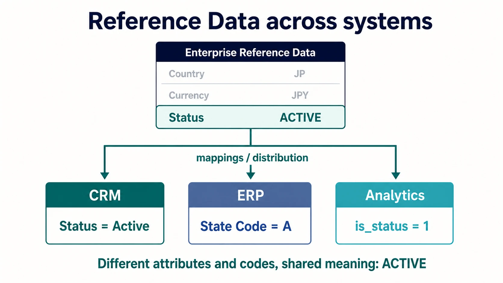

Reference Data Management is the discipline of defining, governing, and distributing the controlled values that systems use to classify data. Country codes, currencies, account statuses, product categories, and regulatory classifications are common examples. These values are usually small in volume, but differences in their meaning or representation can disrupt integrations, controls, and reporting across an enterprise.

Reference Data Management establishes shared vocabulary. It does not require every system to store the same literal value. It requires each local value to map predictably to an agreed meaning.

## Master Data and Reference Data

Master data represents the business entities an organization needs to identify consistently, such as customers, products, suppliers, and locations. Reference data supplies the allowed values used to classify or describe those entities and their activities.

| Question                | Master data                 | Reference data                     |
| ----------------------- | --------------------------- | ---------------------------------- |
| What does it represent? | A business entity           | An allowed value or classification |
| Typical examples        | Customer, product, supplier | Country, currency, status          |
| Primary concern         | Shared identity             | Shared vocabulary                  |
| Common operation        | Match and reconcile records | Define, map, and distribute codes  |

A product is master data; its lifecycle status or category code is reference data. The two disciplines interact, but they solve different problems. [Master Data Management](/docs/data/management/mdm/) establishes shared identity for entities, while Reference Data Management establishes shared vocabulary for the values applied to them.

## Internal and External Reference Data

**Internal reference data** is defined by the organization for its own processes. Examples include approval statuses, customer tiers, cost-center types, and internal risk classifications. Ownership normally belongs to the business function that controls the process in which the values are used.

**External reference data** originates from a standards body, regulator, market operator, or other outside authority. Examples include ISO country and currency codes, industry classifications, and regulatory reporting codes. The organization still needs an accountable owner: external publication does not remove the need to assess changes, approve adoption, and coordinate implementation.

External lists are not automatically authoritative for every local purpose. A standard may contain more detail than a process needs, update on a different schedule, or require mappings to legacy values.

## Controlled Vocabularies and Code Sets

A controlled vocabulary defines the terms or values permitted for a concept. A code set gives those values stable representations that systems can store and exchange. A useful managed entry normally includes:

- a stable code
- a clear label and definition
- its status, such as proposed, active, or retired
- effective dates
- an owner or issuing authority
- relationships to broader, narrower, or equivalent values when relevant

Labels can change while codes remain stable. Definitions matter because two values with similar names may not be equivalent. Free-text fields may still be appropriate for descriptive information, but they should not replace controlled values where validation, interoperability, or consistent aggregation is required.

## Crosswalks and Mappings

Different systems often retain local attribute names and codes for valid operational reasons. A CRM may store `Status = Active`, an ERP may use `State Code = A`, and an analytical model may represent the same concept as `is_status = 1`. A crosswalk records how both the local attributes and their values relate to a shared enterprise concept such as `Status = ACTIVE`.

A composite code concatenates several controlled values when a system needs one compact identifier. For example, mapping `JPN-YEN-LIVE` into shared vocabulary may require a rule that splits and validates the three segments, then maps country `JPN` to `JP`, currency `YEN` to `JPY`, and status `LIVE` to `ACTIVE`. The component order, delimiter, missing-value handling, and transformations must be governed explicitly because this mapping depends on parsing and normalization rules, not only on a simple code-to-code substitution.

Mappings are data products in their own right. They should identify their source and target code sets, direction, effective period, approval state, and any transformation rule. Not every mapping is one-to-one: several local values may collapse into one enterprise value, or one source value may require context before it can map safely.

Ambiguous or lossy mappings should be visible rather than hidden in integration code. That visibility allows consumers to understand whether values are equivalent, approximate, or unsupported.

## Lifecycle and Versioning

Reference values change even when the underlying concepts appear stable. New values are introduced, definitions are refined, codes are merged, and obsolete values are retired. Management therefore needs an explicit lifecycle:

1. Propose and assess a new or changed value.
2. Approve its definition, ownership, and intended use.
3. Publish it with an effective date and version.
4. Notify and support consuming systems.
5. Deprecate or retire it without erasing historical meaning.

Effective dating distinguishes when a value is valid from when a system learned about it. Versions make a complete set reproducible for audits and historical processing. Retired codes should remain resolvable for old records even when new transactions can no longer use them.

In analytical stores, Slowly Changing Dimension (SCD) Type 2 is one common way to preserve successive versions as separate effective-dated records.

## Governance

Governance establishes who has authority to define a code set, approve changes, resolve disputes, and grant exceptions. A practical operating model identifies:

- a business owner accountable for meaning and policy
- a steward responsible for definitions, quality, and change coordination
- technical custodians responsible for publication and reliable delivery
- consuming-system owners responsible for adopting supported versions and reporting issues

Controls should be proportional to impact. A small internal display list may need lightweight review, while a regulatory classification or payment status may require formal approval, segregation of duties, and a complete audit trail.

Reference Data Management operationalizes governance for shared vocabularies; it does not replace enterprise governance. In the broader Data field, the boundaries are useful: MDM establishes shared identity, Reference Data Management establishes shared vocabulary, metadata establishes shared context and meaning, and governance establishes authority and rules.

## Distribution to Consuming Systems

Approved reference data must reach the systems that use it. Common distribution mechanisms include APIs, events, database extracts, configuration packages, and scheduled files. The mechanism matters less than the contract around it.

A reliable distribution contract communicates:

- the code-set identifier and version
- additions, changes, deprecations, and effective dates
- stable identifiers and localized labels where required
- mapping information for supported local representations
- delivery status, acknowledgements, and errors

Consumers should not silently copy a list and allow it to drift. They should either use the governed values directly or maintain an explicit, versioned mapping from local values. Distribution is complete only when consuming systems can validate adoption and preserve the intended semantics.

## Summary

Reference data is compact but consequential. Its management combines controlled vocabularies, explicit mappings, lifecycle discipline, governance, and reliable distribution. The goal is not universal physical uniformity. It is consistent interpretation across systems, even when local representations differ.
