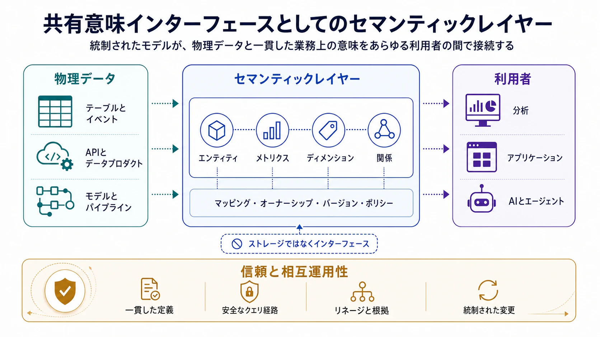

セマンティックレイヤーは、ダッシュボード、ノートブック、アプリケーション、AI システムで再利用できる、安定した業務上の意味をデータに与えます。これにより、利用者が物理テーブルや個別の計算ロジックを、顧客、注文、売上、在庫、リスクといった概念へ毎回読み替える必要がなくなります。

## 概要

セマンティックレイヤーは、データストレージとデータ利用の間に置かれる、統制されたモデルです。業務エンティティ、メジャー、ディメンション、関係、利用ルールを、実装元のテーブルやパイプラインから切り離して表現します。利用者が業務概念を要求すると、セマンティックレイヤーが適切なデータとクエリロジックへ対応付けます。

この分離は二つの問題を解決します。再利用可能な定義を一元化して指標の断片化を抑え、ローカルな意味と共有意味の関係を明示して相互運用性を高めます。良いセマンティックレイヤーは、すべてのドメインに単一の語彙を強制しません。ローカルなニュアンスを保ちつつ、比較、合成、ポリシー適用、自動化に必要な範囲を揃えます。

セマンティックレイヤーは、単なるグロッサリー、カタログ、SQL 式の集合ではありません。定義が機械可読で、物理データと接続され、オーナーシップと変更管理によって統制され、人やシステムが実際に使うツールから利用可能になって初めて、運用可能な仕組みになります。

## セマンティックレイヤーが必要な理由

データプラットフォームが公開するのは、テーブル、カラム、ファイル、イベント、API といった物理構造です。これらだけでは、データの業務上の意味を完全には表せません。`revenue` というカラムも、受注額、請求額、収益認識額、ローカルな推計値のいずれかは名前だけでは分かりません。同じ用語を使っていても、期間、除外条件、通貨、集計ルールがチームごとに異なる場合があります。

再利用可能な意味モデルがなければ、こうしたロジックはダッシュボード、ノートブック、変換処理、アプリケーションコードへ拡散します。コピーが増えるたびに、発見、検証、更新すべき定義も増えます。その結果、次の問題が起きます。

- 同じ指標に見える数値同士が一致しない
- 結合や計算ロジックが重複する
- 新しい利用者が暗黙知に依存する
- 粒度や時間境界を誤ってデータを利用する
- 利用ツールによってポリシー適用がばらつく
- 自然言語やエージェントが生成するクエリを信頼できない

セマンティックレイヤーは、意味を個別レポートの暗黙的な性質ではなく、明示的かつ統制可能なインターフェースにします。

## モデル化する対象

### エンティティと識別子

エンティティは、顧客、アカウント、製品、注文、従業員、拠点など、業務上認識できる対象を表します。セマンティックモデルは、その識別子、関連属性、他のエンティティとの関係を記録します。識別子と表示名の区別も重要です。顧客名は変化したり重複したりしますが、統制された顧客 ID は結合や件数計算の基礎になります。

エンティティ定義では境界も明示します。たとえばアカウントが法人そのものではなく請求関係を表す場合や、アクティブ顧客が恒久的な状態ではなく特定日時点で判定される場合があります。

### メジャー、メトリクス、ディメンション

メジャーは、数量、金額、時間、残高など、集計可能な値です。メトリクスは一つ以上のメジャーに業務上の意図を加え、計算式、粒度、フィルター、時間の扱い、場合によっては目標値や比較基準を定義します。ディメンションは、製品、地域、チャネル、顧客セグメントなど、メジャーを切り分ける観点です。

堅牢なメトリクス定義には通常、次を含めます。

- 計算式、元となるメジャー、許可する集計方法
- エンティティ粒度と利用可能なディメンション
- 包含条件と除外条件
- イベント時刻、報告期間、タイムゾーン
- 通貨、単位、正規化ルール
- オーナー、ステータス、有効なバージョン

これらの情報により、前提が異なる計算式を誤って再利用することを防ぎます。

### 関係と結合経路

関係は、エンティティやデータセットがどう接続されるかを表します。多重度は、一方の各レコードが相手側の一件または複数件と対応するかを示し、省略可能性はその対応が必須かどうかを示します。結合キーは、その関係を実装するフィールドを特定します。これらが重要なのは、技術的に成立する結合でも、ファクトを重複させたりレコードを意図せず除外したりするためです。たとえば、一件の注文を複数の注文明細へ結合すると明細の粒度になります。その状態で注文単位の金額を合計すれば、明細数だけ金額が重複します。

そのためセマンティックモデルは、名前が似たカラムから利用者が関係を推測するのではなく、エンティティ間で利用可能な結合経路を定義すべきです。たとえば売上を顧客地域へ結び付ける場合、`注文 -> 顧客 -> 地域` という経路と、請求アカウントを介する経路では業務上の意味が異なることがあります。セマンティックレイヤーは適切な経路を選択または制約し、複数の経路が競合する場合は曖昧さを示し、多対多の関係には中間エンティティや配賦ルールを要求します。これにより、クエリツールは粒度の変化を明示しながら、安全な結合を再利用できます。

### 語彙と概念マッピング

ビジネスグロッサリーは、顧客、純売上、アクティブアカウントといった用語について、組織で合意した定義を提供します。タクソノミーは、`製品 -> 電子機器 -> スマートフォン` のように、概念をたどりやすい階層へ分類します。オントロジーはさらに、複数種類の関係、制約、場合によっては推論ルールまで表現します。たとえば、サブスクリプションはアカウントに属する、アカウントは組織を表す場合がある、二つの分類は同時に成立しない、といった関係です。すべてのセマンティックレイヤーに形式的なオントロジーが必要なわけではなく、必要な厳密さは、答えるべき問いと相互運用の範囲によって決まります。

これらの概念を、メトリクス、エンティティ、フィールド、データプロダクト、ポリシー、オーナーへ対応付けることで、実務で利用できるようになります。たとえば「取引先」と「顧客」を同じ共有概念の同義語として扱う一方、「受注額」は収益認識済み売上と区別し、両者の関係を明示できます。このようなマッピングは、異なる概念を無理に同一視せずにドメイン固有の言葉を保ち、カタログ、クエリツール、AI システムが利用者の用語を正しいセマンティックオブジェクトへ解決するための統制された手掛かりになります。

## クエリ時の動作

利用者は、物理実装の詳細をすべて知らなくても業務概念を要求できるべきです。たとえば「日本における顧客セグメント別の月次収益認識額」という要求に対して、セマンティックレイヤーは次の処理を行えます。

1. 承認済みの収益メトリクスと有効なバージョンを特定する。
2. 元となるメジャー、エンティティ、結合経路を選択する。
3. 「日本」が請求先の国、事業地域、または別の統制された地域属性のどれを指すかを特定する。
4. 特定した地域フィルターに加え、通貨ルールとカレンダー定義を適用する。
5. 対象の実行エンジン向けにクエリを生成または制約する。
6. 定義、データの出所、鮮度の情報とともに結果を返す。

セマンティックレイヤー自身が SQL を生成する場合も、API を公開する場合も、別のクエリプランナーへメタデータを渡す場合もあります。実行方法より重要なのは、異なるクライアントが同じ統制済みの意図を再利用することです。

これは AI システムにとっても重要です。自然言語インターフェースやエージェントは、「顧客」がアカウントと法人のどちらを指すか、どの売上計算が承認済みか、「日本」が請求先の国と事業地域のどちらを指すかを確実には推論できません。機械可読な意味メタデータは選択肢を絞り、生成するクエリを統制済みの定義や元データへ結び付けます。これにより、結果の根拠が明確になり説明しやすくなりますが、アクセス制御、クエリ検証、評価が不要になるわけではありません。

## 隣接する機能との関係

セマンティックレイヤーはデータプラットフォームの他の機能と連携しますが、それらを置き換えるものではありません。

| 機能                         | 主な責務                                             | セマンティックレイヤーとの関係                                       |
| ---------------------------- | ---------------------------------------------------- | -------------------------------------------------------------------- |
| データカタログ               | 発見、資産一覧、オーナーシップ、技術メタデータ       | 意味資産とその元データを発見可能にする                               |
| ビジネスグロッサリー         | 用語、定義、スチュワードシップ                       | セマンティックオブジェクトが実装する語彙を提供する                   |
| データ変換レイヤー           | 物理データモデルの生成とテスト                       | 意味定義が参照する信頼できるデータを生成する                         |
| マスターデータ管理           | 共有エンティティの同一性解決と統制                   | セマンティックエンティティへ統合済みの識別子と属性を提供する         |
| データコントラクト           | データ提供側と利用側のインターフェース要件を定義する | モデルが依存するソース構造と意味を保護する                           |
| ナレッジグラフ／オントロジー | 豊かな概念関係と推論を表現する                       | 分析クエリの範囲を越えて意味を拡張・形式化できる                     |
| アクセス制御システム         | 認可ポリシーを評価・強制する                         | ポリシーを意味オブジェクトへ付与しても、最終的な強制主体であり続ける |

文章による定義を持つカタログ項目だけでは、その定義をクエリの生成や実行へ一貫して適用できないため、セマンティックレイヤーとはいえません。一方、発見、オーナーシップ、リネージを欠くメトリクスエンジンは、計算を統一できても統制が難しくなります。

## アーキテクチャと相互運用性

実用的なアーキテクチャでは、次の関心事を分離します。

- **意味定義**: エンティティ、メトリクス、ディメンション、関係を記述する
- **物理マッピング**: 意味オブジェクトをテーブル、フィールド、モデル、クエリ式へ結び付ける
- **ガバナンスメタデータ**: オーナー、承認、ライフサイクル、ポリシー、バージョンを記録する
- **提供インターフェース**: クエリツール、API、カタログ、AI 向け検索経路からモデルを公開する
- **可観測性**: 利用状況、失敗、鮮度、コスト、定義のドリフトを記録する

これらを分離すると、業務上の意味を暗黙に変えずに物理データを進化させられます。可搬性も高まりますが、ファイルを書き出すだけで相互運用性が得られるわけではありません。システム間で識別子、型、粒度、集計動作、関係の意味、バージョニングについて合意する必要があります。

意味をツールや組織の境界を越えて共有する場合、標準や形式モデルが役立ちます。**ISO/IEC 11179** はデータ要素定義とメタデータレジストリの概念を提供します。**SKOS** は統制語彙と概念体系を、**OWL** と **RDF** はより豊かなグラフベースの意味表現を支えます。**DCAT** はカタログ間の相互運用を支えます。これらは異なる問題を解くものであり、具体的な交換・統制要件に追加の厳密さが必要な場合に採用すべきです。

ソフトウェア実装も対象範囲が異なります。dbt Semantic Layer、Looker、Cube のようなメトリクス指向システムは、再利用可能な分析定義とクエリ動作に重点を置きます。OpenMetadata や DataHub のようなメタデータプラットフォームは、グロッサリー、リネージ、スキーマ、オーナーシップを接続できます。Apache Iceberg のようなテーブルフォーマットは下層の物理データオブジェクトを提供しますが、それ自体は業務上の意味を定義しません。オープンな交換仕様の例として、旧称 Open Semantic Interchange（OSI）の [Apache Ossie（incubating）](https://ossie.apache.org/) は、分析、AI、BI の各プラットフォーム間でセマンティックモデルを交換可能にすることを目指しています。このような仕様は製品ロックインを減らせますが、可搬性は各システムが表現できる意味の範囲に左右されます。

## オーナーシップと変更管理

意味定義はインターフェースであるため、ライフサイクル管理が必要です。共有オブジェクトごとに責任を持つオーナーを置き、ドラフト、承認済み、非推奨、廃止などのステータスを明示します。レビューには、業務意図を理解するドメイン専門家と、実装動作を検証できるデータ実務者の双方が参加すべきです。

意味を維持したまま物理マッピングだけを更新する変更は、利用者へ影響しない場合があります。計算式、粒度、適格条件、時間解釈を変える変更は意味変更であり、適切にバージョン化すべきです。安全な変更プロセスは通常、次を含みます。

1. リネージと利用状況メタデータから、影響を受けるダッシュボード、モデル、API、AI ワークフローを評価する。
2. 代表的な期間やセグメントで新旧結果を比較する。
3. 変更理由、適用日、移行方法を公開する。
4. 影響が大きい場合は新旧定義を並行運用する。
5. 利用者の移行後に旧バージョンを非推奨とする。

テストは構文確認だけでは不十分です。一意性と関係のテスト、集計時に守るべき不変条件、時間境界での期待動作、権威あるレポートとの照合、安全でない結合経路を防ぐクエリテストなどが有効です。

## 導入アプローチ

価値が高く、定義に議論があり、複数の利用者が再利用する少数の概念から始めます。売上、アクティブ顧客、注文、製品、在庫は典型例ですが、適切な出発点は組織によって異なります。

各概念について次を行います。

1. 依存する意思決定と利用者を特定する。
2. 現在の定義を収集し、正当な差異を説明する。
3. オーナーを割り当て、共有定義または明示的な派生定義に合意する。
4. 粒度、ディメンション、関係、時間の扱い、物理マッピングをモデル化する。
5. 信頼できるユースケースに対して結果を検証する。
6. 既存の利用ワークフローから定義を使えるようにする。
7. 再利用、失敗クエリ、重複定義、変更影響を測定する。

統制された経路が、ローカルでロジックを作り直すより使いやすいときに導入は進みます。ほとんど利用されない巨大なモデルより、重要な問いへ確実に答える小さなモデルの方が価値があります。

## よくある失敗

- **早すぎる中央集権化**: 硬直した全社オントロジーは、正当なドメイン差異を消し、承認のボトルネックになります。
- **意味をすべてローカルに残す**: 利用者が手作業で整合させることになり、ドメイン横断の合成を信頼できません。
- **メトリクスを計算式だけで扱う**: 粒度、時間、単位、フィルター、関係の動作も同じく重要です。
- **定義と物理マッピングを切り離す**: 文章は手作業でしか更新されず、クエリ実行を導けません。
- **バージョニングとリネージを無視する**: 利用者が定義変更の影響を評価できません。
- **オーナーシップより先にツールを選ぶ**: 技術は意味を保存できますが、業務上の責任を解決できません。
- **AI が不足する意味を推論できると考える**: モデルはもっともらしいクエリを生成しながら、誤った概念や結合経路を選ぶ場合があります。

持続的な相互運用性は、ローカルな意味が重要なところではドメイン固有概念を、比較や統制が必要なところでは共有概念を使い、その間を明示的に対応付ける多層的な意味設計から生まれます。

## まとめ

セマンティックレイヤーは、業務上の意味を再利用可能なデータインターフェースへ変えます。物理スキーマの上にエンティティ、メトリクス、ディメンション、関係、語彙を定義し、それらを統制されたデータとクエリ動作へ結び付けます。

価値は、一つのダッシュボードの数値を揃えることだけではありません。物理実装やローカル語彙が変化しても、多くのツール、チーム、自動化システムが同じ意図を再利用できることにあります。その実現には、モデリング技術と同じくらい、オーナーシップ、バージョニング、テスト、導入設計が重要です。
