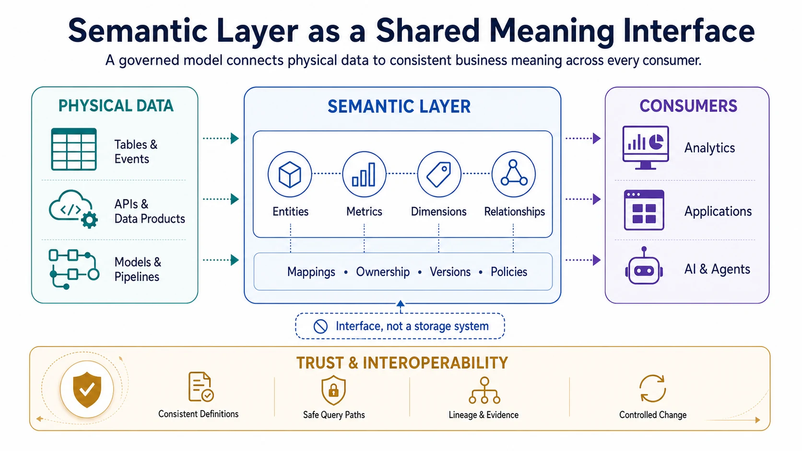
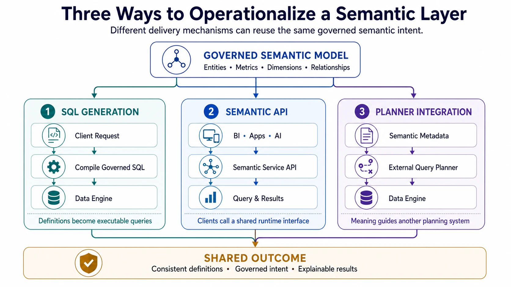
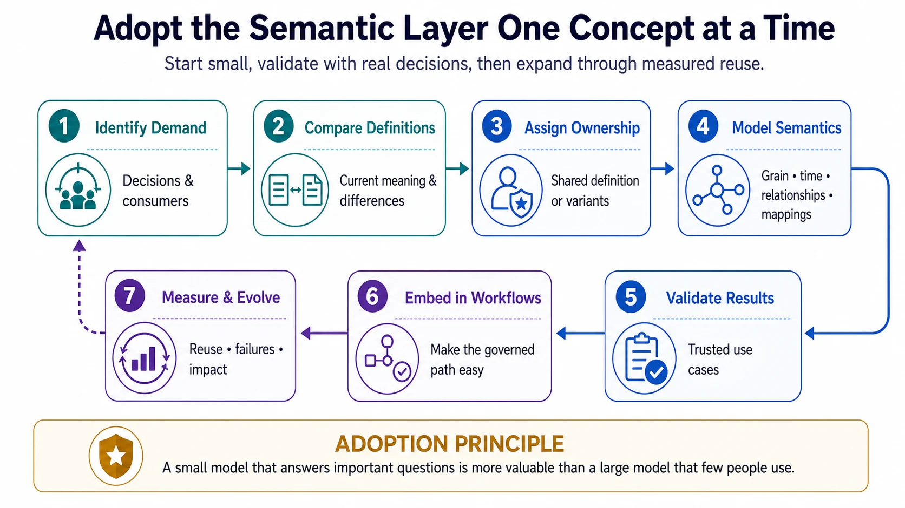

A semantic layer gives data a stable business meaning that can be reused across dashboards, notebooks, applications, and AI systems. It prevents every consumer from having to translate physical tables and locally defined calculations into concepts such as customer, order, revenue, inventory, or risk.

## Executive Summary

The semantic layer is a governed model between data storage and data consumption. It represents business entities, measures, dimensions, relationships, and usage rules independently of the tables and pipelines that implement them. Consumers ask for a business concept; the layer maps that request to the appropriate data and query logic.

This separation solves two related problems. It reduces metric fragmentation by centralizing reusable definitions, and it improves interoperability by making relationships between local and shared meanings explicit. A useful semantic layer does not force every domain to use one vocabulary. It preserves local nuance while defining where concepts must align for comparison, composition, policy, and automation.

A semantic layer is not merely a glossary, a catalog, or a collection of SQL expressions. It becomes operational only when definitions are machine-readable, connected to physical data, governed through ownership and change controls, and available in the tools where people and systems consume data.

## Why a Semantic Layer Is Needed

Data platforms expose physical structures: tables, columns, files, events, and APIs. Those structures rarely express the complete business meaning of the data. A column named `revenue` may represent booked revenue, billed revenue, recognized revenue, or a local estimate. Even when two teams use the same term, they may apply different time windows, exclusions, currencies, and aggregation rules.

Without a reusable semantic model, this logic spreads into dashboards, notebooks, transformations, and application code. Each copy becomes another definition to discover, validate, and update. The consequences include:

- conflicting results for apparently identical metrics
- repeated joins and calculation logic
- slow onboarding and dependence on tribal knowledge
- accidental use of data at the wrong grain or time boundary
- inconsistent policy enforcement across consumption tools
- unreliable natural-language and agent-generated queries

The semantic layer addresses these problems by making meaning an explicit, governed interface rather than an implicit property of individual reports.

## What the Layer Models

### Entities and identifiers

Entities represent recognizable business objects such as customers, accounts, products, orders, employees, or locations. A semantic model records their identifiers, relevant attributes, and relationships. It must also distinguish identity from labels: a customer name may change or collide, while a governed customer identifier remains the basis for joining and counting.

Entity definitions should state important boundaries. For example, an account may be a billing relationship rather than a legal entity, and an active customer may be evaluated at a particular date rather than stored as a permanent status.

### Measures, metrics, and dimensions

A measure is a value that can be aggregated, such as quantity, amount, duration, or balance. A metric adds business intent to one or more measures by defining a calculation, grain, filters, time behavior, and often a target or comparison. Dimensions describe the perspectives by which measures are grouped, such as product, region, channel, or customer segment.

A robust metric definition normally includes:

- formula, source measures, and allowed aggregation
- entity grain and valid dimensions
- inclusion and exclusion rules
- event time, reporting period, and timezone
- currency, unit, or normalization rules
- owner, status, and effective version

These properties prevent a formula from appearing reusable when its underlying assumptions are not.

### Relationships and paths

Relationships describe how entities and datasets connect. Cardinality specifies whether each record relates to one or many records on the other side, while optionality states whether that relationship must exist. Join keys identify the fields that implement the relationship. These properties matter because a technically valid join can still duplicate facts or silently exclude records. For example, joining one order to many order lines preserves the order-line grain, but summing an order-level amount after that join repeats the amount for every line.

A semantic model should therefore define approved join paths between entities, not leave each query author to infer them from matching column names. A request that connects revenue to customer region might follow `order -> customer -> region`; a second route through billing accounts may represent a different business meaning. The layer should select or constrain the appropriate path, identify ambiguous routes, and require an explicit bridge or allocation rule for many-to-many relationships. This allows query tools to reuse safe joins while making changes in grain visible.

### Vocabulary and concept mappings

A business glossary provides agreed definitions for terms such as customer, net revenue, or active account. A taxonomy organizes concepts into a navigable hierarchy, such as `product -> electronics -> smartphone`. An ontology goes further by representing multiple kinds of relationships, constraints, and sometimes inference rules—for example, that a subscription belongs to an account, an account may represent an organization, and two classifications are mutually exclusive. Not every semantic layer needs a formal ontology; the required level of formality depends on the questions and interoperability boundaries it must support.

These concepts become operational when they are mapped to metrics, entities, fields, data products, policies, and owners. Synonyms can map “client” and “customer” to the same shared concept, while a local term such as “bookings” can remain distinct from recognized revenue and explicitly describe how the two relate. Such mappings preserve domain language without implying false equivalence and give catalogs, query tools, and AI systems a controlled way to resolve user terminology to the correct semantic object.

## How It Works at Query Time

A consumer should be able to request a concept without knowing every physical implementation detail. For a request such as “monthly recognized revenue in Japan by customer segment,” the semantic layer can:

1. Resolve the approved revenue metric and its effective version.
2. Select the source measures, entities, and relationship path.
3. Resolve whether “Japan” refers to billing country, operating region, or another governed geographic attribute.
4. Apply the resulting geographic filter together with currency rules and calendar semantics.
5. Generate or constrain a query for the target execution engine.
6. Return results with definition, provenance, and freshness context.

The layer may generate SQL, expose an API, or provide metadata to another query planner. The execution mechanism is secondary. The important property is that different clients reuse the same governed intent.

This is also why the semantic layer is useful to AI systems. Natural-language interfaces and agents cannot reliably infer whether “customer” means an account or a legal entity, which revenue calculation is approved, or whether “Japan” means billing country or operating region. Machine-readable semantic metadata narrows those choices and connects generated queries to governed definitions and source data. It makes results better grounded and easier to explain, but it does not eliminate the need for access controls, query validation, or evaluation.

## Relationship to Adjacent Capabilities

The semantic layer works with other parts of the data platform but does not replace them.

| Capability                  | Primary responsibility                                  | Relationship to the semantic layer                                            |
| --------------------------- | ------------------------------------------------------- | ----------------------------------------------------------------------------- |
| Data catalog                | Discovery, inventory, ownership, and technical metadata | Helps users find semantic assets and their underlying data                    |
| Business glossary           | Terms, definitions, and stewardship                     | Supplies vocabulary that semantic objects can implement                       |
| Transformation layer        | Materializes and tests physical data models             | Produces reliable data that semantic definitions reference                    |
| Master data management      | Resolves and governs shared entity identity             | Provides mastered identifiers and attributes for semantic entities            |
| Data contracts              | Defines producer-consumer interface expectations        | Protects source structure and meaning on which models depend                  |
| Knowledge graph or ontology | Represents rich concept relationships and inference     | Can enrich or formalize semantics beyond analytical query needs               |
| Access-control system       | Evaluates and enforces authorization policy             | Must remain authoritative even when policies are attached to semantic objects |

A catalog entry with a prose definition is not by itself a semantic layer because it cannot consistently participate in query resolution. Conversely, a metric engine without discovery, ownership, and lineage may calculate consistently while remaining difficult to govern.

## Architecture and Interoperability

A practical architecture separates several concerns:

- **Semantic definitions** describe entities, metrics, dimensions, and relationships.
- **Physical mappings** bind those objects to tables, fields, models, and query expressions.
- **Governance metadata** records ownership, approval, lifecycle, policy, and versions.
- **Serving interfaces** expose the model through query tools, APIs, catalogs, and AI retrieval paths.
- **Observability** records usage, failures, freshness, cost, and definition drift.

Separating these concerns allows physical data to evolve without silently changing business meaning. It also makes portability possible, although interoperability requires more than exporting a file. Two systems must agree on identifiers, types, grains, aggregation behavior, relationship semantics, and versioning.

Standards and formal models can help where meaning must cross tool or organizational boundaries. **ISO/IEC 11179** provides concepts for data-element definition and metadata registries. **SKOS** supports controlled vocabularies and concept schemes, while **OWL** and **RDF** support richer graph-based semantics. **DCAT** supports catalog interoperability. These standards solve different problems and should be adopted only where their additional rigor supports a concrete exchange or governance need.

Software implementations also vary in scope. Metric-oriented systems such as dbt Semantic Layer, Looker, and Cube focus on reusable analytical definitions and query behavior. Metadata platforms such as OpenMetadata and DataHub can connect glossary terms, lineage, schemas, and ownership. Table formats such as Apache Iceberg provide physical data objects beneath the layer, but do not define business semantics by themselves. Open interchange specifications such as [Apache Ossie (incubating)](https://ossie.apache.org/), previously known as Open Semantic Interchange (OSI), aim to make semantic models exchangeable across analytics, AI, and BI platforms. Such specifications can reduce product lock-in, but portability still depends on the semantics each participating system can represent.

## Ownership and Change Management

Semantic definitions are interfaces, so they require lifecycle discipline. Each shared object should have an accountable owner and a visible status such as draft, approved, deprecated, or retired. Review should include domain experts who understand business intent and data practitioners who can validate implementation behavior.

Changes that preserve meaning may update a physical mapping without affecting consumers. Changes that alter a formula, grain, eligibility rule, or time interpretation are semantic changes and should be versioned accordingly. A safe change process typically includes:

1. Assess affected dashboards, models, APIs, and AI workflows through lineage and usage metadata.
2. Compare old and new results over representative periods and segments.
3. Publish the rationale, effective date, and migration path.
4. Run old and new definitions in parallel when the impact is material.
5. Deprecate the old version only after consumers have migrated.

Tests should cover more than syntax. Useful controls include uniqueness and relationship tests, aggregation invariants, expected behavior at time boundaries, reconciliation with authoritative reports, and query tests that prevent unsafe join paths.

## Adoption Approach

Start with a small set of concepts that are valuable, disputed, and reused across more than one consumer. Revenue, active customer, order, product, and inventory are common candidates, but the right starting point depends on the organization.

For each concept:

1. Identify the decisions and consumers that depend on it.
2. Document current definitions and explain legitimate differences.
3. Assign an owner and agree on the shared definition or explicit variants.
4. Model its grain, dimensions, relationships, time behavior, and physical mappings.
5. Validate results against trusted use cases.
6. Expose the definition in existing consumption workflows.
7. Measure reuse, failed queries, duplicated definitions, and change impact.

Adoption succeeds when the governed path is easier to use than recreating logic locally. A large model with little consumption is less valuable than a small model that reliably answers important questions.

## Common Failure Modes

- **Centralizing too early.** A rigid enterprise ontology can erase legitimate domain differences and create a slow approval bottleneck.
- **Leaving all meaning local.** Consumers then perform manual reconciliation, and cross-domain composition remains unreliable.
- **Treating metrics as formulas only.** Grain, time, units, filters, and relationship behavior are equally important.
- **Decoupling definitions from physical mappings.** Prose stays current only through manual effort and cannot guide query execution.
- **Ignoring versioning and lineage.** Consumers cannot assess the effect of a changed definition.
- **Choosing a tool before defining ownership.** Technology can store semantics but cannot resolve business accountability.
- **Assuming AI can infer missing meaning.** Models may produce plausible queries while selecting the wrong concept or join path.

Durable interoperability usually comes from layered semantics: domain-specific concepts where local meaning matters, shared concepts where comparison and governance matter, and explicit mappings between them.

## Summary

A semantic layer turns business meaning into a reusable data interface. It defines entities, metrics, dimensions, relationships, and vocabulary above physical schemas, then connects those definitions back to governed data and query behavior.

Its value is not a single consistent dashboard. It is the ability for many tools, teams, and automated systems to reuse the same intent while physical implementations and local vocabularies evolve. That outcome depends as much on ownership, versioning, testing, and adoption as it does on modeling technology.
