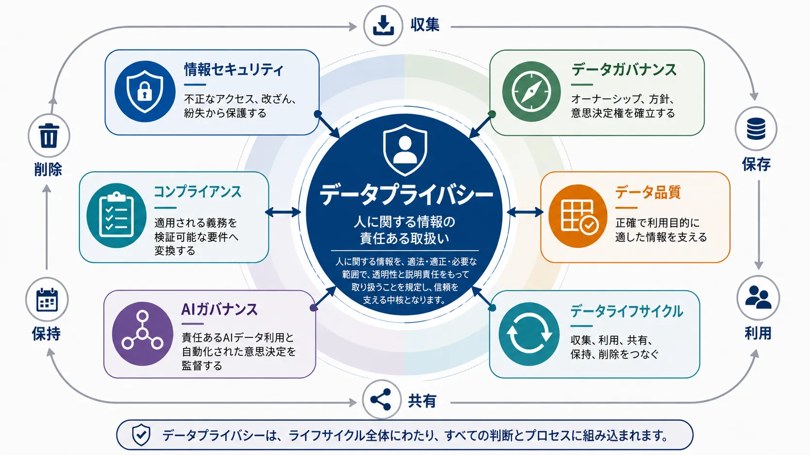
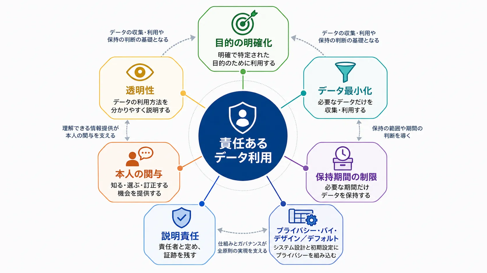

データプライバシーとは、人に関する情報を、いつ、どのように収集し、利用・共有・保持・削除してよいかを判断するための実践です。データ処理が個人に与える影響を可視化し、組織が人を単なる情報源として扱うことなく、データから価値を生み出せるようにします。

プライバシーは、データエコシステムにおける横断的関心事です。データセットは、アプリケーションからプラットフォームへ移動し、他の記録と組み合わされ、分析や AI に利用され、パートナーと共有され、何年にもわたって保持されることがあります。それぞれの段階で、データが何を明らかにするか、誰に影響を与えるかは変化し得ます。プライバシーは、そのような変化を捉えて判断するための原則と管理策を提供します。

したがって、プライバシーは単なるコンプライアンス上の義務ではありません。信頼できるデータ利用の前提条件です。一般消費者、顧客、従業員、パートナーが、自分たちの情報がどのように扱われるかを理解できるとき、組織は何を収集すべきか、どの利用が正当化されるか、どのような保護策が必要かについて、より良い判断を下せます。

## 横断的な関心事

プライバシーは他のデータ領域と密接に関係していますが、それらと同義ではありません。セキュリティは、データを不正なアクセス、改ざん、紛失から守るのに役立ちます。これに対してプライバシーは、人に関する情報を、そもそも特定の目的のために処理すべきか、またどのような条件で処理すべきかを問います。強固なセキュリティはプライバシーにとって必要ですが、それだけで不当または予期されない個人データの利用を適切なものにはできません。

データガバナンスは、データ資産全体にわたってプライバシーを運用可能にするための方針、オーナーシップ、意思決定プロセスを整備します。データ品質は、情報が正確で利用目的に適していることを担保しますが、誤ったデータが人に関する有害な判断につながり得るという意味で、プライバシーにも関わります。コンプライアンスは、適用される法的義務、契約上の義務、業界上の義務を要件へ変換します。一方でプライバシーは、特定の要件を検証する前の段階からシステム設計に反映されるべき、より広い設計規律を提供します。

| 領域               | 主な関心事                                             | プライバシーとの関係                                                                           |
| ------------------ | ------------------------------------------------------ | ---------------------------------------------------------------------------------------------- |
| データプライバシー | 人に関する情報の責任ある処理                           | ライフサイクル全体にわたり、適切な目的、期待、保護のあり方を定義します                         |
| 情報セキュリティ   | 不正なアクセス、改ざん、紛失からの保護                 | プライバシーが依拠する保護策を提供しますが、適切な利用そのものは判断しません                   |
| データガバナンス   | 説明責任、方針、オーナーシップ、意思決定権             | プライバシーを一貫して適用するための運用モデルを提供します                                     |
| データ品質         | 正確性、完全性、一貫性、利用適合性                     | 誤解を招く個人情報に基づく判断や行動のリスクを低減します                                       |
| コンプライアンス   | 適用される法的義務、契約上の義務、業界上の義務への適合 | 関連する義務を、検証可能な要件と証跡へ変換します                                               |
| AI ガバナンス      | AI の責任ある開発、導入、監督                          | 学習データ、推論、自動化された意思決定、フィードバックループへプライバシー上の懸念を拡張します |

プライバシーを機密性と並べて論じるときにも、この区別は重要です。機密性は、認可された当事者への開示に限定することを意味します。これに対してプライバシーは、収集、分析、推論、二次利用、保持も対象にします。機密として扱われている記録であっても、予期されない、過剰な、または有害な形で使われることはあり得ます。

## プライバシーの中核原則

プライバシー原則は、意思決定の視点として有用です。文脈、リスク評価、適用される義務の代替にはなりませんが、データが後から変更や撤回をしにくくなる前に、チームが適切な問いを立てる助けになります。

### 目的の明確化

データは、明確で具体的かつ正当な目的のために収集し、利用するべきです。たとえば、サービス通知を送るためにメールアドレスを収集したチームは、その同じアドレスを無関係なプロファイリングや勧誘に利用できると考えるべきではありません。目的は、伝達可能・統制可能・見直し可能な境界をデータ利用に与えます。

### データ最小化

目的のために必要な最小限の情報だけを利用するべきです。最小化は、収集する項目だけでなく、処理の精度、期間、対象範囲にも関わります。たとえば、ニュースレターの購読には配信のためのメールアドレスが必要ですが、別の具体的な目的がない限り、生年月日、自宅住所、本人確認書類の写しまで必要にはなりません。

### 透明性

人々は、どのような情報が処理され、なぜ処理され、その結果として自分にどのような影響があり得るのかを、意味のある形で理解できるべきです。透明性は、通知文やポリシー文書だけを指すものではありません。明確なデータ説明、理解しやすいプロダクトの挙動、自動化された意思決定の可視的な境界は、いずれも透明性を支えます。

### 説明責任

組織には、データ利用ごとに特定可能なオーナーと、プライバシー上の判断が行われ、見直されたことを示す証跡が必要です。説明責任は、原則を反復可能な実践へ変えます。つまり、誰かが目的に責任を持ち、データフローが理解され、管理策が維持され、例外が検証可能になります。

### 本人の関与

人は、自分に関する情報の処理について、知り、影響を与え、訂正することに利害関係を持っています。同意は、文脈に照らして適切な場合に、本人の十分な理解に基づく選択を表す重要な仕組みのひとつです。同意は理解しやすく、選択内容に具体的に対応し、撤回可能であるべきです。具体的な仕組みは文脈によって異なりますが、この原則の根底にあるのは、データシステムが個人を不透明な記録の受け身の対象として扱うことを防ぐという考え方です。

### 保持期間の制限

ストレージが安価だからという理由だけで、データを無期限に残すべきではありません。保持期間は、目的、業務上の必要性、適用される義務を反映するべきです。アクティブ、アーカイブ済み、削除済みといった明確なライフサイクル状態があることで、過去のデータが十分な吟味なしに再利用される可能性を下げられます。

### プライバシー・バイ・デザイン／デフォルト

プライバシーは、データフローが固まった後で追加されるのではなく、システムを設計している段階から形づくるべきです。デフォルト設定は機能と同じくらい重要です。誰かが明示的に除外しない限り広くデータを公開するワークフローは、制限されたアクセスから始めて意図的に拡張していくワークフローとは、異なるプライバシーの状態を生みます。

これらの原則は、日常的なプラットフォーム上の判断を導きます。ある属性を収集する前には、その属性を必要とする目的は何かを問えます。アクセスを付与する前には、受け手が識別可能な形でその情報を本当に必要としているかを確認できます。データセットを再利用する前には、新たな利用が元の文脈と期待の範囲内にとどまっているかを検証できます。記録を保持する前には、それがいつ有用性を失うべきかを考えられます。

## 原則から運用管理策へ

単一の技術や方針だけでプライバシーを実現することはできません。有効なプライバシーは、データライフサイクル全体で連携して機能する複数の管理策から生まれます。

**データ分類** は、データの機微性と取り扱い上の要件を可視化します。自由に共有できるデータと、アクセス制限やより強い保護策を必要とするデータを区別します。また分類は、識別可能性が氏名やアカウント番号のような明白な識別子だけでなく、属性の組み合わせからも生じ得ることをチームが理解する助けにもなります。

**目的と利用の管理策** は、データセットを収集理由および利用可能な条件と結び付けます。これにより、使いやすいからという理由だけでデータが明示的な判断なしに転用されるリスクを減らせます。メタデータ、データ契約、明確な文書化は、データセットがチームやシステムをまたいで移動する際にも、その文脈を保持する助けになります。

**アクセス管理** は、適切な人、サービス、ワークロードだけが機微な情報を取得できるようにします。最小権限、職務の分離、見直し可能な認可判断は、不必要な露出を抑えます。ただしアクセス制御は、それだけで完全なプライバシー対策とみなすのではなく、意図された利用に基づいて設計されるべきです。

**非識別化** は、データが特定の人へ結び付けられるリスクを減らすことができます。仮名化、集計、一般化、匿名化といった手法には、それぞれ異なる性質と限界があります。どの手法が適切かは、データの内容、文脈、受け手、そして現実的な再識別可能性によって決まります。

**ライフサイクル管理** は、保持、アーカイブ、削除の判断を一貫して適用します。これにより、古くなった複製、忘れられた抽出データ、廃止済みシステムが、統制されない個人情報の保管場所になることを防ぎます。ライフサイクル管理では、下流のデータセット、バックアップ、派生アウトプットも考慮する必要があります。

**ガバナンスと証跡** は、誰がプライバシー上の判断を下し、どのように例外を扱い、管理策が時間を通じてどのように示されるかを定めます。データオーナー、スチュワード、プライバシー専門家、セキュリティチーム、プラットフォームチームはそれぞれ異なる責任を負いますが、その判断は共有された方針、メタデータ、見直しプロセスによってつながっているべきです。

これらの能力は相互に補強し合います。分類はアクセス制御に情報を与えます。目的情報は再利用と保持の判断に情報を与えます。ガバナンスは技術的な保護策と説明責任あるオーナーシップを結び付けます。こうして、システム、チーム、利用形態が変化しても、責任あるデータ利用を持続しやすくなります。

## トピックページ

このセクションは、ひとつの長い記事ではなく、ドキュメントライブラリとして構成されています。
以下のトピックページから、解決したい問いに合う領域へ直接進んでください。












## まとめ

データプライバシーは、設計とガバナンスの継続的な実践です。組織が、人に関して何の情報を必要とするのか、なぜ必要なのか、どれくらいの期間保持すべきか、そしてその利用を責任あるものにするためにどのような保護策と説明責任の仕組みが必要かを判断する助けになります。

プライバシーが、データ収集、プラットフォーム設計、アクセス判断、再利用、ライフサイクル管理に組み込まれているとき、それは信頼できるデータシステムの基盤を形づくります。その基盤によって、組織は、データに表現されている人々への敬意を保ちながら、より明確に、よりしなやかにデータを活用できるようになります。
