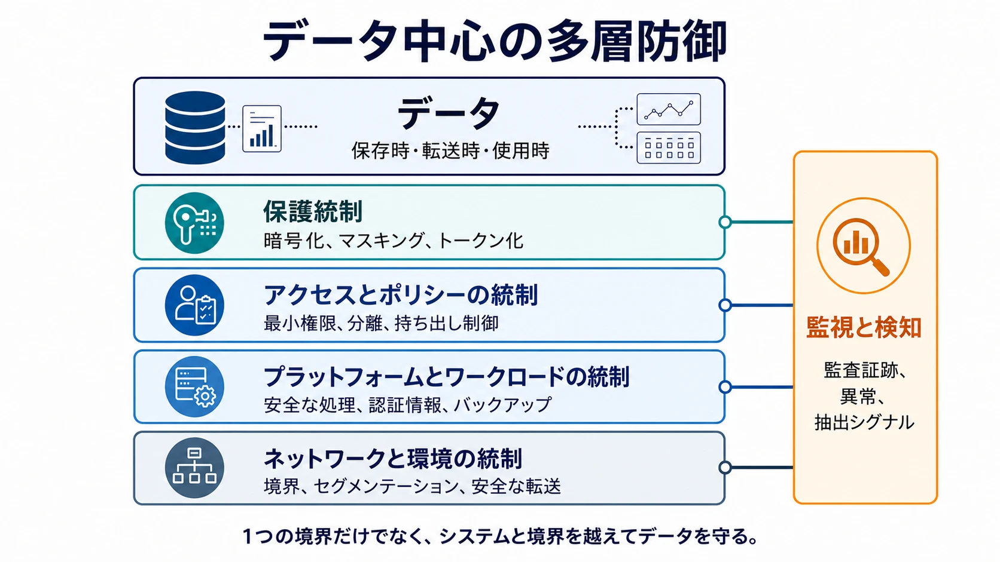

データセキュリティは、データがどこに存在し、どこへ移動していても、不正な開示、改変、破壊、漏えい、悪用から保護する領域です。中心となる問いは、**システム、チーム、クラウド、地域、パートナー、分析環境、AI ワークロードの境界を越えるデータを、どのように適切に保護し続けるか**です。

機密性は開示先を制限し、完全性は不正な変更から守り、可用性は必要なときにデータと復旧手段を利用可能にし、真正性は生成元と操作への確信を支えます。機密性（Confidentiality）、完全性（Integrity）、可用性（Availability）の 3 要素は、それぞれの英語の頭文字を取って CIA と呼ばれます。ただし、実効的なセキュリティは CIA の 3 要素だけで機械的に分類せず、データライフサイクルと現実的な脅威を中心に設計します。

## データ中心の境界

現代のデータが 1 つのシステム内に留まることはほとんどありません。データは、業務データベース、分析プラットフォーム、オブジェクトストレージ、SaaS、バックアップ、パートナー環境、AI システムへコピーされます。1 つのデータベースやネットワーク境界だけを守っても、別のコピーや転送経路は露出したままです。

データ中心のセキュリティは、資産が境界を越えても保護を追従させます。多層防御、最小権限、影響範囲の縮小、侵害を前提とする考え方を組み合わせ、侵害を防ぎ、侵害された ID やコンポーネントが到達できる範囲を制限し、悪用を検知して、復旧能力を維持します。

重要な原則は、1 つのシステムの境界だけでなく、システムと境界を越えてデータを守ることです。

## 2 つの補完的なライフサイクル

データセキュリティには、関連しながら対象が異なる 2 つのライフサイクルがあります。**データライフサイクル**は、保護対象であるデータが収集、保存、処理、共有、バックアップ、削除されるまでを追います。**セキュリティ運用サイクル**は、リスクを理解し、保護手段を適用し、問題を検知し、保護された状態へ復旧するための反復的な活動を表します。前者はデータがどこにあり、何が起こり得るかを問い、後者はシステムや脅威が変化するなかで保護をどう維持するかを問います。

### データライフサイクル：保護要件が変わる場所

セキュリティ要件は、データの状態と越える境界によって変わります。保存されたオブジェクトを守る統制だけでは、クエリ結果、パートナー側のコピー、メモリ上に露出した値まで自動的には保護できません。

| ライフサイクルまたは状態 | 代表的な関心事                                                   |
| ------------------------ | ---------------------------------------------------------------- |
| 収集                     | 生成元の真正性、安全な取り込み、悪意ある入力、早期分類           |
| 保存                     | 暗号化、アクセス境界、分離、公開されたオブジェクトストレージ     |
| 処理                     | メモリ露出、一時コピー、ワークロード認証情報、信頼できないコード |
| 分析と AI                | 過剰アクセス、ノートブック、抽出、モデルの入力と出力             |
| 共有                     | 受領者側の統制、持ち出し経路、パートナー境界                     |
| バックアップとアーカイブ | 暗号化、特権アクセス、改変防止、復旧可能性                       |
| 削除                     | レプリカ、キャッシュ、バックアップ、残存する鍵と媒体             |

クラウドストレージ、ストリーム、ウェアハウス、レイクハウス、SaaS 分析、クリーンルーム、データプロダクト、クラウド間転送、AI 利用は、統制を適用する文脈であり、個別のセキュリティ分類ではありません。

### セキュリティ運用サイクル：保護を維持する方法

運用サイクルは、データ状態を並べた別の順序ではありません。データライフサイクルのすべての状態に適用する継続的な管理ループです。分類、リネージ、保存先、ワークロード、脅威が変われば、既存の統制を再評価して調整します。

- **理解と評価**では、重要なデータ、コピー、流れ、依存関係、機密性、露出、信頼境界、現実的な脅威を把握します。
- **保護と制御**では、暗号化、表現を変える技術、安全な保存と転送、最小権限、分離、管理された共有、持ち出し制限を適用します。
- **検知、対応、復旧**では、セキュリティ関連の活動を観測し、アクセスを封じ込め、認証情報と鍵をローテーションし、影響データを調査し、信頼できるコピーを復元して完全性を確認します。

このサイクルは、一度だけ進む手順ではなくフィードバックを生みます。検知やインシデントから未知のコピーや弱い境界が判明し、復旧テストからバックアップや鍵管理の不足が見つかり、新しいメタデータによって分類と取り扱いが変わります。制御活動で利用する ID と認可モデルの詳細は [アクセス制御](/ja/docs/acc/) で扱います。

## スコープ、脅威、隣接領域

2 つのライフサイクルは、データセキュリティが対象とする範囲を定めます。脅威モデリングは現実的な失敗経路に照らしてその範囲を検証し、隣接領域はデータセキュリティの下位領域になることなく、ポリシー、文脈、システム設計、専門的な統制を提供します。

### データ中心の脅威モデリング

データから始め、機微または事業上重要な資産、コピー、流れ、信頼境界を特定します。不正な読み取り・変更、誤開示、公開設定、認証情報侵害、権限昇格、内部不正、外部流出、ランサムウェア、バックアップ侵害、テナント間露出、第三者侵害、推論を検討し、予防・検知・復旧の統制へ対応付けます。

脅威モデリングは 2 つのライフサイクルを接続します。各データ状態における脅威を調べ、運用サイクルによって予防、検知、封じ込め、復旧できるかを検証します。

### 隣接領域との関係

| 領域                                                                                                             | 主な問い                                                         | データセキュリティとの関係                                                                  |
| ---------------------------------------------------------------------------------------------------------------- | ---------------------------------------------------------------- | ------------------------------------------------------------------------------------------- |
| データガバナンス                                                                                                 | 誰が意思決定を所有し、ポリシーと例外を管理し、遵守を示すか       | 要件と説明責任を定め、セキュリティが保護手段を運用します。                                  |
| [データプライバシー](/ja/docs/data/privacy/)                                                                     | 人に関する情報の処理は適切で、必要か                             | セキュリティの保護手段に依存しますが、利用の適切性はセキュリティだけでは判断できません。    |
| [アクセス制御](/ja/docs/acc/)                                                                                    | 誰または何が、どの操作を行えるか                                 | 保護手段の 1 つです。データセキュリティは暗号化、露出、監視、流出、完全性、復旧も扱います。 |
| [データ管理](/ja/docs/data/management/)                                                                          | データを信頼でき、利用可能で、持続可能な状態にするにはどうするか | セキュリティ上の保護要件が適用される、ライフサイクルと品質の実務を担います。                |
| [データアーキテクチャ](/ja/docs/data/data-architecture/) と [データエンジニアリング](/ja/docs/data/engineering/) | データシステムをどのように構成し、構築し、運用するか             | データセキュリティが必要な特性を定義・検証する対象となるシステムとフローを提供します。      |

## トピックページ









## まとめ

データセキュリティは、データライフサイクルを通じて状態が変化する資産を守り、継続的な運用サイクルによってその保護を維持します。2 つの視点を組み合わせることで、変化するデータ状態と、リスク評価、統制の適用、問題の検知、信頼できるデータの復旧に必要な活動を接続します。
