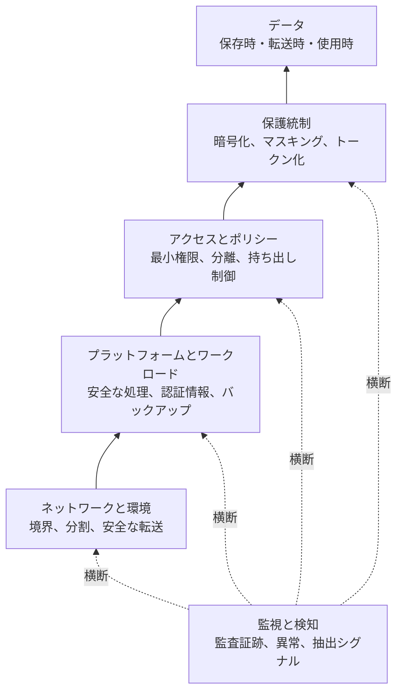
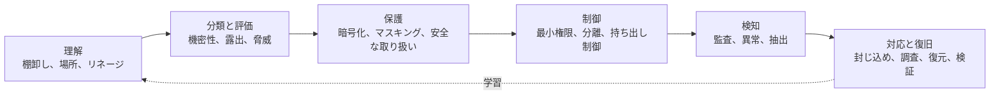

データセキュリティは、データがどこに存在し、どこへ移動していても、不正な開示、改変、破壊、漏えい、悪用から保護する領域です。中心となる問いは、**システム、チーム、クラウド、地域、パートナー、分析環境、AI ワークロードの境界を越えるデータを、どのように適切に保護し続けるか**です。

機密性は開示先を制限し、完全性は不正な変更から守り、可用性は必要なときにデータと復旧手段を利用可能にし、真正性は生成元と操作への確信を支えます。ただし、実効的なセキュリティは CIA の 3 要素だけで機械的に分類せず、データライフサイクルと現実的な脅威を中心に設計します。

## データ中心の境界

現代のデータは、ウェアハウス、レイクハウス、オブジェクトストレージ、ノートブック、キャッシュ、一時ファイル、抽出データ、分析ツール、バックアップ、SaaS、パートナー環境、AI システムへコピーされます。1 つのデータベースやネットワーク境界だけを守っても、別のコピーや転送経路は露出したままです。

多層防御、最小権限、影響範囲の縮小、侵害を前提とする考え方を組み合わせ、システムと境界を越えてデータを守ります。

## 理解から復旧まで

重要なデータとコピーを理解し、機密性・重要度・脅威を分類・評価し、暗号化などで保護し、最小権限と持ち出し制限で経路を制御し、異常を検知して、封じ込めと復旧を行います。ID と認可モデルの詳細は [アクセス制御](/ja/docs/acc/) で扱います。

## ライフサイクル全体のセキュリティ

| 状態         | 代表的な関心事                                         |
| ------------ | ------------------------------------------------------ |
| 収集         | 生成元の真正性、安全な取り込み、悪意ある入力、早期分類 |
| 保存         | 暗号化、アクセス境界、分離、公開ストレージ             |
| 処理         | メモリ露出、一時コピー、ワークロード認証情報           |
| 分析と AI    | 過剰アクセス、ノートブック、抽出、モデル入出力         |
| 共有         | 受領者統制、持ち出し経路、パートナー境界               |
| バックアップ | 暗号化、特権アクセス、改変防止、復旧可能性             |
| 削除         | レプリカ、キャッシュ、バックアップ、残存鍵             |

## 軽量な脅威モデリング

データから始め、機微または事業上重要な資産、コピー、流れ、信頼境界を特定します。不正な読み取り・変更、誤開示、公開設定、認証情報侵害、権限昇格、内部不正、外部流出、ランサムウェア、バックアップ侵害、テナント間露出、第三者侵害、推論を検討し、予防・検知・復旧の統制へ対応付けます。

## 隣接領域との境界

- **データガバナンス**は所有、ポリシー、意思決定権、例外、証跡を定めます。セキュリティは保護手段を実装・運用します。
- [データプライバシー](/ja/docs/data/privacy/) は人に関する情報の処理が適切かを判断します。強いセキュリティだけで不適切な利用を正当化できません。
- [アクセス制御](/ja/docs/acc/) は誰または何が操作できるかを定めます。データセキュリティは暗号化、露出、監視、流出、完全性、復旧も扱います。
- [データ管理](/ja/docs/data/management/)、 [データアーキテクチャ](/ja/docs/data/data-architecture/)、 [データエンジニアリング](/ja/docs/data/engineering/) は、保護対象となるライフサイクル、構造、実装を扱います。

## トピックページ









## まとめ

データセキュリティは、データを理解・分類し、多層の保護と制御を適用し、アクセスと移動を観測し、封じ込めと復旧の能力を維持します。
