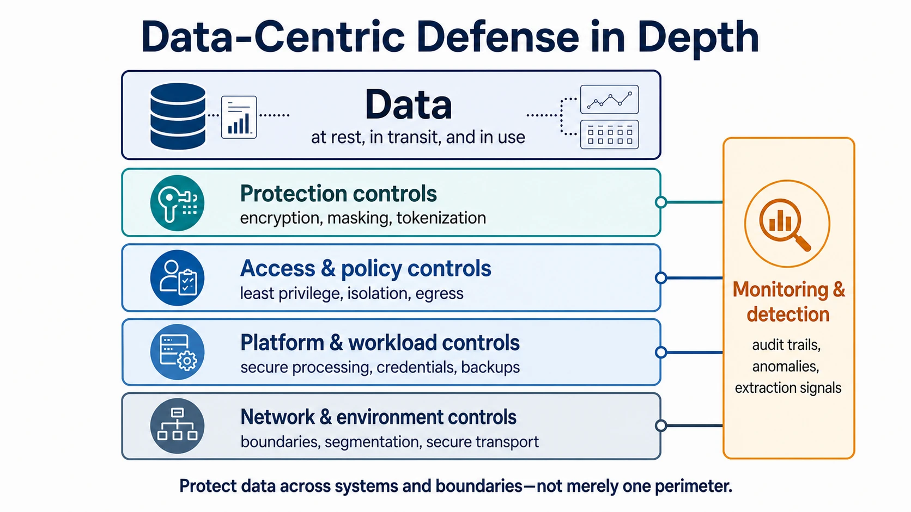
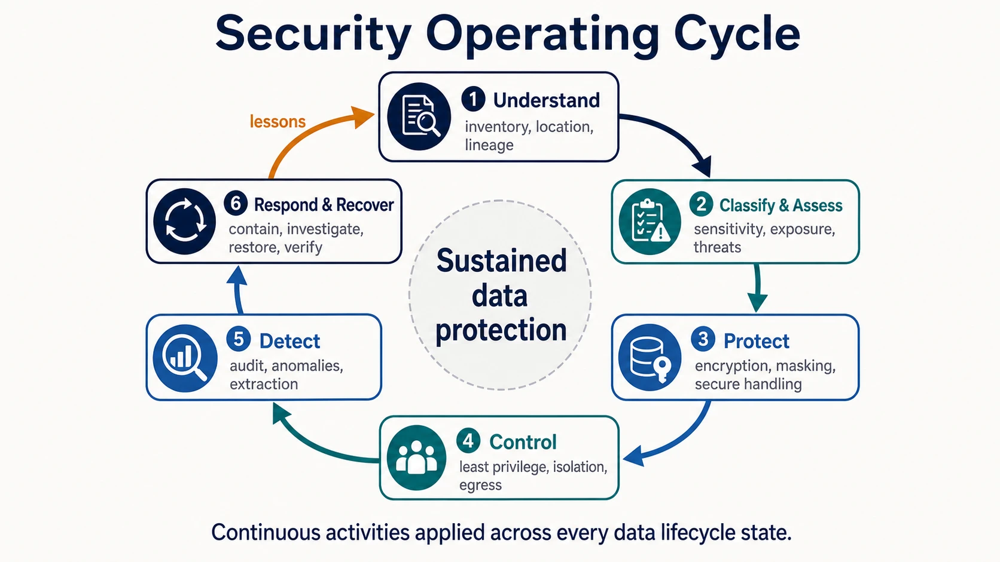

Data security protects data against unauthorized disclosure, alteration, destruction, leakage, and misuse wherever it resides or moves. Its central question is: **How do we maintain appropriate protection as data crosses systems, teams, clouds, regions, partners, analytics environments, and AI workloads?**

Confidentiality limits disclosure, integrity protects against unauthorized or undetected change, availability keeps data and recovery capabilities usable, and authenticity establishes confidence in sources and actions. These objectives are foundations, but effective security follows the data lifecycle and realistic threats rather than organizing everything mechanically around the CIA triad.

## A Data-Centric Boundary

Modern data rarely remains in one system. It is copied across operational databases, analytical platforms, object storage, SaaS services, backups, partner environments, and AI systems. Protecting one database or network perimeter therefore leaves other copies and transfer paths exposed.

Data-centric security follows the asset across boundaries. It combines defense in depth, least privilege, blast-radius reduction, and assume-breach thinking: prevent compromise, limit what a compromised identity or component can reach, detect misuse, and preserve recovery.

The principle is to protect data across systems and boundaries, not merely the perimeter around one system.

## Two Complementary Lifecycles

Data security has two related but distinct lifecycle views. The **data lifecycle** follows the protected asset as it is collected, stored, processed, shared, backed up, and deleted. The **security operating cycle** describes the recurring activities used to understand risk, apply safeguards, detect failure, and restore protection. The first asks where the data is and what can happen to it; the second asks how protection is maintained as systems and threats change.

### The Data Lifecycle: Where Protection Changes

Security requirements change with the state of the data and the boundary it is crossing. A control that protects a stored object does not automatically protect a query result, a partner copy, or a value exposed in memory.

| Lifecycle or state | Representative concerns                                                      |
| ------------------ | ---------------------------------------------------------------------------- |
| Collection         | Source authenticity, secure ingestion, malicious input, early classification |
| Storage            | Encryption, access boundaries, isolation, exposed object stores              |
| Processing         | Memory exposure, temporary copies, workload credentials, untrusted code      |
| Analytics and AI   | Excessive access, notebooks, extracts, model inputs and outputs              |
| Sharing            | Recipient controls, egress paths, partner boundaries                         |
| Backup and archive | Encryption, privileged access, immutability, recoverability                  |
| Deletion           | Replicas, caches, backups, residual keys and media                           |

Cloud storage, streams, warehouses, lakehouses, SaaS analytics, clean rooms, data products, cross-cloud transfers, and AI consumption are contexts in which controls operate—not separate security taxonomies.

### The Security Operating Cycle: How Protection Is Sustained

The operating cycle is not another sequence of data states. It is a continuous management loop applied across every state in the data lifecycle. A change in classification, lineage, destination, workload, or threat can cause the cycle to reassess and adjust existing controls.

- **Understand and assess** important data, copies, flows, dependencies, sensitivity, exposure, trust boundaries, and credible threats.
- **Protect and control** data and credentials with encryption, representation-changing techniques, secure storage and transport, least privilege, isolation, controlled sharing, and egress restrictions.
- **Detect, respond, and recover** by observing security-relevant activity, containing access, rotating credentials and keys, investigating affected data, restoring trusted copies, and validating integrity.

The cycle produces feedback rather than a one-time progression. Detection and incidents reveal unknown copies or weak boundaries; recovery tests expose gaps in backups or key management; new metadata can change classification and handling. Detailed identity and authorization models used within the Control activity belong in [Access Control](/docs/acc/).

## Scope, Threats, and Relationships

The two lifecycle views define the coverage of Data Security. Threat modeling tests that coverage against credible failure paths, while neighboring disciplines provide policy, context, system design, and specialized controls without becoming subdomains of Data Security.

### Data-Focused Threat Modeling

Start with the data. Identify sensitive or business-critical assets, enumerate copies and flows, mark trust boundaries, and ask how confidentiality, integrity, availability, or authenticity could fail. Relevant threats include unauthorized reading or modification, accidental disclosure, public exposure, credential compromise, privilege escalation, insiders, exfiltration, ransomware, backup compromise, cross-tenant exposure, third-party compromise, and inference from protected data. Prioritize credible paths by impact and ease, then map preventive, detective, and recovery controls.

Threat modeling connects the two lifecycles: it examines threats at each data state and tests whether the operating cycle can prevent, detect, contain, and recover from them.

### Relationships with Neighboring Disciplines

| Discipline                                                                                         | Primary question                                                                  | Relationship to data security                                                                                                    |
| -------------------------------------------------------------------------------------------------- | --------------------------------------------------------------------------------- | -------------------------------------------------------------------------------------------------------------------------------- |
| Data Governance                                                                                    | Who owns decisions, sets policy, manages exceptions, and demonstrates compliance? | Establishes requirements and accountability; security operates safeguards.                                                       |
| [Data Privacy](/docs/data/privacy/)                                                                | Is processing information about people appropriate and necessary?                 | Depends on safeguards, but appropriate use cannot be decided by security alone.                                                  |
| [Access Control](/docs/acc/)                                                                       | Who or what may perform which action?                                             | Provides one protection mechanism; security also covers encryption, exposure, monitoring, exfiltration, integrity, and recovery. |
| [Data Management](/docs/data/management/)                                                          | How does data remain trustworthy, usable, and sustainable?                        | Operates lifecycle and quality practices on which security imposes safeguards.                                                   |
| [Data Architecture](/docs/data/data-architecture/) and [Data Engineering](/docs/data/engineering/) | How are data systems structured, built, and operated?                             | Provide systems and flows whose security properties are defined and verified here.                                               |

## Topic Pages









## Summary

Data security protects the asset as its state changes throughout the data lifecycle and sustains that protection through a continuous operating cycle. Together, these views connect changing data states with the activities needed to assess risk, apply controls, detect failure, and recover trusted data.
