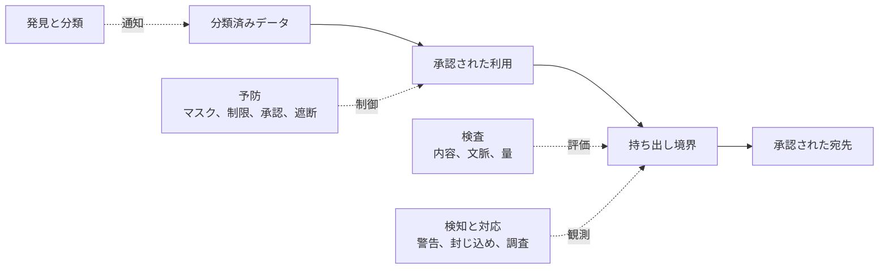

データ損失防止（DLP）は、正規に見える経路からの不正開示を抑えます。誤共有、公開クラウドストレージ、侵害された認証情報、内部不正、大量クエリ、SaaS 連携、端末、パートナー交換、分析や AI の出力が流出経路になります。

[アクセス制御](/ja/docs/acc/) は操作の許可を判断します。DLP はさらに、許可された操作の量、宛先、表現、連続性が許容できない開示を生まないかを判断します。

- **誤漏えい**: 宛先間違い、公開リンク、ノートブック、機微なログ、管理外ファイル
- **クラウドと SaaS**: 公開オブジェクト、緩い共有、未承認コネクタ、広すぎる外部アプリ権限
- **クエリ抽出**: 小さなクエリの反復、広い絞り込み、集約からの推論、大量エクスポート
- **端末**: ダウンロード、画面取得、クリップボード、印刷、外部媒体、キャッシュ
- **共有境界**: 合意を越えた保持、結合、再配布。詳細は [データ共有](/ja/docs/data/sharing/) で扱います。
- **侵害ワークロード**: サービス ID、パイプライン、AI ツールによる高速な取得と転送

発見と分類、項目の最小化、エクスポート・宛先制限、追加承認、環境分離、内容検査、行動検知を組み合わせます。暗号化、圧縮、変換、未知形式は単純な検査を回避するため、ID、分類、リネージ、クエリ、転送、端末の文脈も使います。

一律遮断ではなく、低リスクは許可し、曖昧な操作には警告や理由を求め、高影響の転送を遮断または承認対象にします。AI ではプロンプト、検索結果、ツール出力、応答、トレース、評価データ、提供者側の保持も確認します。個人情報の適切な利用は [データプライバシー](/ja/docs/data/privacy/) に属します。

## まとめ

DLP は許可済みの接続も開示経路になり得ると捉え、データ理解、露出最小化、宛先制御、文脈検査、行動検知、迅速な封じ込めを組み合わせます。
