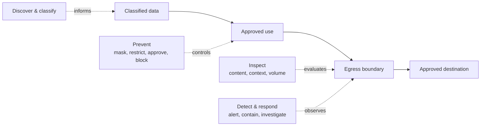

Data loss prevention (DLP) reduces unauthorized disclosure through channels that can appear legitimate. Data may leave through accidental sharing, public cloud storage, compromised credentials, insiders, bulk queries, SaaS integrations, endpoints, partner exchanges, or analytics and AI outputs.

Authentication and authorization remain necessary, but an authorized session can still become an exfiltration path. [Access Control](/docs/acc/) determines whether an action is allowed; DLP also asks whether the volume, destination, representation, and sequence of allowed actions create unacceptable disclosure.

## Loss and Exfiltration Paths

- **Accidental leakage:** wrong recipients, public links, notebook output, sensitive logs, or unmanaged files.
- **Cloud and SaaS exposure:** public object stores, permissive sharing, unsanctioned connectors, and broad third-party scopes.
- **Query extraction:** repeated small queries, broad filters, aggregate inference, or exports that reconstruct a dataset.
- **Endpoints:** downloads, screenshots, clipboard, printing, removable media, and local caches.
- **Partner boundaries:** retention, combination, or redistribution beyond agreed controls. See [Data Sharing](/docs/data/sharing/).
- **Compromised workloads:** service identities, pipelines, and AI tools retrieving and forwarding data at machine speed.

Discovery identifies protected data. Preventive controls minimize fields, restrict exports and destinations, require approvals, isolate environments, and transform values. Egress controls constrain networks, storage, APIs, email, collaboration tools, and cross-account or cross-region movement. Content inspection helps, but encrypted, compressed, transformed, or novel data may evade it.

Behavioral detection looks for unusual query breadth, velocity, destinations, repeated extraction, mass downloads, or role-inconsistent actions. Combine identity, classification, lineage, query, transfer, and endpoint context.

Blanket blocking can drive legitimate work to unmanaged channels. Use risk tiers: allow routine low-risk flows, warn or request justification for ambiguous cases, and block or approve high-impact transfers. DLP remains defense in depth with least privilege, minimization, controlled interfaces, monitoring, contracts, and response.

For AI workloads, consider prompts, retrieval results, tool outputs, responses, traces, evaluation datasets, and provider retention. Appropriate processing of personal information remains with [Data Privacy](/docs/data/privacy/).

## Summary

DLP treats authorized connectivity as a potential disclosure path and combines data knowledge, minimized exposure, controlled destinations, contextual inspection, behavioral detection, and rapid containment.
