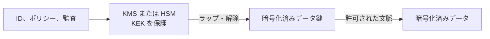

暗号化は正当な鍵なしではデータを読めない状態にします。保存時と転送時を保護し、使用時の露出も限定できます。重要なのは設定の有無ではなく、平文がどこに現れ、誰が鍵を使え、鍵のライフサイクルをどう制御するかです。

暗号化は機密性を守りますが、正当なアプリケーションの漏えい、過剰権限のクエリ、アクセス可能なコピーの破壊までは防げません。

- **保存時**: ファイル、オブジェクト、ディスク、スナップショット、抽出、アーカイブ、バックアップを保護します。
- **転送時**: API、パイプライン、ストリーム、複製、ダウンロード、パートナー接続を暗号化し、接続先も認証します。
- **使用時**: メモリと計算環境での露出を、分離、平文範囲の最小化、安全な実行環境、機密コンピューティングで抑えます。

共通鍵暗号は大量データに効率的です。公開鍵暗号は鍵共有や署名に使われ、両者は通常組み合わせます。エンベロープ暗号化では DEK でデータを暗号化し、KEK で DEK を保護します。

KMS は鍵、ポリシー、操作、バージョン、監査を管理します。HSM は強固な暗号境界を提供します。鍵をデータから分離し、可能なら鍵管理と日常のデータ管理も分離し、復号をワークロード、環境、目的、文脈で制限します。

生成、有効化、利用、保存、ローテーション、失効、保管、破棄を管理します。プロバイダー管理鍵は運用負荷を下げ、顧客管理鍵は制御を増やす一方で可用性と復旧の責任も増やします。暗号学的消去は、すべての鍵コピーを制御でき、平文や別コピーが残らない場合に限り削除として成立します。

## まとめ

暗号化はチェック項目ではなくシステム特性です。対象の脅威と状態を定め、平文を最小化し、鍵階層を設計し、鍵利用を制限・監視し、ローテーションと復旧をテストします。
