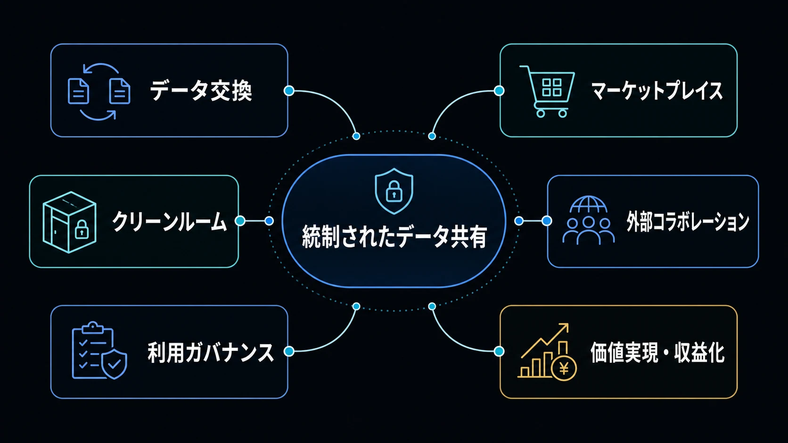
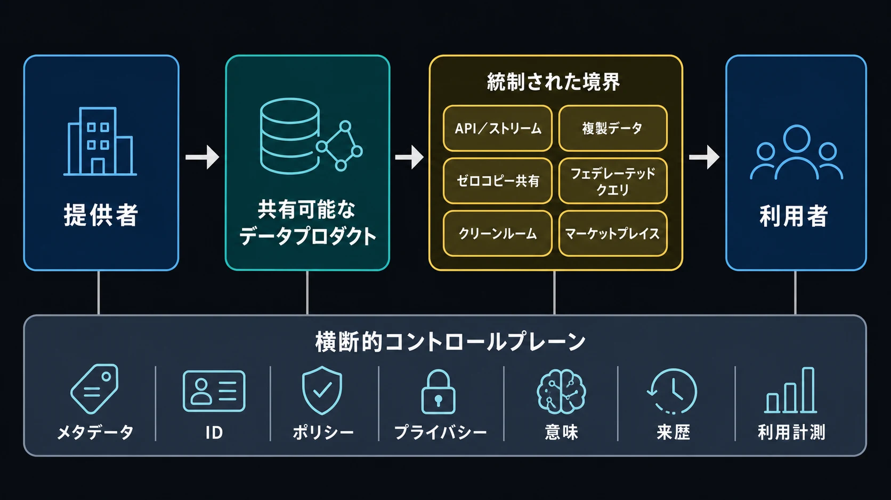

データ共有（Data Sharing）は、統制されたデータを、そのデータを生み出したシステム、チーム、組織の外部から利用できるようにする能力です。別の主体がデータを安全に発見・理解・利用・交換し、共同で活用し、場合によっては収益化できる状態へ変えます。

データ領域において、共有は **価値創出層（Value Layer）** に位置づけられます。 [データ分析](/ja/docs/data/analytics/) がデータを解釈して価値を生み出すのに対し、データ共有はその価値を組織やエコシステムの境界を越えて広げます。目的は単にバイト列を移動することではありません。データが境界を越えた後も、意味、信頼、制御、説明責任を維持することです。

## データ共有が重要な理由

多くのデータは、所有されることよりも利用されることで価値を持ちます。プロダクトチームが運用シグナルを分析ドメインに提供することもあれば、メーカーがサプライヤーと需要予測を交換することもあります。銀行と小売企業が顧客単位の記録を開示せずに集計結果を算出したり、行政機関がエコシステム全体で再利用できるデータを公開したりする場合もあります。

それぞれが異なる境界を越えますが、接続性だけでは不十分です。利用者には、利用可能なインターフェースとデータを解釈するための十分な文脈が必要です。提供者には、アクセス、許可された用途、変更、提供終了を統制する手段が必要です。双方が、品質、来歴、実際の利用状況を確認できなければなりません。

したがって、データ共有は次の問いに答えます。

> 統制されたデータが境界を越えた後も、有用で、理解可能で、制御され、価値ある状態を保つにはどうすればよいか。

## データ共有とは何か

共有に隣接する複数の能力は重なり合いますが、同義ではありません。

| 能力                   | 主な目的                                                                       | 代表的な境界または結果                                            |
| ---------------------- | ------------------------------------------------------------------------------ | ----------------------------------------------------------------- |
| データ統合             | システム、パイプライン、統合データモデルを構築するためにデータを移動・結合する | 別の技術システムへ維持されるデータフロー                          |
| データアクセス         | 認可された利用者による問い合わせや取得を可能にする                             | 権限とアクセス経路                                                |
| データ共有             | データを中心とした、統制された提供者と利用者の関係を確立する                   | 利用可能な資産、インターフェース、ポリシー、運用上の責任          |
| データ交換             | 共有関係に必要な転送またはリモートアクセスを実行する                           | プロトコル、ファイル配信、API、ストリーム、クエリインターフェース |
| データコラボレーション | 合意された技術・ガバナンス境界内で複数主体が価値を導き出す                     | 共同分析、協調した意思決定、許可された出力                        |

統合パイプラインは共有を実装でき、アクセス制御は常に統制された共有の一部です。しかし、どちらも単独では十分ではありません。共有ではさらに、当事者、提供対象、その意味、許可される用途、期待できるサービス、関係の変更・終了方法を定義します。

利用可能な単位は、多くの場合 [データプロダクト](/ja/docs/data/metadata/data-products/) です。これはオーナー、インターフェース、契約、品質期待値、ライフサイクルを持つデータセット、ストリーム、API、モデル、分析サービスなどを指します。共有資産をプロダクトとして扱うことで、利用者を暗黙知に依存させず、境界を明示できます。

## データ共有の全体像

データ共有の全体像は、相互に関連する6つの領域から構成されます。

1. **データ交換メカニズム**は、データやクエリを境界の向こうへ運びます。
2. **データマーケットプレイス**は、発見、申請、提供、計測を支えます。
3. **データクリーンルーム**は、機密データを用いた共同作業を制約します。
4. **外部コラボレーションモデル**は、独立した複数主体の協調方法を定めます。
5. **利用ガバナンスとライセンス**は、利用者ができることを定義し、執行します。
6. **価値実現と収益化**は、利用を測定可能な成果に結び付けます。

これらは6つの独立した製品ではありません。マーケットプレイスで承認された申請をゼロコピーのテーブル共有で提供し、その資産にライセンスと品質契約を付与し、利用テレメトリを監査と課金の両方に使う場合があります。1つのプラットフォームが複数の機能を実装する場合でも、アーキテクチャ上の責務は区別すべきです。

## データ交換メカニズム

交換メカニズムは、データを技術的に利用可能にする方法を決めます。プロトコル一覧ではなく、共有関係の制約から考えることが有効です。

| メカニズム                                       | 移動モデル               | 鮮度と対話性                             | 適する状況                                               |
| ------------------------------------------------ | ------------------------ | ---------------------------------------- | -------------------------------------------------------- |
| バッチまたはファイル交換                         | コピー、通常はプッシュ   | 定期スナップショット                     | 可搬性、単純な配信、切断された環境での処理が重要         |
| API                                              | リクエスト／レスポンス   | オンデマンド                             | 限定されたレコード、操作、ドメインインターフェースが必要 |
| イベントまたはストリーミング                     | 継続的なプッシュ／プル   | 準リアルタイムのイベントや状態変化       | 利用者が変化に反応し、ストリームの意味を管理できる       |
| レプリケーション                                 | 管理されたコピー         | 定期から準リアルタイム                   | ローカル性能、回復性、エンジン独立性がコピーを正当化する |
| データベースまたはウェアハウス共有               | 多くはリモート／ライブ   | クエリ時または提供者管理の更新           | エクスポートせず統制されたオブジェクトを公開できる       |
| オブジェクトストレージまたはオープンテーブル共有 | コピーまたは直接アクセス | スナップショット、増分、ライブメタデータ | 大規模分析データでエンジン選択と保存の可搬性が必要       |
| クエリフェデレーション                           | 原則として永続コピーなし | クエリ時                                 | データを所有者側に残し、リモート実行を許容できる         |

これらは、複数のアーキテクチャ上の観点で比較できます。

- **コピーと非コピー。** コピーはワークロードを分離し、実行時の提供者依存を減らせますが、同期、削除、所在地、取消しの課題を生みます。「ゼロコピー」は共有層で管理対象の複製を作らないことを意味し、クライアントがキャッシュしないことや、クエリ時にデータが転送されないことを意味しません。
- **バッチと継続処理。** バッチは明確な配信時点を作り、照合しやすくします。ストリームは遅延を減らしますが、イベント契約、順序、再生、継続運用の判断が必要です。
- **プッシュとプル。** プッシュでは提供者が配信時期を制御し、プルでは利用者が取得時期を制御します。APIやプロトコルが通知と取得の両方を支える場合もあります。
- **データプレーンとコントロールプレーン。** データプレーンはファイル、レコード、イベント、クエリ結果を転送します。コントロールプレーンは発見、ID、権利付与、ポリシー、メタデータ、認証情報、監査を管理します。持続可能なアーキテクチャには両方が必要です。
- **密結合と相互運用性。** プラットフォームネイティブの共有は、対応環境内で強い統合とガバナンスを提供できます。オープン形式やプロトコルはエンジンやクラウドをまたぐ選択肢を広げますが、ID、意味、ポリシーも相互運用できなければ十分ではありません。
- **集中型とフェデレーテッド型。** 中央ゲートウェイは一貫した制御を容易にします。分散した公開はドメインや組織の所有権を維持しますが、共通の識別子、メタデータ、ポリシー、信頼規約を必要とします。

代表的な技術は異なる層を具体化します。 [Delta Sharing](https://github.com/delta-io/delta-sharing) は、共有された分析データへのアクセスを受領者に付与するオープンプロトコルです。 [OpenSharing](https://opensharing.io/) は、このプロトコルモデルを発展させ、構造化テーブル、ファイルボリューム、モデル、エージェントスキルの共有に共通の階層とアクセスパターンを定義する新しい取り組みです。資産境界をデータセット以外へ広げますが、普遍的に実装済みと仮定せず、発展途上の仕様とエコシステムとして評価すべきです。 [Apache Iceberg REST Catalog仕様](https://iceberg.apache.org/rest-catalog-spec/) は、安全なテーブルアクセスのための認証情報発行とリモート署名を含むカタログインターフェースを定義します。Apache Iceberg自体はオープンテーブル形式であり、完全な共有ガバナンスモデルではありません。

適切なメカニズムとは、許容できる信頼前提の下で、鮮度、規模、機密性、相互運用性、取消し、運用コストの要件を満たすものです。多くの組織は、1つのプロダクト・ポリシー面の背後で複数のメカニズムを利用します。

## データマーケットプレイス

データマーケットプレイスは、共有可能なデータ資産を取り巻く発見、アクセス、ガバナンス、取引の層です。提供者のオファーと利用者のニーズを結び付け、検索後の関係まで扱います。

- **社内マーケットプレイス**は、チームやドメインをまたぐ統制された再利用を支えます。
- **クラウドまたはプラットフォームのマーケットプレイス**は、顧客や参加者へのデータプロダクト配布を支えます。
- **業界・エコシステム型の交換基盤**は、共通の目的やルールを持つ参加者を結びます。
- **公共・オープンデータポータル**は、公開ライセンスや利用条件の下で広範な発見とアクセスを可能にします。

カタログは資産を一覧化して説明します。マーケットプレイスは通常、発見から、アクセス申請、条件評価、権利付与の承認、交換メカニズムのプロビジョニング、利用観測、更新・取消し、場合によっては課金までの経路を加えます。提供、条件、運用上の制御を持たない洗練された画面は、依然としてカタログです。

マーケットプレイスのメタデータは、プロダクト説明、オーナー、分類、契約、サービス期待値、利用可能な配布形態、許可用途を結び付けるべきです。 [DCAT 3](https://www.w3.org/TR/vocab-dcat-3/) は、データセット、データサービス、カタログ、配布形態の相互運用可能な記述に関するW3C勧告です。カタログの相互運用を支えますが、権利付与、決済、ポリシー執行そのものは提供しません。

利用計測はマーケットプレイスのループを閉じます。提供者は採用状況と有用性を把握し、利用者はサービス状態を確認し、ガバナンス担当者はアクセスをレビューし、商用運営者は購読や使用量を計測できます。計測データとその利用目的も統制対象です。

## データクリーンルーム

データクリーンルームは、機密データを使った共同作業のための、制御されたアーキテクチャとガバナンスのパターンです。参加者は境界のある環境にデータを提供し、許可された分析を実行し、相互の基礎レコードへ自由にアクセスすることなく、制約された結果を受け取ります。

代表例には、オーディエンス重複・キャンペーン効果の測定、不正調査、医療・研究分析、通常の方法では生データを統合できない組織間の共同計画があります。ワークフローには、承認済みのデータセット、参加者、目的、クエリテンプレート、プライバシーを考慮したID照合、列・行・関数制限、集計しきい値、小規模グループの抑制、出力検査、ログ、リネージ、エクスポート・保持制御などが含まれます。

「クリーンルーム」は1つのプライバシー技術を指す名称ではありません。脅威モデルに応じて、通常の分離とアクセス制御、信頼実行環境、コンフィデンシャルコンピューティング、差分プライバシー、秘密計算、準同型暗号、またはそれらの組み合わせを利用できます。 [NISTのプライバシー強化暗号ガイダンス](https://csrc.nist.gov/Projects/pec) は秘密計算などを説明し、 [NIST SP 800-226](https://csrc.nist.gov/pubs/sp/800/226/final) は差分プライバシー保証の評価指針を提供します。

各技術が保護する対象は異なります。信頼実行環境は処理中のデータを隔離できますが、許可された結果が情報を明らかにしすぎるかは判断しません。差分プライバシーは公開統計からの情報漏えいを制限できますが、参加者の本人性や契約条件を確立しません。秘密計算は個々の入力を他者に開示せず共同計算できますが、あらゆる計算を安全または実用的にするものではありません。

技術的制御が明示的な脅威モデルに合致し、許可される入力、計算、出力、運営者、証跡をガバナンスが定めて初めて、クリーンルームは信頼できます。名称だけでプライバシーが保証されるわけではありません。

## 外部コラボレーションモデル

独立した組織間の共有では、単一の参加者がID、インフラ、ポリシー、意味、是正を自動的に支配しないため、アーキテクチャが変わります。

| モデル                           | 関係                                             | アーキテクチャ上の重点                               |
| -------------------------------- | ------------------------------------------------ | ---------------------------------------------------- |
| 提供者から利用者                 | 1つの提供者が1つ以上の利用者へ提供               | プロダクト契約、権利付与、配信、サポート、取消し     |
| パートナー間交換                 | 2者が補完的なデータを交換                        | 相互条件、ID、照合、責任                             |
| 複数主体のコラボレーション       | 複数者が共通成果に貢献                           | 中立的調整、貢献ルール、出力制御                     |
| フェデレーテッド分析             | 計算を分散データへ移動、または結果を統合         | クエリ計画、ローカル執行、結果の意味、信頼           |
| 組織横断データプロダクト         | 共同運営プロダクトを合意済み利用者へ提供         | 共同所有、ライフサイクル、サービスレベル、変更管理   |
| 業界エコシステム／データスペース | 共通ルールと相互運用サービスを通じて参加者が共有 | フェデレーテッドID、ポリシー、意味、来歴、ガバナンス |
| 官民コラボレーション             | 公的・民間主体が権限またはデータを組み合わせる   | 公益、透明性、ライセンス、法域、公平性               |

このようなモデルでは、**分散型オーナーシップ**とは参加者が自身のデータと制御に責任を持ち続けることです。**相互運用性**はファイル形式だけでなく、ID、カタログメタデータ、契約、ポリシー、意味まで含む必要があります。**信頼**については、どの運営者、ハードウェア、参加者、検証者を何のために信頼するかを明示します。**法域と責任境界**では、インシデント、訂正、撤回、データ主体や契約上の義務への対応者を決めます。

データスペースは、この広い協調に向けた重要な新興モデルです。単一の中央データプールではなく、共有ガバナンスと相互運用可能な構成要素による複数主体のデータ利用を目指します。アーカイブされた欧州の [Data Spaces Support Centre Blueprint v2.0](https://archive.dssc.eu/space/BVE2/1071251457/Data+Spaces+Blueprint+v2.0+-+Home) は、DSSCの活動期間中に整理された概念と構成要素について、影響力のある一つの捉え方を保存しています。現在も保守されている仕様や、独立したデータスペース実装間の相互運用性を示すものではなく、設計の歴史的文脈を理解するための資料として参照するのが適切です。「データスペース」は、単一の普遍的プロトコルではなく、複数のアプローチの総称です。

関連概念はNotes with AIの既存ページで詳しく扱っています。 [データメッシュ](/ja/docs/data/metadata/data-mesh/) はドメイン指向の所有を、 [データプロダクト](/ja/docs/data/metadata/data-products/) は利用可能なインターフェースを、 [フェデレーテッドガバナンス](/ja/docs/data/metadata/federated-governance/) は分散ポリシーと説明責任を説明します。データ共有は、それらを再定義せず、交換・協調境界に適用します。

## 利用ガバナンスとライセンス

ガバナンスは公開後に追加する事務手続きではなく、共有アーキテクチャの一部です。統制された共有では「誰がアクセスできるか」だけでなく、次の問いに答える必要があります。

> 何の目的で、どの条件の下で、いつまで利用でき、利用者はそのデータで何をしてよいのか。

重要な制御には、認証・認可・権利付与、目的制限、データ分類、契約制限、利用・変更・帰属表示・再配布のライセンス、地理・所在地・法域の制限、保持期限、削除・返却、利用ログ、監査可能性、期限切れ、取消し、コピーや派生データの管理が含まれます。

技術的制御は一部の条件を執行できます。ゲートウェイはAPI呼び出しを認可し、クエリエンジンは行を絞り込み、クリーンルームは関数と出力を制約し、ストレージ認証情報には期限を設定できます。法的・契約的制御は、正当に受領したコピーを元のシステム外で利用する場合など、提供者が完全に観測・防止できない行動を統制します。どちらも他方を代替しません。

機械可読ポリシーは両者の接続を助けます。 [W3C ODRL Information Model](https://www.w3.org/TR/odrl-model/) は、許可、禁止、義務、当事者、資産、制約を表現します。これはポリシー表現標準であり、自動執行システムでも法的解釈の代替でもありません。執行には信頼できるメタデータ、判断点、ID、証跡が必要です。

取消しは共有開始前に設計すべきです。ライブクエリの権利は迅速に無効化できても、ダウンロード済みデータ、バックアップ、学習済みモデル、派生集計は残る可能性があります。契約、保持制御、リネージ、プロダクト設計で、成果物ごとの取消しの意味を定義する必要があります。

個人データを扱う場合、 [データプライバシー](/ja/docs/data/privacy/) が目的制限、最小化、保持を含む適法で責任ある処理の原則を提供します。認可だけで利用が適切になると仮定せず、この領域へ接続すべきです。

## 価値実現と収益化

組織がデータを共有する理由は、単独の主体やサイロでは生み出せない成果を得るためです。直接的価値には、整理されたデータセットや分析サービスのライセンス、継続アクセスの購読料、API・クエリ・レコード単位の従量課金、商用データプロダクト、マーケットプレイス収益があります。

間接的価値には、パートナー支援と統合時間の短縮、サプライチェーン計画と回復性の改善、共同意思決定、重複収集・照合の削減、プロダクトや顧客体験の改善、エコシステムのネットワーク効果、研究・イノベーションの加速があります。

したがって、データ収益化は必ずしもデータセットの販売を意味しません。メーカーが在庫状況を流通業者と共有すれば、アクセス料ではなく履行能力が改善します。社内マーケットプレイスは重複開発を減らし、意思決定を速めます。公共データサービスは、公開者が直接回収しない社会的・経済的価値を生み得ます。

持続可能な価値は利用者の成果に依存します。提供者は発見、利用開始、継続利用、サービス品質、利用者の負担、提供コスト、下流成果を測定する必要があります。理解されず、信頼されず、運用コストが高いデータでは、大量アクセスも価値の証拠になりません。信頼、品質、使いやすさ、予測可能な経済性はプロダクトの一部です。

## 統制されたデータ共有のアーキテクチャ

次の単純なモデルは、共有資産と境界を越えるメカニズムを分離します。

提供者は、明示されたプロダクト境界に責任を持ちます。交換・コラボレーション境界は、コピーの転送、ライブアクセス、制約された計算、複数サービスの調整を行います。利用者は、文脈と義務を伴うデータまたは結果を受け取ります。

横断的能力が共有関係を統制可能にします。**発見とメタデータ**はプロダクト、オーナー、インターフェース、品質、配布形態を示します。**IDとアクセス**は信頼ドメインをまたぐ参加者と権利を確立します。**契約とポリシー**はサービス期待値と許可用途を定めます。**プライバシーとセキュリティ**はリスクに応じて人、データ、処理、出力を守ります。**意味**は異なるモデルや組織間で共通理解を維持します。**リネージと来歴**は起源、変換、バージョン、派生成果物を示します。**オブザーバビリティと利用計測**は運用、監査、改善、課金を支えます。

コントロールプレーンとデータプレーンの区別は特に重要です。保存・プロトコル層がオープンでも、IDやポリシー層が閉じている場合があります。逆に、独自転送を使いながら可搬なメタデータと契約を公開する場合もあります。相互運用性はエンドツーエンドで評価しなければなりません。

## 共有モデルの選び方

万能なモデルはありません。次の問いで主要な制約を明らかにします。

| 判断上の問い                         | 代表的なパターンへの示唆                                                                                                 |
| ------------------------------------ | ------------------------------------------------------------------------------------------------------------------------ |
| 利用者は誰か                         | 社内ではネイティブなプロダクト、パートナー間では組織横断IDと契約、エコシステムでは相互運用可能な分散サービスが重要です。 |
| データを物理的に移動する必要があるか | 切断処理やローカル性能にはファイル・複製、コピーの制御・鮮度問題が大きければライブ共有・フェデレーションを検討します。   |
| どの程度の鮮度が必要か               | 定期判断にはスナップショット、変化への反応にはストリーム、最新分析にはライブクエリが適します。                           |
| 機密・規制対象データか               | 項目を最小化し、ポリシー対応アクセスを適用し、過度な公開になる場合はクリーンルームや派生結果を検討します。               |
| 生データを公開できるか               | できなければ、行レベルデータではなくAPI、集計、モデル出力、制約クエリ、プライバシー保護結果を提供します。                |
| どの程度の相互運用性が必要か         | 複数プラットフォームにまたがる場合はオープン形式・プロトコル・語彙・可搬なIDを選び、実装互換性を検証します。             |
| ポリシーとIDを誰が制御するか         | 集中型ではゲートウェイ、分散型では共通信頼、識別子、ポリシーマッピング、ローカル執行が必要です。                         |
| 計測・収益化が必要か                 | マーケットプレイスのワークフロー、計量、プロダクト分析、権利ライフサイクル、商用条件を加えます。                         |
| アクセス取消し時に何が起きるか       | ライブアクセスは止めやすく、コピー・派生物には期限、削除義務、リネージ、証跡が必要です。                                 |
| 参加者間の信頼前提は何か             | 脅威モデルに応じて直接共有、中立運営者、コンフィデンシャルコンピューティング、暗号技術、公開検証を選びます。             |

実務では、成果に必要な最小限のデータと最も弱い信頼前提から選定を始めます。その後、図の上だけでなく通常運用において、サービス、コスト、使いやすさ、取消し要件を満たせるかを検証します。

## データエコシステムとのつながり

データ共有は、データ知識体系の他領域に支えられる境界能力です。

- [データ分析](/ja/docs/data/analytics/) は、利用者がアクセス可能なデータを根拠、予測、意思決定へ変える方法を説明します。
- [データマネジメント](/ja/docs/data/management/) は、共有プロダクトを信頼できるものにするアクセス性、品質、ライフサイクル、サービス期待値を維持します。
- [メタデータ](/ja/docs/data/metadata/) は、コントロールプレーンの発見、リネージ、契約、分類、自動化を支えます。
- [データプロダクト](/ja/docs/data/metadata/data-products/) は、所有され、バージョン管理され、利用可能な共有単位を説明します。
- [データメッシュ](/ja/docs/data/metadata/data-mesh/) は、分散した提供者のドメイン指向オーナーシップモデルを提供します。
- [フェデレーテッドガバナンス](/ja/docs/data/metadata/federated-governance/) は、分散ドメインのポリシーと説明責任を調整します。
- [セマンティックレイヤー](/ja/docs/data/metadata/semantic-layer/) は、提供者と利用者のモデルが異なる場合の共通の意味と対応関係を提供します。
- [データプライバシー](/ja/docs/data/privacy/) は、人に関するデータの適切な処理を統制します。

これらの能力との関係から、データ共有はエクスポート機能だけには還元できません。交換メカニズムは、統制されたプロダクトから始まり、利用、計測、変更、最終的な撤回まで続く提供者と利用者の関係の中間部分にすぎません。

## トピックページ

共有境界や運用モデルごとの詳細は、次のページで説明します。









## 新しい方向性

2026年時点で、複数の方向性が共有境界を変えつつありますが、成熟度は同じではありません。

**成熟した基盤**には、API、管理されたファイル交換、レプリケーション、イベントストリーム、データベース権利、カタログ、契約、IDベースのアクセスがあります。オープンテーブル形式とプロトコル型共有は分析データで実用性を増していますが、クロスプラットフォーム対応は機能と実装によって異なります。

**発展中の相互運用性**は、データ形式からカタログ、意味、ID、ポリシー、新しい資産種別へ広がっています。 [OpenSharing](https://opensharing.io/) は、共有プロトコルをテーブル、非構造化ファイルボリューム、モデル、エージェントスキルへ適用する例です。さらに一部の資産種別はコミュニティ提案またはロードマップ段階です。DCAT、ODRL、オープンテーブルカタログ、共有プロトコルはそれぞれ問題の一部を扱いますが、単一仕様だけで複数主体の共有アーキテクチャ全体が相互運用可能になるわけではありません。

**データスペースとポリシー対応エコシステム**は、参加規則、データ主権への期待、機械可読ポリシーを持つ分散サービスへ共有を進めています。参照モデルは有用ですが、本番相互運用とガバナンスは依然としてエコシステム固有です。

**プライバシー強化型コラボレーション**は、生データを通常の方法で集約せずに実行できる分析を広げています。クリーンルーム、コンフィデンシャルコンピューティング、差分プライバシー、暗号技術は、一般的な「プライバシー保護」というラベルでまとめず、脅威モデルと測定可能な保証に基づいて選ぶべきです。

**データプロダクトとマーケットプレイス**は、発見と権利付与、自動提供、利用テレメトリ、サービス管理、商用・非商用価値の計測を結び付ける、より運用的なプロダクト面へ収束しています。持続的な変化は、資産の公開から提供者と利用者の関係管理への移行です。

このセクションのトピックページでは、交換メカニズム、マーケットプレイス、クリーンルーム、データスペース、オープンデータをさらに詳しく扱います。このハブは、現在の製品構成に固定せず、共通アーキテクチャと境界を示します。

## 参考資料

- [Delta Sharingプロトコルと参照実装](https://github.com/delta-io/delta-sharing)
- [OpenSharingプロトコル](https://opensharing.io/)
- [Apache Iceberg REST Catalog仕様](https://iceberg.apache.org/rest-catalog-spec/)
- [W3C Data Catalog Vocabulary（DCAT）3](https://www.w3.org/TR/vocab-dcat-3/)
- [W3C Open Digital Rights Language（ODRL）Information Model 2.2](https://www.w3.org/TR/odrl-model/)
- [NIST Privacy-Enhancing Cryptographyプロジェクト](https://csrc.nist.gov/Projects/pec)
- [NIST SP 800-226：差分プライバシー保証の評価指針](https://csrc.nist.gov/pubs/sp/800/226/final)
- [アーカイブ版 Data Spaces Support Centre Blueprint v2.0](https://archive.dssc.eu/space/BVE2/1071251457/Data+Spaces+Blueprint+v2.0+-+Home)

## まとめ

データ共有は、統制されたデータを境界の向こうで利用可能にします。そのアーキテクチャは、共有可能なデータプロダクト、交換・コラボレーションメカニズム、利用者との関係、発見、ID、ポリシー、プライバシー、意味、来歴、計測のためのコントロールプレーンを組み合わせます。

優れた共有設計は、成果と信頼境界から始め、データを移動するか、ライブ状態に置くか、制御された結果だけを返すかを選択します。ガバナンスと取消しをアーキテクチャ要件として扱い、標準と実装を区別し、データ量ではなく利用者の成果によって価値を測ります。
