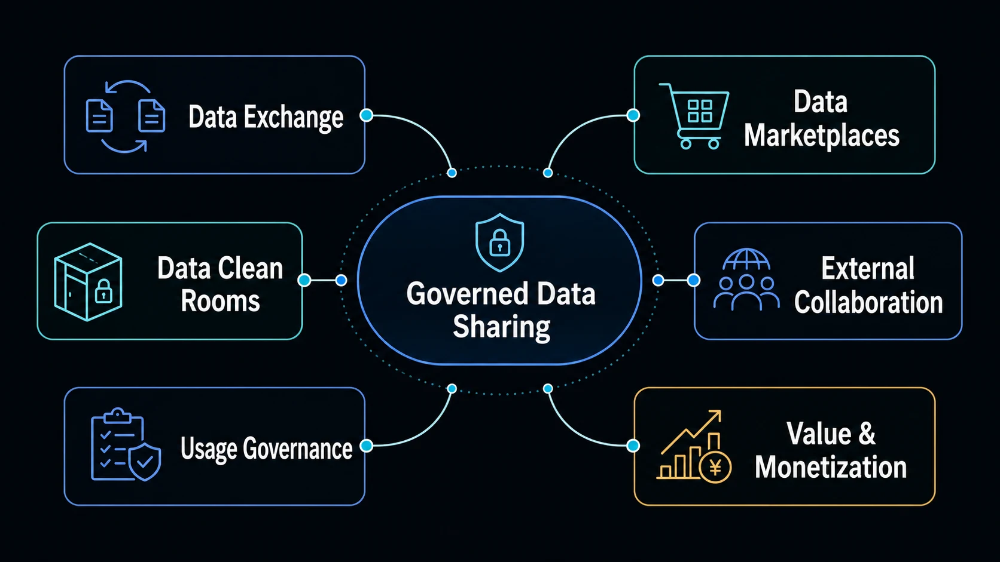
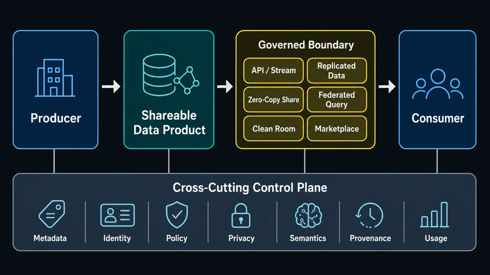

Data sharing is the capability that makes governed data available beyond the system, team, or organization that produced it. It turns data into something another party can safely discover, understand, consume, exchange, collaborate on, and sometimes monetize.

Within the Data landscape, sharing belongs to the **Value Layer**. [Data Analytics](/docs/data/analytics/) creates value by interpreting data; Data Sharing extends that value across organizational and ecosystem boundaries. The objective is not simply to move bytes. It is to preserve meaning, trust, control, and accountability as data crosses a boundary.

## Why Data Sharing Matters

Most data acquires value through use rather than possession. A product team may expose operational signals to an analytics domain, a manufacturer may exchange forecasts with suppliers, a bank and a retailer may calculate an aggregate insight without revealing customer-level records, or a public agency may publish reusable data for an entire ecosystem.

Each case crosses a different boundary, but all require more than connectivity. The consumer needs a usable interface and enough context to interpret the data. The producer needs a way to govern access, permitted use, change, and withdrawal. Both sides need evidence about quality, provenance, and actual consumption.

Data Sharing therefore answers a specific question:

> How does governed data cross a boundary and remain useful, understandable, controlled, and valuable after it does?

## What Data Sharing Means

Several adjacent capabilities overlap with sharing but are not synonyms.

| Capability         | Primary intent                                                                      | Typical boundary or result                                      |
| ------------------ | ----------------------------------------------------------------------------------- | --------------------------------------------------------------- |
| Data integration   | Move or combine data to build a system, pipeline, or consolidated data model        | A maintained flow into another technical system                 |
| Data access        | Let an authorized consumer query or retrieve data                                   | A permission and an access path                                 |
| Data sharing       | Establish a governed producer-consumer relationship around data                     | An available asset, interface, policy, and operating commitment |
| Data exchange      | Perform the transfer or remote access used by a sharing relationship                | A protocol, file delivery, API, stream, or query interface      |
| Data collaboration | Let multiple parties derive value within agreed technical and governance boundaries | Shared analysis, coordinated decisions, or permitted outputs    |

An integration pipeline can implement a share, and access control is always part of governed sharing. Neither is sufficient by itself. Sharing also defines who the parties are, what is being offered, what it means, which uses are permitted, what service can be expected, and how the relationship changes or ends.

The consumable unit is often a [data product](/docs/data/metadata/data-products/): a dataset, stream, API, model, or analytical service with an owner, interface, contract, quality expectations, and lifecycle. Treating the shared asset as a product makes the boundary explicit instead of leaving consumers dependent on informal knowledge.

## The Data Sharing Landscape

Six connected concerns form the landscape:

1. **Data exchange mechanisms** carry data or queries across the boundary.
2. **Data marketplaces** support discovery, request, fulfillment, and measurement.
3. **Data clean rooms** constrain collaboration on sensitive data.
4. **External collaboration models** define how two or more independent parties coordinate.
5. **Usage governance and licensing** state and enforce what consumers may do.
6. **Value realization and monetization** connect consumption to measurable outcomes.

These are not six independent products. A marketplace may fulfill an approved request through a zero-copy table share; the shared asset may carry a license and quality contract; and usage telemetry may support both audit and billing. The architecture should keep those responsibilities distinct even when one platform implements several of them.

## Data Exchange Mechanisms

The exchange mechanism determines how data becomes technically available. The most useful starting point is not a list of protocols, but the constraints of the relationship.

| Mechanism                          | Movement model               | Freshness and interaction               | Useful when                                                            |
| ---------------------------------- | ---------------------------- | --------------------------------------- | ---------------------------------------------------------------------- |
| Batch or file exchange             | Copy, usually push           | Periodic snapshots                      | Portability, simple delivery, or disconnected processing matters       |
| API                                | Request/response             | On demand                               | Consumers need bounded records, operations, or domain interfaces       |
| Event or streaming interface       | Continuous push/pull         | Near-real-time events or state changes  | Consumers react to change and can manage stream semantics              |
| Replication                        | Managed copy                 | Periodic to near-real-time              | Local performance, resilience, or engine independence justifies copies |
| Database or warehouse share        | Often remote/live            | Query-time or provider-managed updates  | The platforms can expose governed objects without export pipelines     |
| Object-storage or open-table share | Copy or direct object access | Snapshot, incremental, or live metadata | Large analytical datasets need engine choice and storage portability   |
| Query federation                   | No durable copy by default   | Query-time                              | Data must remain with its owner and remote execution is acceptable     |

These mechanisms can be compared along several architectural dimensions:

- **Copy versus no-copy.** Copies can isolate workloads and reduce runtime dependency on a producer, but create synchronization, deletion, residency, and revocation work. “Zero-copy” avoids a managed duplicate in the sharing layer; it does not mean that clients never cache data or that no bytes move during a query.
- **Batch versus continuous.** Batch creates explicit delivery points and is easier to reconcile. Streams reduce latency but require event contracts, ordering and replay decisions, and continuous operations.
- **Push versus pull.** Push lets the producer control delivery timing; pull lets the consumer control retrieval. APIs and protocols may support both notification and retrieval.
- **Data plane versus control plane.** The data plane transfers files, records, events, or query results. The control plane manages discovery, identity, entitlements, policy, metadata, credentials, and audit. A durable architecture designs both.
- **Tight coupling versus interoperability.** Native platform sharing can provide strong integration and governance within its supported environment. Open formats and protocols can broaden engine and cross-cloud choice, but only if identity, semantics, and policy also interoperate.
- **Centralized versus federated.** A central gateway simplifies consistent control. Federated publication preserves domain or organizational ownership but requires shared identifiers, metadata, policy, and trust conventions.

Representative technologies illustrate different layers. [Delta Sharing](https://github.com/delta-io/delta-sharing) is an open protocol for granting recipients access to shared analytical data. [OpenSharing](https://opensharing.io/) is an emerging evolution of that protocol model that defines a common hierarchy and access pattern for sharing structured tables, file volumes, models, and agent skills. It broadens the asset boundary beyond datasets, but should be evaluated as a developing specification and ecosystem rather than assumed to be universally implemented. The [Apache Iceberg REST Catalog specification](https://iceberg.apache.org/rest-catalog-spec/) defines a catalog interface that includes credential vending and remote signing for secure table access. Apache Iceberg itself is an open table format, not a complete sharing governance model. Cloud warehouses and lakehouse platforms also provide native live-sharing implementations, but a product feature should not be described as an industry standard merely because it uses the phrase “zero copy.”

The right mechanism is the one that satisfies freshness, scale, sensitivity, interoperability, revocation, and operating-cost requirements with acceptable trust assumptions. Many organizations use several mechanisms behind one product and policy surface.

## Data Marketplaces

A data marketplace is the discovery, access, governance, and transaction layer around shareable data assets. It connects a producer's offer with a consumer's need and carries the relationship beyond search.

Common marketplace scopes include:

- **Internal enterprise marketplaces** for governed reuse across teams and domains
- **Cloud or platform marketplaces** for distributing data products to customers or platform participants
- **Industry and ecosystem exchanges** for participants with shared sector goals or rules
- **Public and open-data portals** for broad discovery and access under public licenses or terms

A catalog inventories and describes assets. A marketplace normally adds a path from discovery to action: request access, evaluate terms, approve entitlement, provision the exchange mechanism, observe use, renew or revoke the relationship, and sometimes charge for it. A polished catalog interface without fulfillment, terms, or operating controls is still a catalog.

Marketplace metadata should connect product descriptions, owners, classifications, contracts, service expectations, available distributions, and permitted uses. Standards can improve parts of this surface. [DCAT 3](https://www.w3.org/TR/vocab-dcat-3/) is a W3C Recommendation for interoperable descriptions of datasets, data services, catalogs, and distributions. It supports catalog interoperability; it does not provide marketplace entitlement, payment, or policy enforcement by itself.

Usage measurement closes the marketplace loop. Producers can learn whether products are adopted and useful, consumers can see service behavior, governance teams can review access, and commercial operators can meter subscriptions or usage. The measurements and their purposes should themselves be governed.

## Data Clean Rooms

A data clean room is a controlled architecture and governance pattern for collaboration on sensitive data. Participants contribute or make data available within a bounded environment, run permitted analyses, and receive constrained outputs without obtaining unrestricted access to one another's underlying records.

Common scenarios include audience overlap measurement, campaign measurement, fraud investigation, healthcare or research analysis, and joint planning between organizations that cannot pool raw data conventionally. A clean-room workflow may include:

- approved datasets, participants, purposes, and query templates
- privacy-aware identity matching or private set intersection
- column, row, and function restrictions
- aggregation thresholds and suppression of small groups
- review or automated validation of queries and outputs
- logging, lineage, and reproducible audit evidence
- controls on export, retention, and repeated-query attacks

“Clean room” does not name one privacy technology. Depending on its threat model, an implementation may use conventional isolation and access control, a trusted execution environment, confidential computing, differential privacy, secure multi-party computation, homomorphic encryption, or combinations of these. [NIST guidance on privacy-enhancing cryptography](https://csrc.nist.gov/Projects/pec) explains mechanisms such as secure multi-party computation, while [NIST SP 800-226](https://csrc.nist.gov/pubs/sp/800/226/final) provides guidance for evaluating differential privacy guarantees.

These mechanisms protect different things. A trusted execution environment can isolate data while it is processed but does not determine whether an allowed result reveals too much. Differential privacy can bound information leakage from released statistics but does not establish participant identity or contract terms. Secure multi-party computation can calculate over separate inputs without revealing them to other parties, but it does not make every possible computation safe or operationally practical.

A clean room is credible only when its technical controls match an explicit threat model and its governance defines allowed inputs, computations, outputs, operators, and evidence. The label alone is not a privacy guarantee.

## External Collaboration Models

Sharing across independent organizations changes architecture because no single participant automatically controls identity, infrastructure, policy, semantics, or remediation.

| Model                                 | Relationship                                                       | Architectural emphasis                                            |
| ------------------------------------- | ------------------------------------------------------------------ | ----------------------------------------------------------------- |
| Producer to consumer                  | One provider serves one or many recipients                         | Product contract, entitlement, delivery, support, and revocation  |
| Partner-to-partner exchange           | Two parties exchange complementary data                            | Reciprocal terms, identity, reconciliation, and responsibility    |
| Multi-party collaboration             | Several parties contribute to a shared outcome                     | Neutral coordination, contribution rules, output control          |
| Federated analytics                   | Computation moves to distributed data or results are combined      | Query planning, local enforcement, result semantics, trust        |
| Cross-organization data product       | A jointly operated product serves agreed consumers                 | Joint ownership, lifecycle, service levels, and change control    |
| Industry data ecosystem or data space | Participants share through common rules and interoperable services | Federated identity, policy, semantics, provenance, and governance |
| Public/private collaboration          | Public and private actors combine authority or data                | Public interest, transparency, licensing, jurisdiction, equity    |

In these models, **decentralized ownership** means that participants retain responsibility for their data and controls. **Interoperability** must extend beyond file formats to identity, catalog metadata, contracts, policies, and semantics. **Trust** must be stated: which operator, hardware, participant, or verifier is trusted, and for what. **Jurisdiction and responsibility boundaries** must establish who handles incidents, corrections, withdrawal, and data-subject or contractual obligations.

Data spaces are an important emerging model for this broader coordination. They aim to enable multi-party data use through shared governance and interoperable building blocks rather than one central data pool. The archived European [Data Spaces Support Centre Blueprint v2.0](https://archive.dssc.eu/space/BVE2/1071251457/Data+Spaces+Blueprint+v2.0+-+Home) preserves one influential account of the concepts and building blocks developed during the DSSC initiative. It is useful as historical design context, not as a currently maintained specification or evidence that independently built data spaces interoperate. “Data space” remains a family of approaches rather than one universal protocol.

The supporting concepts already have deeper coverage in Notes with AI. [Data Mesh](/docs/data/metadata/data-mesh/) explains domain-oriented ownership, [Data Products](/docs/data/metadata/data-products/) defines the consumable interface, and [Federated Governance](/docs/data/metadata/federated-governance/) explains distributed policy and accountability. Data Sharing applies those ideas at an exchange or collaboration boundary rather than redefining them.

## Usage Governance and Licensing

Governance is part of the sharing architecture, not paperwork applied after exposure. The decision is broader than “Who can access this data?” A governed share must increasingly answer:

> For what purpose, under what conditions, for how long, and what may the consumer do with it?

Important controls include:

- authentication, authorization, and entitlement to the product and interface
- purpose limitation and consent context where personal data is involved
- data classification and handling requirements
- contractual restrictions and licenses for use, modification, attribution, and redistribution
- geographic, residency, and jurisdictional restrictions
- retention limits and required deletion or return
- usage logging, lineage, auditability, and incident evidence
- expiration, revocation, and management of copies or derived data

Technical controls can enforce some terms: gateways can authorize calls, query engines can filter rows, clean rooms can constrain functions and outputs, and storage credentials can expire. Legal and contractual controls govern behavior that the provider cannot fully observe or prevent, such as use of a legitimately received copy outside the original system. Neither layer replaces the other.

Machine-readable policy can help connect the layers. The [W3C ODRL Information Model](https://www.w3.org/TR/odrl-model/) represents permissions, prohibitions, duties, parties, assets, and constraints. It is a policy-expression standard, not an automatic enforcement system or a substitute for legal interpretation. Enforcement still requires reliable metadata, decision points, identity, and evidence.

Revocation deserves architectural attention before sharing begins. A live query entitlement can often be disabled quickly; a downloaded dataset, backup, trained model, or derived aggregate may persist. Contracts, retention controls, lineage, and product design must define what revocation means for each artifact.

When personal data is involved, [Data Privacy](/docs/data/privacy/) provides the principles for lawful and responsible processing, including purpose limitation, minimization, and retention. The sharing design should link to that discipline rather than assume that authorization alone makes a use appropriate.

## Value Realization and Monetization

Organizations share data to produce outcomes that one party or silo cannot create alone. Value may be direct:

- licensing a curated dataset or analytical service
- charging a subscription for continuing access
- metering API calls, queries, records, or other usage
- selling a commercial data product
- earning marketplace revenue

Value may also be indirect:

- enabling partners and shortening integration time
- improving supply-chain planning and resilience
- making better joint decisions
- reducing duplicate collection and reconciliation
- improving products and customer experiences
- creating ecosystem network effects
- accelerating research and innovation

Data monetization therefore does not necessarily mean selling datasets. A manufacturer sharing inventory availability with distributors may improve fulfillment rather than generate a data-access invoice. An internal marketplace may reduce duplicate engineering and speed decisions. A public data service may create societal or economic value that is not captured by the publisher.

Sustainable value depends on consumer outcomes. Producers need to measure discovery, activation, recurring use, service quality, consumer effort, cost to serve, and the downstream result the share enables. High-volume access is not evidence of value if the data is poorly understood, untrusted, or expensive to operate. Trust, quality, usability, and predictable economics are part of the product.

## Architecture of Governed Data Sharing

A simple model separates the shared asset from the mechanism used to cross the boundary:

The producer is accountable for an explicit product boundary. The exchange or collaboration boundary may transfer a copy, provide live access, execute a constrained computation, or coordinate multiple services. The consumer receives data or results together with context and obligations.

Cross-cutting capabilities make the relationship governable:

- **Discovery and metadata** identify the product, owner, interface, quality, and available distributions.
- **Identity and access** establish participants and entitlements across trust domains.
- **Contracts and policy** state service expectations and permitted use.
- **Privacy and security** protect people, data, workloads, and outputs according to risk.
- **Semantics** preserve shared meaning across different models and organizations.
- **Lineage and provenance** show origin, transformations, versions, and derived artifacts.
- **Observability and usage measurement** support operations, audit, product improvement, and billing.

The distinction between control plane and data plane is especially important. An architecture may be open at the storage or protocol layer while remaining closed at identity or policy, or it may use a proprietary transport while publishing portable metadata and contracts. Interoperability must be evaluated end to end.

## Choosing a Sharing Model

No model is universally best. Use the following questions to expose the decisive constraints.

| Decision question                        | Signals toward common patterns                                                                                                                                                 |
| ---------------------------------------- | ------------------------------------------------------------------------------------------------------------------------------------------------------------------------------ |
| Who is the consumer?                     | Internal teams may use platform-native products; partners need cross-organization identity and contracts; ecosystems benefit from interoperable, federated services.           |
| Must data physically move?               | Use files or replication for disconnected processing and local performance; consider live sharing or federation when copies create unacceptable control or freshness problems. |
| How fresh must it be?                    | Snapshots suit periodic decisions; streams suit event reactions; live query suits current analytical state but adds runtime dependency.                                        |
| Is the data sensitive or regulated?      | Minimize fields, apply policy-aware access, and consider a clean room or derived outputs when ordinary sharing exposes too much.                                               |
| Can raw data be exposed?                 | If not, expose an API, aggregate, model output, constrained query, or privacy-protected result rather than row-level data.                                                     |
| How interoperable must it be?            | Prefer open formats, protocols, metadata vocabularies, and portable identity patterns when consumers span platforms; validate actual implementation compatibility.             |
| Who controls policy and identity?        | Central control may use a gateway; federated control needs shared trust, identifiers, policy mapping, and local enforcement.                                                   |
| Is measurement or monetization required? | Add marketplace workflow, metering, product analytics, entitlement lifecycle, and commercial terms where applicable.                                                           |
| What happens when access is revoked?     | Live access is easier to stop; copies and derivatives require expiry, deletion duties, lineage, and evidence.                                                                  |
| What trust assumptions exist?            | Choose direct sharing, a neutral operator, confidential computing, cryptographic collaboration, or public verification according to the threat model.                          |

A practical selection process starts with the least data and weakest trust assumption needed to produce the intended outcome. It then tests whether the chosen pattern can meet service, cost, usability, and revocation requirements in normal operation—not only in an architecture diagram.

## How Data Sharing Connects to the Data Ecosystem

Data Sharing is a boundary capability supported by the rest of the Data knowledge graph:

- [Data Analytics](/docs/data/analytics/) explains how consumers turn accessible data into evidence, predictions, and decisions.
- [Data Management](/docs/data/management/) maintains accessibility, quality, lifecycle, and service expectations that make a shared product dependable.
- [Metadata](/docs/data/metadata/) supplies discovery, lineage, contracts, classifications, and automation for the sharing control plane.
- [Data Products](/docs/data/metadata/data-products/) describes the owned, versioned, consumable unit being shared.
- [Data Mesh](/docs/data/metadata/data-mesh/) provides a domain-oriented ownership model for decentralized producers.
- [Federated Governance](/docs/data/metadata/federated-governance/) coordinates policy and accountability across distributed domains.
- [Semantic Layer](/docs/data/metadata/semantic-layer/) provides shared meaning and mappings when producer and consumer models differ.
- [Data Privacy](/docs/data/privacy/) governs appropriate processing when data relates to people.

Together, these capabilities explain why Data Sharing cannot be reduced to export functionality. The exchange mechanism is only the middle of a producer-consumer relationship that begins with a governed product and continues through consumption, measurement, change, and eventual withdrawal.

## Topic Pages

Use these topic pages to move from the landscape into a specific sharing boundary or operating model.









## Emerging Directions

Several directions are reshaping the sharing boundary as of 2026, but they are at different levels of maturity.

**Mature foundations** include APIs, managed file exchange, replication, event streams, database entitlements, catalogs, contracts, and identity-based access. Open table formats and protocol-based sharing are increasingly practical for analytical data, but cross-platform support varies by feature and implementation.

**Developing interoperability** extends from data formats into catalogs, semantics, identity, policy, and new asset types. [OpenSharing](https://opensharing.io/) illustrates this expansion by applying a sharing protocol to tables, unstructured file volumes, models, and agent skills. Some further asset types remain community proposals or roadmap items. DCAT, ODRL, open table catalogs, and data-sharing protocols each address part of the problem; no single specification makes a complete multi-party sharing architecture interoperable.

**Data spaces and policy-aware ecosystems** are moving sharing toward federated services with participant rules, sovereignty expectations, and machine-readable policy. Their reference models are useful, while production interoperability and governance remain ecosystem-specific.

**Privacy-enhancing collaboration** is expanding the range of analyses that can be performed without conventional raw-data pooling. Clean rooms, confidential computing, differential privacy, and cryptographic methods should be selected by threat model and measured guarantees, not grouped under a generic privacy-preserving label.

**Data products and marketplaces** are converging on a more operational product surface: discovery linked to entitlement, automated fulfillment, usage telemetry, service management, and commercial or non-commercial value measurement. The durable shift is from publishing assets to managing producer-consumer relationships.

The topic pages in this section examine exchange mechanisms, marketplaces, clean rooms, data spaces, and open data in greater depth. This hub preserves their shared architecture and boundaries without locking the documentation to today's product landscape.

## Further Reading

- [Delta Sharing protocol and reference implementation](https://github.com/delta-io/delta-sharing)
- [OpenSharing protocol](https://opensharing.io/)
- [Apache Iceberg REST Catalog specification](https://iceberg.apache.org/rest-catalog-spec/)
- [W3C Data Catalog Vocabulary (DCAT) 3](https://www.w3.org/TR/vocab-dcat-3/)
- [W3C Open Digital Rights Language (ODRL) Information Model 2.2](https://www.w3.org/TR/odrl-model/)
- [NIST Privacy-Enhancing Cryptography project](https://csrc.nist.gov/Projects/pec)
- [NIST SP 800-226: Guidelines for Evaluating Differential Privacy Guarantees](https://csrc.nist.gov/pubs/sp/800/226/final)
- [Archived Data Spaces Support Centre Blueprint v2.0](https://archive.dssc.eu/space/BVE2/1071251457/Data+Spaces+Blueprint+v2.0+-+Home)

## Summary

Data Sharing makes governed data usable across a boundary. Its architecture combines a shareable data product, an exchange or collaboration mechanism, a consumer relationship, and a control plane for discovery, identity, policy, privacy, semantics, provenance, and measurement.

Good sharing design begins with the outcome and trust boundary, then chooses whether data should move, remain live, or yield only controlled results. It treats governance and revocation as architectural requirements, distinguishes standards from implementations, and measures value in consumer outcomes rather than data volume alone.
