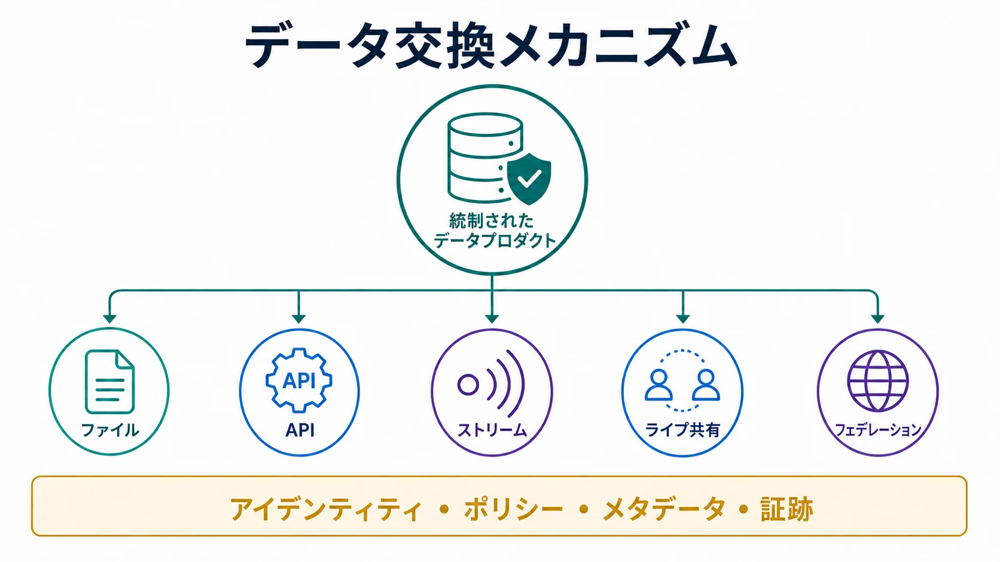

データ交換メカニズムとは、共有関係においてデータを届け、クエリの接点を公開し、またはデータ資産に対する処理を可能にする技術的な手段です。これは [データ共有](/ja/docs/data/sharing/) の一部を実現しますが、それだけで提供側と利用側の関係全体が定義されるわけではありません。

コピーの転送、最新状態の公開、変更の配信、データに近い場所での処理など、方式ごとに境界の性質は異なります。適切な選択は、鮮度、規模、機密性、相互運用性、コスト、失効可能性、許容できる実行時依存関係によって決まります。

## 交換だけでは共有は完成しない

交換メカニズムは主にデータプレーンに属します。統制された共有には、発見、アイデンティティ、権限、ポリシー、契約、リネージ、利用証跡を扱うコントロールプレーンも必要です。

転送手段を選んだだけで共有の問題が解決したと考えてはいけません。ファイルには所有者やライセンスが欠ける場合があり、API は呼び出し元を認証できても利用目的を保持できるとは限りません。ライブ共有もコピーを減らせますが、意味や契約の問題は別に残ります。

## メカニズムの種類

| 種類                                     | 主な動作                                           | 強み                                 | 主なトレードオフ                       |
| ---------------------------------------- | -------------------------------------------------- | ------------------------------------ | -------------------------------------- |
| バッチ／ファイル配信                     | 定期的なファイルやスナップショットを公開           | 単純で可搬性が高い                   | コピーの陳腐化と失効が難しい           |
| API アクセス                             | 要求に応じて限定されたデータや操作を返す           | ドメイン指向で選択的に公開できる     | 実行時結合と要求規模の制約             |
| イベント／ストリーム                     | 変更を継続的に配信                                 | 状態変化へ低遅延で反応できる         | 順序、再生、契約が複雑                 |
| レプリケーション                         | 利用側に管理されたコピーを維持                     | ローカル性能とワークロード分離       | 同期、所在地、ライフサイクルのコスト   |
| ライブテーブル共有                       | 提供側が管理する分析オブジェクトを公開             | エクスポートなしで新鮮なデータを利用 | プラットフォーム互換性と実行時依存     |
| オブジェクトストレージ／オープンテーブル | オブジェクトとテーブルメタデータへのアクセスを許可 | 複数エンジンから大規模分析が可能     | ストレージアクセスだけでは統制できない |
| クエリフェデレーション                   | リモートシステムをまたいでクエリを実行             | データをローカル管理下に保てる       | 性能、可用性、意味のばらつき           |

複数方式は併用できます。監査用の日次スナップショット、業務変更用のストリーム、選択参照用の API を同じプロダクトが提供することもあります。

## コピー、ノーコピー、ゼロコピー

コピー型では利用側が独立した表現を保存します。耐障害性、ローカル性能、エンジン選択の自由度は高まりますが、同期、削除、保持、来歴、訂正の責任が生じます。

ノーコピー型やライブ共有では、正式なオブジェクトを提供側の管理下に置き、リモートクエリやストレージの経路を提供します。資格情報の失効はファイル回収より容易ですが、可用性、性能、ポリシー適用は提供側や仲介者に依存します。

「ゼロコピー」は狭く解釈すべきです。通常は共有サービスが別の完全なデータセットを作成・管理しないことを意味し、クライアントによる転送、キャッシュ、派生物の実体化、エクスポートまでなくなるわけではありません。

## オープンなプロトコル、形式、実装

オープンテーブル形式はテーブル状態とファイルの表現を、カタログプロトコルはメタデータの発見・更新方法を、共有プロトコルは資産へのアクセス付与方法を定義します。

[Delta Sharing](https://github.com/delta-io/delta-sharing) は分析データ共有のオープンプロトコルと参照実装を提供します。 [OpenSharing](https://opensharing.io/) はそのモデルをテーブル、ファイルボリューム、モデル、エージェントスキルへ広げようとしている開発中の仕様・エコシステムです。 [Apache Iceberg REST Catalog 仕様](https://iceberg.apache.org/rest-catalog-spec/) は共通カタログ API を定義します。ただし Iceberg は、完全な利用統制システムではありません。

## 選定時の問い

1. 必要なのはコピー、クエリ接点、変更ストリーム、派生結果のどれか。
2. どの程度の遅延と履歴再生が必要か。
3. ストレージと計算コストを誰が負担するか。
4. クエリ時に提供側の可用性へ依存できるか。
5. スキーマや意味の変更をどう通知するか。
6. 失効後のローカルコピーや派生物をどう扱うか。
7. どのエンジン、クラウド、アイデンティティ基盤を相互運用するか。
8. 提供側が保持すべき利用証跡は何か。

答えは、多くの場合、一つの統制された [データプロダクト](/ja/docs/data/metadata/data-products/) の背後に複数方式を組み合わせることです。

## よくある失敗

- 所有者、説明、サービス期待値のないエクスポート処理をデータプロダクトと呼ぶ
- クライアントキャッシュや下流の実体化を無視してゼロコピーを主張する
- 再生、順序、互換性を定義せずストリーミングを選ぶ
- オープンな保存形式だけでポリシーとアイデンティティも可搬になると考える
- 保持、訂正、削除手順なしに利用側コピーを作る
- 可用性とコストの制御なしに重要な利用者をリモートクエリへ結合する

## まとめ

データ交換メカニズムは、共有境界の技術的な振る舞いを決めます。持続可能な設計原則は、データプレーンとコントロールプレーンを同時に選ぶことです。アクセス、意味、ポリシー、来歴、変更、利用、撤回が技術的な接点とともに管理されて初めて、共有は統制可能になります。
