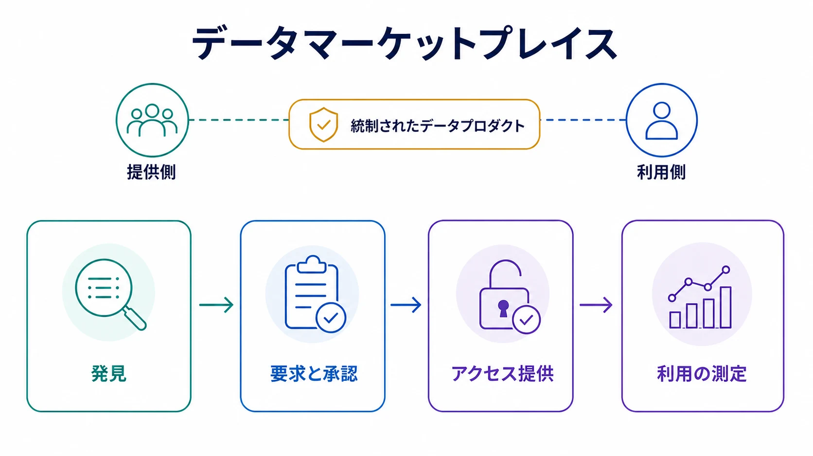

データマーケットプレイスは、共有可能なデータプロダクトを中心に提供側と利用側を結び付けます。発見だけでなく、要求、評価、承認、提供、運用、測定までのワークフローを組み合わせた仕組みです。

マーケットプレイス自体がデータプレーンなのではありません。ファイル、API、ストリーム、ライブ共有、クリーンルームなどの [交換メカニズム](/ja/docs/data/sharing/data-exchange-mechanisms/) を払い出すための、プロダクト、統制、取引のレイヤーです。

## カタログからマーケットプレイスへ

カタログは、どのデータが存在し、何を意味し、誰が所有し、どこから利用できるかを説明します。マーケットプレイスは、その発見面を行動へつなげます。

| 能力               | カタログ                       | マーケットプレイス     |
| ------------------ | ------------------------------ | ---------------------- |
| 棚卸しと検索       | 中核的責任                     | 必須の基盤             |
| 所有者とメタデータ | 資産を説明                     | 提供条件と判断を支援   |
| アクセス要求       | 外部手続きへ案内する場合がある | ワークフローに統合     |
| 権限付与と提供     | 通常は範囲外                   | 承認済み共有を払い出す |
| 条件と契約         | 表示する場合がある             | 取引に関連付ける       |
| 利用・サービス証跡 | 任意                           | 採用と運用を測定       |
| 価格と請求         | 範囲外                         | 商用モデルでは任意     |

見栄えのよいカードを並べただけではマーケットプレイスになりません。利用者が発見から、統制された権限の取得と継続利用まで進めることが必要です。

## マーケットプレイスの種類

**企業内マーケットプレイス**はチームやドメインをまたぐ再利用を支援します。主な価値は直接収益ではなく、重複削減、提供迅速化、説明責任の明確化です。

**プラットフォーム型マーケットプレイス**はクラウド、ウェアハウス、データ基盤内で提供側と利用側を結びます。提供を簡素化できる一方、アイデンティティ、商流、技術モデルが基盤に結合します。

**業界・エコシステム型取引所**は、共通の目的、語彙、規則を持つ参加者を調整します。難所は画面設計よりも、信頼、意味の合意、責任境界です。

**公共・オープンデータポータル**も発見と測定の面では似ていますが、オープンライセンスと非差別的アクセスに特徴があります。詳しくは [オープンデータ](/ja/docs/data/sharing/open-data/) を参照してください。

## 中核アーキテクチャ

- プロダクト、提供形式、所有者、信頼指標を扱うカタログと検索
- 利用者と組織のアイデンティティ
- アクセス要求、審査、承認のワークフロー
- 権限と資格情報の払い出し
- 契約、ライセンス、ポリシーメタデータ
- 交換メカニズムへのコネクタ
- 利用、サービスレベル、コスト、監査のテレメトリ
- 必要に応じた提供条件、購読、計量、請求、精算

マーケットプレイスをすべての情報の正本にする必要はありません。既存のアイデンティティ、ポリシー、契約、データ提供システムを、利用者の導線に沿って調整する役割を担います。

## プロダクトとメタデータ

提供物は所有者のいないテーブルではなく、安定した [データプロダクト](/ja/docs/data/metadata/data-products/) を指すべきです。目的、対象利用者、所有者、スキーマ、意味、品質、鮮度、インターフェース、分類、許可用途、価格、支援、ライフサイクル状態を記述します。

[DCAT 3](https://www.w3.org/TR/vocab-dcat-3/) はカタログ、データセット、データサービス、配布物を相互運用可能に記述する W3C 語彙です。 [ODRL](https://www.w3.org/TR/odrl-model/) は許可、禁止、義務、当事者、資産、制約を表現できます。ただし、いずれも権限付与や強制、証跡を単独で実現するものではありません。

## 価値の測定

掲載数だけでなく、検索成功率、要求から承認までの時間、承認から初回利用までの時間、払い出し成功率、継続利用者、品質、重複回避、利用成果、提供コスト、必要に応じた収益を測ります。

利用が少ない原因は、需要不足、弱いメタデータ、過大な承認負荷、使いにくい接点、低い信頼かもしれません。掲載数を増やすだけでは解決しません。

## 統制と運用モデル

提供側は品質、契約、変更、支援に責任を持ちます。基盤チームはマーケットプレイスと払い出し機能を運用し、ガバナンスチームは分類と判断規則を定めます。組織外・法域外へ広がる場合は、法務、プライバシー、セキュリティ、商務も関与します。

## よくある失敗

- カタログの名称を変えただけでマーケットプレイスとする
- 信頼できるプロダクトではなく、すべてのテーブルを掲載する
- サービス目標や説明可能な判断なしに承認を中央集約する
- 成功した利用ではなく在庫数を測る
- プロダクト識別子を一つの物理実装に結合する
- 品質、信頼、支援コストより先に収益化する

## まとめ

データマーケットプレイスは、発見を入口として、要求、権限、提供、ポリシー、利用、終了までをデータプロダクトの周囲で運用します。商用機能は任意ですが、需要を統制された利用と測定可能な成果へ結ぶ経路は不可欠です。
