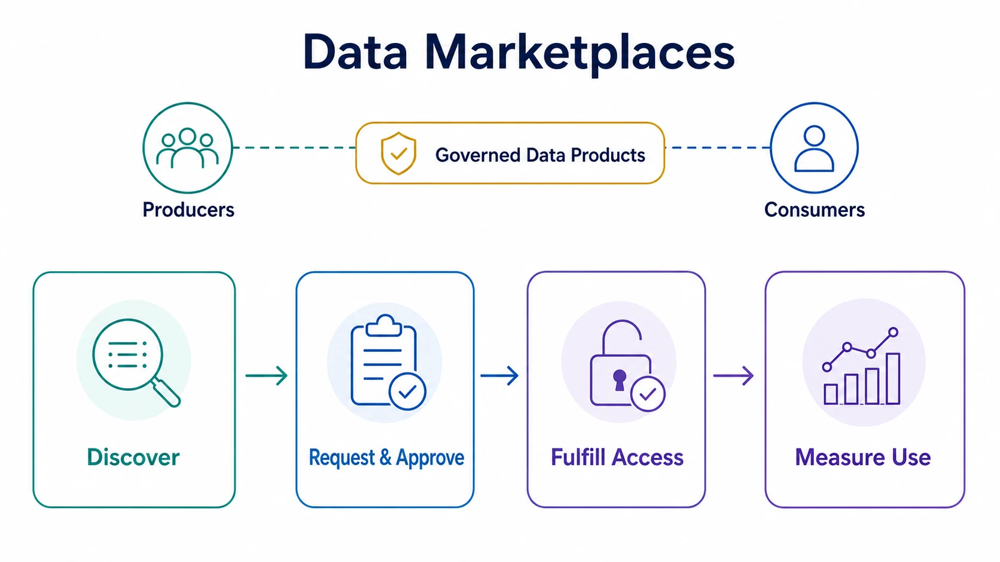

A data marketplace connects producers and consumers around shareable data products. It combines discovery with the workflow needed to request, evaluate, authorize, fulfill, operate, and measure a sharing relationship.

The marketplace is therefore not the data plane itself. It is a product, governance, and transaction layer that can provision files, APIs, streams, live shares, clean-room access, or other [exchange mechanisms](/docs/data/sharing/data-exchange-mechanisms/).

## From Catalog to Marketplace

A catalog answers questions such as what data exists, what it means, who owns it, and where it can be accessed. A marketplace extends this surface into action.

| Capability                  | Catalog               | Marketplace                          |
| --------------------------- | --------------------- | ------------------------------------ |
| Inventory and search        | Core responsibility   | Required foundation                  |
| Ownership and metadata      | Describes assets      | Supports offers and decisions        |
| Access request              | May link to a process | Integrated workflow                  |
| Entitlement and fulfillment | Usually external      | Provisions the approved share        |
| Terms and contracts         | May display them      | Associates them with the transaction |
| Usage and service evidence  | Optional              | Measures adoption and operation      |
| Pricing and billing         | Outside scope         | Optional for commercial models       |

A catalog with polished cards is not automatically a marketplace. The transition occurs when a consumer can move from finding an asset to obtaining and operating a governed entitlement.

## Marketplace Types

**Internal enterprise marketplaces** support reuse across teams and domains. Their value is usually reduced duplication, faster delivery, and clearer accountability rather than direct revenue.

**Platform marketplaces** connect providers with consumers inside a cloud, warehouse, or data platform ecosystem. They can simplify fulfillment but may couple participants to the platform's identity, commercial, and technical model.

**Industry or ecosystem exchanges** coordinate participants with common sector goals, vocabulary, or rules. Their hardest problems are often trust, semantic agreement, and responsibility boundaries rather than interface design.

**Public and open-data portals** publish resources for broad use. They may resemble marketplaces in discovery and measurement, but open licensing and non-discriminatory access distinguish them from negotiated or restricted commercial offers. See [Open Data](/docs/data/sharing/open-data/) for that publication model.

## Core Architecture

A marketplace normally coordinates several services:

- a catalog and search index for products, distributions, owners, and trust signals
- consumer and organization identity
- access-request, review, and approval workflows
- entitlement and credential provisioning
- product contracts, licenses, and policy metadata
- connectors to exchange mechanisms
- usage, service-level, cost, and audit telemetry
- commercial services such as offers, subscriptions, metering, invoices, and settlement when required

The marketplace should not become the authoritative system for every concern. Identity may remain with an identity provider, policy decisions with a governance service, contracts with a contract system, and data access with the serving platform. The marketplace coordinates those systems around a consumer journey.

## Product and Metadata Model

The marketplace offer should point to a stable [data product](/docs/data/metadata/data-products/) rather than an unowned table. Useful metadata includes purpose, intended consumers, owner, schema, semantics, quality, freshness, available interfaces, geographic coverage, classification, permitted use, price, support, and lifecycle state.

[DCAT 3](https://www.w3.org/TR/vocab-dcat-3/) provides a W3C vocabulary for interoperable descriptions of catalogs, datasets, data services, distributions, and dataset series. It can improve discovery and federated catalog exchange, but it does not supply entitlement, payment, or enforcement.

Machine-readable policies such as [ODRL](https://www.w3.org/TR/odrl-model/) can represent permissions, prohibitions, duties, parties, assets, and constraints. A policy expression still requires an enforcement and evidence architecture.

## Measuring Marketplace Value

Marketplace success should not be measured only by the number of listed assets. Useful measures follow the consumer journey:

- search success and product-detail engagement
- request-to-approval time
- approval-to-first-use time
- successful provisioning and access failures
- recurring active consumers
- product quality and service-level behavior
- duplicated assets or integrations avoided
- consumer outcomes, cost to serve, and revenue where applicable

Low adoption may indicate weak demand, poor metadata, excessive approval friction, unusable interfaces, or low trust. Adding more listings does not resolve those causes.

## Governance and Operating Model

Producers remain accountable for product quality, contracts, change, and support. Platform teams operate marketplace and fulfillment capabilities. Governance teams define classifications and decision rules. Commercial, legal, privacy, and security specialists participate when the offer crosses organizational or jurisdictional boundaries.

The operating model must address delisting, deprecation, changed terms, entitlement review, incident response, and revocation. A marketplace that can grant access but cannot reliably end it is incomplete.

## Common Failure Modes

- Treating the marketplace as a rebranded catalog
- Listing every table instead of curating dependable products
- Centralizing approval without service targets or explainable decisions
- Measuring inventory rather than successful consumption and outcomes
- Binding product identity to one physical implementation
- Adding monetization before quality, trust, and support economics are understood

## Summary

A data marketplace operationalizes the relationship between a data producer and consumer. Discovery is its entry point, not its endpoint.

The durable marketplace connects metadata, requests, entitlement, fulfillment, policy, usage, and lifecycle around well-defined products. Commercial functions are optional; a governed path from demand to measurable consumption is not.
