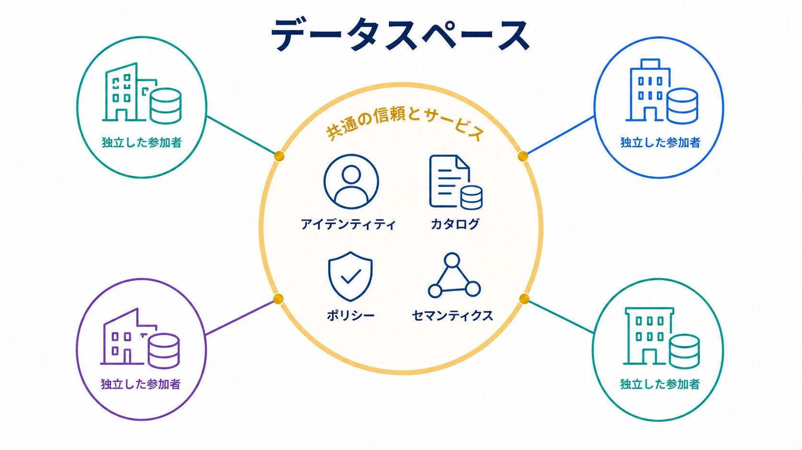

データスペースは、独立した参加者が共通規則、信頼メカニズム、相互運用可能なサービスを通じてデータを共有・利用する連合型の環境です。すべてのデータ、基盤、権限を一つのプラットフォームへ集中させずにエコシステムを調整します。

これは単一の共通プロトコルではなく、組織とアーキテクチャの一群を表す名称です。業界、法域、統制、技術基盤、参加者が保持する制御の度合いによって実装は異なります。

## 通常の共有との違い

二者間共有は提供側と利用側を結び、マーケットプレイスは提供条件と権限を調整します。データスペースはさらに、時間とともに提供側、利用側、仲介者、運営者になり得る多数の参加者に、再利用可能な参加規則と共通サービスを設けます。

共有データレイクの構築が目的とは限りません。データを各参加者のもとに置き、API、ファイル、ライブ共有、フェデレーション、クリーンルームなどの [交換メカニズム](/ja/docs/data/sharing/data-exchange-mechanisms/) で利用できます。

## アーキテクチャの構成要素

| 構成要素               | 中核となる問い                                         |
| ---------------------- | ------------------------------------------------------ |
| 参加者アイデンティティ | 組織、人物、ワークロードをどう認識するか               |
| 信頼と参加手続き       | 参加に必要な証拠と合意は何か                           |
| カタログと発見         | プロダクト、サービス、ポリシー、参加者をどう見つけるか |
| データプロダクト       | どの安定した所有者付き接点を提供するか                 |
| 交換サービス           | データ、クエリ、イベント、結果をどう届けるか           |
| ポリシーと契約         | 許可目的、義務、制約をどう表すか                       |
| セマンティクス         | 識別子、語彙、単位、概念をどう整合するか               |
| 来歴と証跡             | 起源、変換、利用、判断をどう追跡するか                 |
| ガバナンス             | 誰が規則を変更し、紛争を解決し、責任を問うか           |

相互運用性は各レイヤーで評価します。共通ファイル形式だけではアイデンティティやポリシーは可搬にならず、共通カタログ語彙だけでも業務概念の解釈は一致しません。

## ガバナンスモデル

参加規則を定める主体、参加の権利と義務、必須標準、適合性評価、事故・苦情・紛争への対応、共通サービスの資金、退出方法を定義します。連合型とは中央調整がないことではなく、中央責任を限定しながら、所有と強制を分散することです。

## データ主権と制御

データ主権という意図は、具体的な制御と現実的な限界へ翻訳する必要があります。ライブアクセスはダウンロード済みコピーより失効しやすく、機械可読ポリシーは許可用途を伝えられますが遵守を保証しません。契約は技術的に観測できない行動を扱えますが、執行と証跡が必要です。

[ODRL](https://www.w3.org/TR/odrl-model/) は許可、禁止、義務、当事者、資産、制約を表す標準モデルです。ポリシー交換に利用できますが、共通プロファイル、判断ロジック、強制点、監査動作は別途必要です。

## セマンティック／カタログ相互運用性

[DCAT 3](https://www.w3.org/TR/vocab-dcat-3/) は相互運用可能なカタログ記述と連合検索を支援します。 [セマンティックレイヤー](/ja/docs/data/metadata/semantic-layer/) や明示的な語彙対応は、業務概念、識別子、単位、分類を整合できます。

目標は限定された合意です。エコシステム境界を越える要素だけを標準化し、利用や統制を妨げないローカルモデルは維持します。

## データメッシュとの関係

[データメッシュ](/ja/docs/data/metadata/data-mesh/) は組織ドメイン内外の分散所有を扱います。データスペースは、法的権限、基盤、動機が別々の参加者からなるエコシステムへ類似原則を適用します。

[連合型ガバナンス](/ja/docs/data/metadata/federated-governance/) はローカル制御と共通ポリシーの均衡を、データプロダクトは利用可能な境界を提供します。データスペースは参加資格、組織間信頼、共通サービスを加えます。

## 参照モデルと成熟度

アーカイブされた [Data Spaces Support Centre Blueprint v2.0](https://archive.dssc.eu/space/BVE2/1071251457/Data+Spaces+Blueprint+v2.0+-+Home) には、DSSC の活動で整理された概念と構成要素が保存されています。現在保守されている仕様や相互運用性の証明ではなく、歴史的な設計背景として参照できます。

理念、参照アーキテクチャ、プロファイル、検証済み実装、参加者間の実際の適合性を区別すべきです。同じ語彙を使うだけでは技術互換性は成立しません。

## よくある失敗

- 所有を連合型と称しながら中央プラットフォームへ集約する
- 参加規則と説明責任より先にコネクタを作る
- 主権を階層的な制御モデルではなく製品機能として扱う
- 共通形式だけで意味やポリシーも相互運用できると考える
- 持続可能な資金と運用責任なしに統制を定義する
- 明確な利用課題や測定可能な価値なしにエコシステムを開始する

## まとめ

データスペースは、独立した参加者間の統制されたデータ利用を調整します。重要なのは名称ではなく、明示的な信頼、相互運用可能な接点、強制可能な責任、持続に足る共通価値を伴って組織境界を越えられることです。
