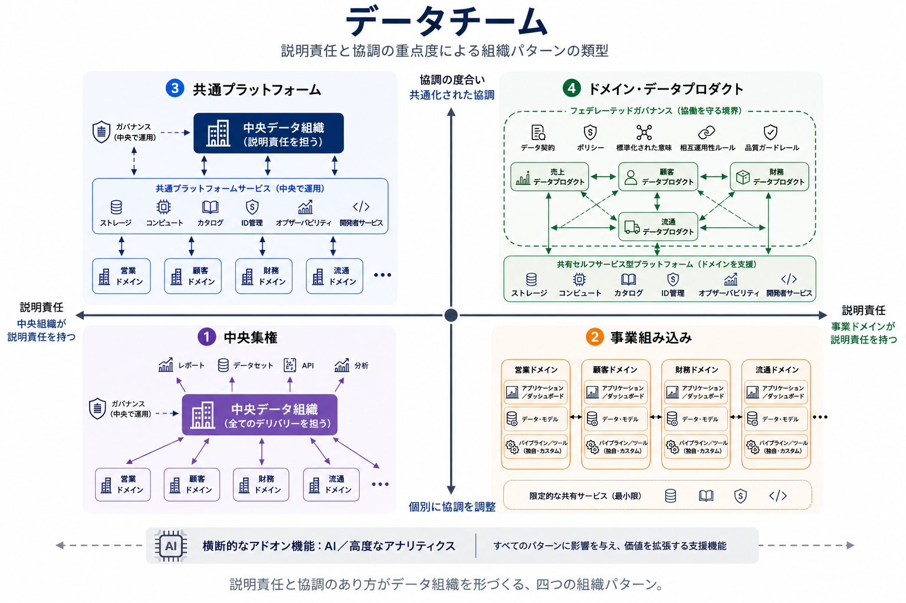

データチームの設計は、組織アーキテクチャに関する意思決定です。中心となる問いは、**誰がデータ業務を担い、その業務を組織全体でどのように協調させるか**です。

この問いへの答えは、意思決定をどこで行うか、成果に誰が説明責任を持つか、そして事業上の文脈を共有の技術機能とどう結び付けるかを決めます。これは成熟度の階段ではありません。分散的なモデルが中央集権より本質的に高度なわけではなく、どのモデルが適切かは、組織の境界、義務、スキル、協調する能力によって決まります。

このページでは、中央集権、事業組み込み、共通プラットフォーム、ドメイン・データプロダクトという四つの基本パターンを説明します。これらは固定された組織図ではなく、概念的な配置です。実際の組織は、複数のパターンの要素を組み合わせることがよくあります。

## 二つの整理軸

パターンは、二つの軸で捉えると理解しやすくなります。

- **説明責任のモデル:** データの成果に対する主要な説明責任は、中央データ組織が持つのか、それともデータの意味と利用に最も近い事業ドメインが持つのか。
- **協調のモデル:** チームはおおむね独立して活動するのか、それとも共有プラットフォーム、ガバナンス、標準、再利用可能な機能に依存して、組織全体のデータ業務を協調させるのか。

横軸は **中央組織による説明責任** から **事業ドメインによる説明責任** へ、縦軸は **個別に協調を調整** から **共通化された協調** へと伸びます。これらは、優劣ではなく設計上の選択肢です。

ガバナンスは、協調を実現する主要な手段の一つです。直接的な管理、中央で調整された標準、またはフェデレーテッドなポリシーと共同の意思決定として現れます。プラットフォーム機能は共通化された協調を強化できますが、それだけで説明責任の所在を決めるものではありません。コスト、提供速度、組織規模、コミュニケーションの負荷は、説明責任と協調の選択から生じる結果であり、それ自体がモデルを定義するものではありません。

## 四つの基本パターン

### 中央集権

**一つの中央データチームが、組織のデータ機能の大半を提供します。**

中央集権のチームは、一般にデータエンジニアリング、分析、ガバナンス、基盤となるプラットフォームを所有します。事業部門は必要なことをそのチームに持ち込み、チームが作業の優先順位を付け、共通の実践を定めます。

このパターンは、データの専門知識が不足している場合、規制要件によって直接的な統制が必要な場合、または一つのチームが利用者との距離を保てるほど組織が小さい場合に有用です。説明責任を明確にし、一貫した標準を迅速に整備できます。

一方で、需要が一か所に集中します。ドメインとユースケースが増えるにつれて待ち行列が長くなり、中央チームはローカルな意思決定の文脈を見失うことがあります。一つのチームが、事業と同じ速度であらゆるドメインの要件を理解し、提供することを期待されると、このモデルは有効に機能しなくなります。

### 事業組み込み

**事業ドメインが、自らのローカルなデータ業務を編成し、提供します。ドメイン間の正式な協調は限定的です。**

アナリスト、データエンジニア、データサイエンティストは、プロダクト、営業、オペレーション、地域などのチームに所属します。自らが支援する意思決定に近い場所で優先順位を決め、多くの場合、ローカルなデータ資産と実践を維持します。

事業組み込みのチームは、比較的独立した事業単位があり、強いドメイン知識と自律して行動できる十分な技術力を持つ場合に適しています。迅速に対応でき、ローカルなプロセス、指標、顧客について深い理解を得られます。

代償は分断です。定義、アクセス方法、インフラがばらつき、重複作業が増え、ドメインをまたいだデータの結合が難しくなることがあります。ローカルな自律性が全社的な価値につながるのは、組織がローカルな選択の関係性も管理できる場合に限られます。

### 共通プラットフォーム

**中央データ組織がデータ機能全体の説明責任を維持しながら、強力な共有プラットフォームによって規模と一貫性を高めます。**

このパターンは中央集権を強化した形であり、主要な所有責任をドメインに移すものではありません。中央組織は、共有プラットフォーム機能、標準、ガバナンス、そしてデリバリーの大部分を調整します。ドメインチームは要件、事業上の専門知識、ときにはローカルなデリバリーを担いますが、データ機能全体を機能させる主要な説明責任は中央機能に残ります。

共有の取り込み、変換フレームワーク、オブザーバビリティ、メタデータサービス、共通のアクセスパターンは、重複作業を減らし、中央による提供の信頼性を高めます。プラットフォームは中央集権モデルの運用を改善しますが、それだけでドメインが独立して管理されるデータプロダクトの所有者になるわけではありません。

この配置は、全社的な一貫性と中央組織による説明責任を必要としつつ、拡大するニーズを支える十分なプラットフォーム機能を備えた組織に適しています。主なリスクは他の中央集権モデルと同じです。プラットフォームチームが再利用可能な機能と明確なサービス境界を提供せず、すべての提供判断を統制すると、社内のゲートキーパーになり得ます。

### ドメイン・データプロダクト

**事業ドメインが、他のドメインと利用者向けの相互運用可能なデータプロダクトを所有します。セルフサービス型プラットフォームとフェデレーテッドガバナンスがこれを支えます。**

ドメイン・データプロダクトは、単なる人員の分散配置ではありません。ドメインは、プロダクトのライフサイクルと利用者にとっての価値に説明責任を持ちます。合意された期待に沿って、発見可能で、理解可能で、信頼でき、安全で、利用可能な状態にする責任です。この説明責任は継続的なものであり、最初のデータセットやパイプラインを提供した後もドメインに残ります。

このモデルは、データプロダクト間の相互作用に依存します。ドメインは、合意されたインターフェースとデータ契約を通じてプロダクトを公開します。他のドメインは、それらのプロダクトを発見、利用、組み合わせることで、自身の意思決定やプロダクトを支えます。標準化された意味、互換性への期待、ドメイン間の問いを解決する仕組みにより、中央チームが各プロダクトの提供を指揮しなくても、このプロダクトネットワークは機能します。

セルフサービス型プラットフォームは、アクセス、ストレージ、処理、発見、品質シグナル、運用支援といった再利用可能な機能を提供します。フェデレーテッドガバナンスは、ドメイン全体に適用されるポリシーと相互運用性のルールを定めます。これらのどちらも、各ドメイン・データプロダクトの共同所有者ではありません。利用者が受け取る成果に対する説明責任は、ドメインに残ります。

このパターンは、事業ドメインが持続的で、十分なエンジニアリング能力があり、直近のローカルな利用を超えてデータを提供する理由がある場合に成立します。こうした条件がなければ、データプロダクトという言葉は、同じく分断されたデータ資産と不明確な責任を表すだけのラベルになりかねません。

## 比較表

| 基本パターン | 所有責任 | プラットフォーム | ガバナンス | 自律性 |
| --- | --- | --- | --- | --- |
| 中央集権 | 中央データチーム | 中央で所有・運用される機能 | 直接的な管理と全社標準 | 事業ドメインでは低い |
| 事業組み込み | 事業ドメイン | ローカルまたは独自に選択した機能 | 正式な協調は最小限 | 各ドメイン内では高い |
| 共通プラットフォーム | ドメインが参加する中央データ組織 | 共有プラットフォーム機能が中央による提供を改善 | 中央で調整された標準とサービス | 中央サービスの境界内で中程度 |
| ドメイン・データプロダクト | 事業ドメインがプロダクトの成果を所有 | ドメインが利用するセルフサービス型プラットフォーム | フェデレーテッドなポリシー、相互運用性のルール、共同の意思決定 | 利用者向けの継続的な責任を伴い高い |

この表は順位付けではありません。実務上の結果を生む選択肢を示しています。たとえば、中央での所有責任は重複を減らす一方で待ち行列を生むことがあり、ドメインの自律性はローカルな応答性を高める一方で、相互運用性を保つためにより強いプラットフォーム機能とガバナンスを必要とする場合があります。

## 重要な違い

共通プラットフォームとドメイン・データプロダクトは、どちらも強力な共有プラットフォームと共通の標準を持つことがあります。違いは、データプロダクトの成果に対する主要な説明責任がどこにあるかです。

**共通プラットフォーム**では、中央データ組織がデータ機能全体に説明責任を持ち、デリバリーの大部分を調整します。ドメインは参加しますが、他のドメイン向けのプロダクトを継続的に所有する立場にはなりません。プラットフォームは、中央集権による提供の規模と一貫性を高めます。

**ドメイン・データプロダクト**では、ドメインが利用者に対するプロダクトの成果を所有します。プラットフォームは再利用可能なセルフサービス機能を提供し、フェデレーテッドガバナンスは相互運用性、リスク、標準化された意味に関するルールを提供します。これらの機能はエコシステムを支援し、協調させますが、各プロダクトのライフサイクルを中央で管理するものではありません。

簡潔に言えば、共通プラットフォームは中央組織が説明責任を持つモデルを改善します。ドメイン・データプロダクトは、プロダクトの説明責任をドメインに分配し、それらのプロダクトがガバナンスのあるネットワークとして相互作用することを求めます。

## バリエーションと能力レイヤー

よく使われるいくつかの呼称は、追加の基本パターンではなく、既存パターンの洗練や支援機能を表しています。

### センター・オブ・エクセレンス

分析、ガバナンス、AI のセンター・オブ・エクセレンスは、実践を定め、専門的な能力を育成し、組織横断の取り組みを支援できます。どの基本パターンにも併設できますが、それだけで運用上のデータ業務を誰が所有するかは決まりません。

### ハイブリッドな配置

組織は、選択した責任を中央に集めながら、他の責任を事業へ組み込むことがよくあります。たとえば、中央組織が共有の取り込みとガバナンスを運用し、ドメインがローカルな分析を維持する場合です。このような配置は、実際の所有責任と意思決定の境界を特定して理解すべきであり、すべてのハイブリッドを新たなトポロジーとして扱うべきではありません。

### データメッシュに着想を得た実践

一部の組織は、ドメイン・データプロダクトを主要なモデルとして採用しなくても、データプロダクトという表現、フェデレーテッドガバナンスの実践、またはセルフサービス型プラットフォームの構成要素を取り入れます。こうした実践は、それ自体で価値があります。しかし、ドメインが実際に他の利用者向けのプロダクトを所有し、提供しない限り、ドメインのプロダクトに対する説明責任は生まれません。

### AI による拡張

AI は、どのパターンにおいても、発見、文書化、データ品質の調査、分析、プラットフォーム運用を支援できます。AI が、誰がデータの説明責任を受け入れるか、誰が意味上の対立を解決するか、誰がリスクを管理するかを決めるわけではありません。AI は能力レイヤーであり、データチームのトポロジーでもガバナンスの代替でもありません。

## 典型的な変化の経路

組織は、成長、再編、企業買収、新しいプロダクト上の要求や規制上の要求に応じて、チーム構造を変えます。単一の必須経路はありません。

- **スタートアップ**は、小さなチームが全社に対応できるため中央集権から始め、プロダクト領域が明確になるにつれてローカルな能力を事業に組み込むことがあります。
- **プロダクト企業**は、中央組織による説明責任を維持したまま共有プラットフォームを強化することも、ドメインが持続的で相互に再利用可能なデータを交換する必要が生じた場合にドメイン・データプロダクトへ移行することもあります。
- **規制の厳しい企業**は、リスクとプラットフォーム運用について強い中央組織による説明責任を維持しながら、選択したスチュワードシップとデリバリーの責任をドメインに委ねることがあります。
- **急成長した組織**は、どの責任を共有し続けるべきかを判断する前に、共通の標準を整備し重複を減らすため、分断された能力を一時的に中央に集めることがあります。

重要なのは、次にどのラベルへ進むかではありません。現在の配置が、説明責任、協調する能力、組織の実際の事業境界と整合しているかどうかです。

## まとめ

データチームの設計が成功するのは、所有責任、インセンティブ、プラットフォーム機能、ガバナンスの仕組みが相互に強化し合うときです。ツールはこの整合を支援できますが、それ自体で作り出すことはできません。

責任を明確にし、自律性に見合う支援をチームに与え、ドメインをまたいで協調する信頼できる方法を提供できるパターンを選んでください。適切なモデルは、組織規模、規制上の義務、技術力、そして共有プラットフォームとガバナンス機能を長期的に維持する意思によって決まります。
