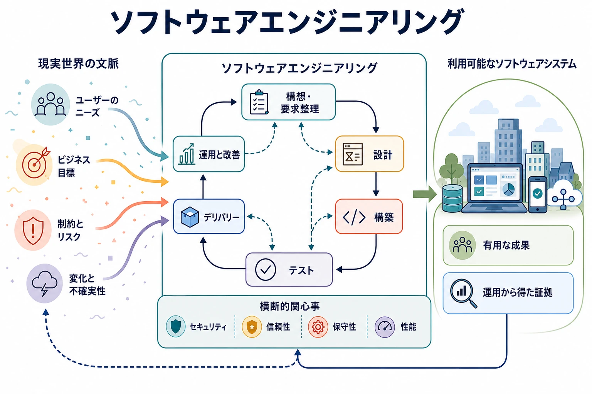

ソフトウェアエンジニアリングとは、現実の制約のもとでソフトウェアシステムを設計、構築、提供、運用し、継続的に進化させるための専門分野です。その対象はプログラミングだけではありません。エンジニアは、正しさ、保守性、信頼性、セキュリティ、性能、提供速度、開発者の生産性、組織の複雑さ、コストの間で、絶えずトレードオフを判断します。

このハブでは、この分野を複数の視点から案内します。ドメインは主要な知識領域を示し、ライフサイクルは構想・要求整理から進化し続ける本番システムまでの活動をたどり、横断的関心事はすべての段階に影響する品質を示します。これらの視点は意図的に重なっています。各トピックはドキュメントツリー内に一つの正規の置き場所を持ちますが、複数の概念的な経路からたどることができます。

三つの列は、この分野の中心的な活動を、システムを形にすること、品質を確かめて変更を届けること、本番環境で運用し進化させることに整理しています。これらは独立した工程ではありません。セキュリティはすべての活動を横断し、ライフサイクルは繰り返しのフィードバックを生み出します。信頼性、保守性、コストなどの横断的関心事は全体の判断に影響し、AI 支援・エージェント型エンジニアリングは、仕事の進め方とエンジニアリング対象となるシステムの両方を変えます。

## どこから始めるか

- **この分野を初めて学ぶ場合：** 構想・要求整理から改善までのライフサイクルをたどり、各段階がどの知識領域を利用するかをドメインマップで確認します。
- **システムを設計する場合：** [ソフトウェアアーキテクチャ](/docs/arch/) から始め、境界とインターフェースを開発、品質、セキュリティ、運用へつなげます。
- **デリバリーを改善する場合：** デリバリーと DevOps から始め、テスト、開発者体験、信頼性へ続くフィードバックループをたどります。
- **本番ソフトウェアを運用する場合：** 信頼性と運用から始め、アーキテクチャやデリバリーの判断へさかのぼります。
- **コーディングエージェントを利用する場合：** AI 支援・エージェント型ソフトウェアエンジニアリングから始め、人によるレビュー、評価、実行境界を常に意識します。

## ドメインから探す

### ソフトウェア設計とアーキテクチャ

この領域が解決するのは、構造上の複雑さです。境界、責任、インターフェース、データの流れを定め、システムの一貫性を失わずに変更するためのトレードオフを扱います。まずソフトウェアアーキテクチャ、システム設計、API 設計、モジュール性を学び、分散システム、アーキテクチャスタイル、ドメイン駆動設計、イベント駆動アーキテクチャ、デザインパターン、アーキテクチャ決定記録へ進みます。

[ソフトウェアアーキテクチャのハブを見る →](/docs/arch/)

### ソフトウェア開発

開発は、意図と設計を保守可能で実行可能な振る舞いへ変換します。プログラミングパラダイム、言語とランタイム、ライブラリとフレームワーク、依存関係管理、バージョン管理、コードレビュー、リファクタリング、コード品質、開発者ツールが対象です。中心となる課題は、単にコードを作ることではなく、変更を長期にわたって理解しやすく、安全で、経済的なものにすることです。

[ソフトウェア開発を見る →](software-development/)

**基礎トピック：** バージョン管理、読みやすいコード、依存関係管理、コードレビュー。

**発展トピック：** ランタイムの振る舞い、リファクタリング戦略、フレームワークのトレードオフ、大規模なコード編成。

### テストと品質エンジニアリング

品質エンジニアリングは、ソフトウェアが意図した振る舞いや重要なシステム品質を満たすかについて、迅速で信頼できるフィードバックを生み出します。単体、統合、契約、エンドツーエンド、プロパティベース、性能、セキュリティの各テストは異なる観点から検証し、静的解析と自動化はフィードバックループをさらに短くします。したがって、テストはリリース直前の最終ゲートではなく、設計と開発の一部です。

[テストと品質エンジニアリングを見る →](testing-quality-engineering/)

**基礎トピック：** テスト戦略、単体テスト、統合テスト、静的解析。

**発展トピック：** 契約テスト、プロパティベーステスト、エンドツーエンドテスト、性能テスト、テスト容易性、大規模システムの品質エンジニアリング。

### デリバリーと DevOps

デリバリーは、ソースコードの変更を制御された本番環境の結果へつなげます。ビルドシステム、CI/CD、アーティファクト管理、リリースエンジニアリング、デプロイ戦略、Infrastructure as Code、GitOps により、この経路を再現可能かつ観測可能にします。プラットフォームエンジニアリングと開発者体験は、個々のプロダクトチームが負う認知的・運用上の負荷を軽減します。






**次に探るトピック：** 継続的デリバリー、再現可能なビルド、アーティファクトの来歴、プログレッシブデリバリー、プラットフォームエンジニアリング、開発者体験。

### 信頼性と運用

運用は、現実の環境に照らしてソフトウェアを検証します。オブザーバビリティ、ログ、メトリクス、トレース、サービスレベル目標、インシデント管理、レジリエンス、キャパシティプランニング、パフォーマンスエンジニアリングにより、チームは本番環境での振る舞いを理解し、制御できます。サイトリライアビリティエンジニアリングは、これらの仕組みを明確な信頼性目標と結び付け、変更と安定性のバランスを取る運用モデルを提供します。






**次に探るトピック：** オブザーバビリティ、SRE、インシデントからの学習、レジリエンスパターン、キャパシティプランニング、パフォーマンスエンジニアリング。

### セキュリティ

セキュリティは、ソフトウェア、その依存関係、運用者に許可する行為を制限し、前提が崩れたときの影響を抑えます。セキュア開発、アプリケーションセキュリティ、脅威モデリング、アイデンティティ、シークレット管理、依存関係とソフトウェアサプライチェーンのセキュリティ、DevSecOps は、独立した最終レビューではなく、設計、構築、デリバリー、運用の全体に組み込みます。

アイデンティティ、認可、ポリシー適用、脅威モデル、エージェントの認可については、[アクセス制御のハブ](/docs/acc/) を参照してください。ソフトウェアエンジニアリングでは、正規の説明を重複させるのではなく、それらの制御を開発ワークフローへ結び付けます。

### エンジニアリングプラクティス

ソフトウェアは組織の中のチームによって作られるため、技術的な成果はコードだけでなく、社会的な仕組みや意思決定の仕組みにも左右されます。要求、技術ドキュメント、エンジニアリングプロセス、コードオーナーシップ、技術的負債、指標、チームトポロジー、アーキテクチャガバナンス、意思決定は、知識と責任の流れを決めます。効果的なプラクティスは、プロセス自体を目的化せずに、トレードオフを可視化し、フィードバックを生み出します。

**基礎トピック：** 要求、ドキュメント、オーナーシップ、意思決定記録。

**発展トピック：** チーム境界、技術的負債の管理、エンジニアリング指標、ガバナンス、組織設計。

### AI 支援・エージェント型ソフトウェアエンジニアリング

AI は、コーディングアシスタント、レビュー担当、テスト生成器、リポジトリ全体を扱うエージェント、ツールを利用するワークフローとしてエンジニアリング作業に参加できます。効果的に活用するには、仕様とコンテキストのエンジニアリング、範囲を限定したツール、サンドボックス実行、人による承認、生成コードの評価、エージェントが何をなぜ変更したかを確認できる記録が必要です。MCP などの相互運用の仕組みはモデルとツールを接続しますが、認可や信頼性の制御を置き換えるものではありません。

次の二つは関連していますが、区別する必要があります。

1. **ソフトウェアエンジニアリングで利用するツールとしての AI** は、リポジトリの理解、コードの作成とレビュー、テスト作成、デリバリーの自動化を変えます。
2. **AI システムのためのソフトウェアエンジニアリング** は、モデルや自律エージェントを含むアプリケーションに、アーキテクチャ、データ、評価、運用、セキュリティ、ガバナンスを適用します。

ハーネスエンジニアリングは両者の交点にあります。コーディングエージェントが信頼できる形で働くためのコンテキスト、ツール、制約、フィードバック、評価環境を設計します。モデルの基礎、AI エンジニアリング、インフラストラクチャ、コンテキストエンジニアリング、エージェントプロトコルについては、[人工知能のハブ](/docs/ai/) を参照してください。

[ソフトウェアエンジニアリングのツールとしての AI を見る →](ai-as-software-engineering-tool/)

## ライフサイクルから探す

このライフサイクルはウォーターフォールではなく、繰り返されるフィードバックループです。作業は前後に移動することも、複数の段階を同時に横断することもあります。

| 段階               | 中心となる問い                             | 関連するトピック                                                                            |
| ------------------ | ------------------------------------------ | ------------------------------------------------------------------------------------------- |
| **構想・要求整理** | どの課題、価値、制約が重要か               | 利用者ニーズ、要求、ドメイン理解、リスク、コスト、成功指標                                  |
| **設計**           | どの境界とトレードオフが変更を安全にするか | アーキテクチャ、システム設計、API、脅威モデリング、データ設計                               |
| **構築**           | 設計を保守可能な形でどう表現するか         | プログラミング、依存関係、バージョン管理、レビュー、リファクタリング、開発者ツール          |
| **テスト**         | 何を根拠に確信を持てるか                   | 自動テスト、静的解析、セキュリティテスト、性能テスト、評価                                  |
| **デリバリー**     | 変更を制御されたリリースにどう変えるか     | ビルド、アーティファクト、CI/CD、デプロイ戦略、Infrastructure as Code、来歴                 |
| **運用**           | 現実の条件下でシステムがどう振る舞うか     | オブザーバビリティ、SRE、インシデント対応、キャパシティ、レジリエンス、セキュリティ、コスト |
| **改善**           | 得られた情報に基づいて何を変えるべきか     | 本番環境のフィードバック、振り返り、技術的負債、指標、実験、再設計                          |

AI 支援は、仕様の明確化からインシデント分析まで、すべての段階に現れます。ただし、行為がもたらし得る影響が大きいほど、検証の水準と人による監督も強める必要があります。

## 横断的関心事から探す

横断的関心事は、ドメインとライフサイクルの各段階に適用する観点です。単一のディレクトリツリーでは表現できない関係を明らかにします。

| 横断的関心事         | システム全体で問うこと                                                         |
| -------------------- | ------------------------------------------------------------------------------ |
| **信頼性**           | どの障害を想定し、どう検出し、システムをどう復旧するか                         |
| **セキュリティ**     | どの信頼境界と権限が存在し、露出をどう制限するか                               |
| **性能**             | レイテンシ、スループット、リソース、応答性の予算をどこで消費するか             |
| **保守性**           | 過度なリスクを負わずに、システムを理解、テスト、変更できるか                   |
| **スケーラビリティ** | 負荷、データ、チームの増加に伴って、どの技術的・組織的制約が現れるか           |
| **開発者体験**       | エンジニアが有用なフィードバックを得て、安全な変更を完了するまでどれだけ速いか |
| **コスト**           | 設計、デリバリー、運用のどの判断がライフサイクル全体のコストを左右するか       |
| **ガバナンス**       | 意思決定、例外、記録、結果を誰が所有するか                                     |

たとえば、オブザーバビリティは、信頼性、分散システムの診断、パフォーマンスエンジニアリング、プラットフォーム運用を支えます。API 設計は、アーキテクチャをセキュリティ、データ交換、エージェントのツール利用へつなぎます。CI/CD は、テスト、サプライチェーンセキュリティ、リリース制御、開発者体験を結び付けます。これらはナビゲーションの経路であり、ページを重複させる理由ではありません。

## 隣接する知識領域

- [ソフトウェアアーキテクチャ](/docs/arch/) では、アーキテクチャのディメンション、境界、ビュー、フロー、意思決定フレームワークを詳しく扱います。
- [人工知能](/docs/ai/) では、AI の基礎、AI エンジニアリングとインフラストラクチャ、コンテキストエンジニアリング、エージェントの相互運用、責任ある AI を扱います。
- [データ](/docs/data/) では、データアーキテクチャ、エンジニアリング、プラットフォーム、管理、メタデータ、プライバシー、アナリティクスを扱います。
- [アクセス制御](/docs/acc/) では、アイデンティティ、認可モデル、ポリシーシステム、多層防御、ガバナンス、自律エージェントの制御を扱います。

これらは主たる所有領域の境界であり、分断する壁ではありません。ソフトウェアエンジニアリングは、現実のシステムを設計、構築、提供、運用するプラクティスを通じて、これらの領域を結び付けます。

## このハブを成長させる方法

ファイルシステムは各ページを一つの正規の場所に保存し、ハブページは概念的なナビゲーションを提供し、メタデータやタクソノミーは将来、領域横断の関係を表現できます。この分離により、トピックの置き場所を安定させたまま、新しい経路を追加できます。

新しいトピックは、地図の空欄を埋めるためではなく、意味のある永続的な指針を提供できる段階でページにします。それまでは、空のリンク先を作らず、このハブ上で重要な領域として示します。セクションが成長しても、ドメインの概要では少数の出発点を強調し、コンテンツ量が必要性を裏付けた場合に限って、詳細な索引やメタデータによる関連トピックナビゲーションを導入します。

## まとめ

ソフトウェアエンジニアリングは、構造、実装、検証、デリバリー、運用、セキュリティ、人と組織のプラクティスを調整する分野です。単一の階層ですべての関係を表現することはできません。知識領域を理解するにはドメインを、システム全体のフィードバックをたどるにはライフサイクルを、両者を横断する品質を検討するには横断的関心事を利用してください。ファイルシステムはドキュメントを保存し、ハブはその全体像を説明します。
