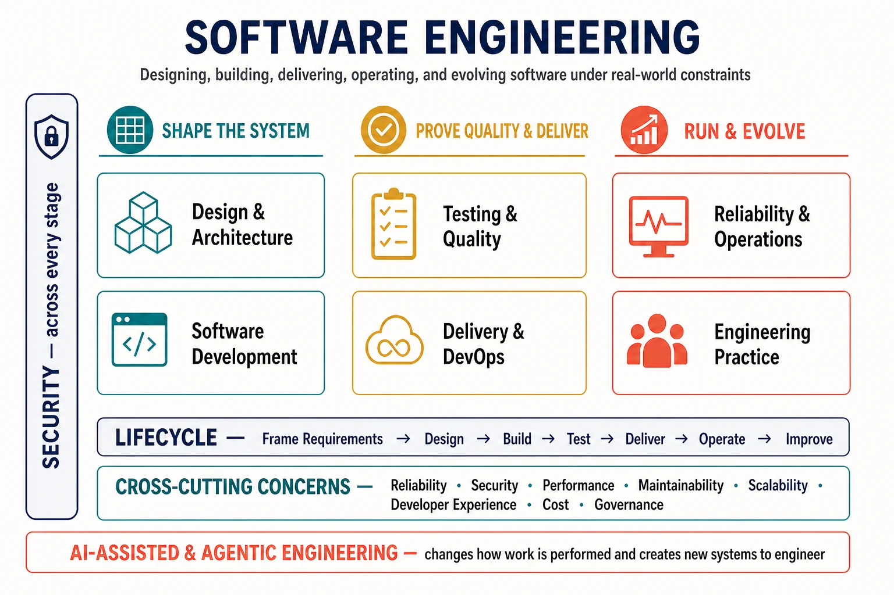

Software engineering is the discipline of designing, building, delivering, operating, and evolving software systems under real-world constraints. It extends beyond programming: engineers must continually balance correctness, maintainability, reliability, security, performance, delivery speed, developer productivity, organizational complexity, and cost.

This hub presents several ways to navigate that discipline. The domains below describe its major bodies of knowledge; the lifecycle follows work from framing requirements to evolving a production system; and cross-cutting concerns show qualities that influence every stage. These views overlap by design. A topic has one canonical home in the documentation tree but may be approached from several conceptual paths.

The three columns group the field by its central work: shaping the system, proving quality and delivering change, and running and evolving software in production. They are not isolated phases. Security spans every activity; the lifecycle supplies a recurring flow of feedback; cross-cutting concerns such as reliability, maintainability, and cost influence decisions throughout; and AI-assisted and agentic engineering changes both how the work is performed and what kinds of systems must be engineered.

## Where to start

- **New to the field:** follow the lifecycle from framing requirements through improvement, using the domain map to understand what each stage draws upon.
- **Designing a system:** begin with [Software Architecture](/docs/arch/), then connect boundaries and interfaces to development, quality, security, and operations.
- **Improving delivery:** start with Delivery & DevOps, then trace its feedback loops into testing, developer experience, and reliability.
- **Operating production software:** start with Reliability & Operations and work backward toward architecture and delivery decisions.
- **Using coding agents:** begin with AI-Assisted & Agentic Software Engineering, while keeping human review, evaluation, and execution boundaries in view.

## Explore by domain

### Software Design & Architecture

This domain manages structural complexity. It establishes boundaries, responsibilities, interfaces, data movement, and the trade-offs that let a system change without losing coherence. Start with software architecture, system design, API design, and modularity; deepen into distributed systems, architecture styles, domain-driven design, event-driven architecture, patterns, and architecture decision records.

[Explore the Software Architecture hub →](/docs/arch/)

### Software Development

Development turns intent and design into maintainable executable behavior. It covers programming paradigms, languages and runtimes, libraries and frameworks, dependency management, version control, code review, refactoring, code quality, and developer tooling. The central problem is not merely producing code, but making change understandable, safe, and economical over time.

[Explore Software Development →](software-development/)

**Foundations:** version control, readable code, dependency management, and code review.

**Deeper topics:** runtime behavior, refactoring strategies, framework trade-offs, and large-scale code organization.

### Testing & Quality Engineering

Quality engineering creates fast, credible feedback about whether software satisfies its intended behavior and important system qualities. Unit, integration, contract, end-to-end, property-based, performance, and security tests provide different evidence; static analysis and automation shorten the loop further. Testing is therefore part of design and development, not a gate applied only before release.

[Explore Testing & Quality Engineering →](testing-quality-engineering/)

**Foundations:** test strategy, unit and integration testing, and static analysis.

**Deeper topics:** contract, property-based, end-to-end, and performance testing; testability; and quality engineering at system scale.

### Delivery & DevOps

Delivery connects a source change to a controlled production outcome. Build systems, CI/CD, artifact management, release engineering, deployment strategies, infrastructure as code, and GitOps make that path repeatable and observable. Platform engineering and developer experience reduce the cognitive and operational load placed on individual product teams.






**Explore next:** continuous delivery, build reproducibility, artifact provenance, progressive delivery, platform engineering, and developer experience.

### Reliability & Operations

Operations tests software against reality. Observability, logging, metrics, tracing, service-level objectives, incident management, resilience, capacity planning, and performance engineering help teams understand and control production behavior. Site reliability engineering connects these mechanisms to explicit reliability targets and an operating model for balancing change with stability.






**Explore next:** observability, SRE, incident learning, resilience patterns, capacity planning, and performance engineering.

### Security

Security constrains what software, its dependencies, and its operators are allowed to do—and limits the impact when assumptions fail. Secure development, application security, threat modeling, identity, secrets management, dependency and supply-chain security, and DevSecOps belong throughout design, build, delivery, and operation rather than in a separate final review.

Use the [Access Control hub](/docs/acc/) for identity, authorization, policy enforcement, threat models, and agent authorization. Software-engineering coverage should connect those controls to development workflows without duplicating their canonical explanations.

### Engineering Practice

Software is built by teams inside organizations, so technical outcomes depend on social and decision systems as well as code. Requirements, technical documentation, engineering processes, code ownership, technical debt, metrics, team topology, architecture governance, and decision-making determine how knowledge and responsibility move. Effective practice makes trade-offs visible and creates feedback without turning process into an end in itself.

**Foundations:** requirements, documentation, ownership, and decision records.

**Deeper topics:** team boundaries, technical-debt management, engineering metrics, governance, and organizational design.

### AI-Assisted & Agentic Software Engineering

AI can participate in engineering work as a coding assistant, reviewer, test generator, repository-level agent, or tool-using workflow. Effective use depends on specification and context engineering, bounded tools, sandboxed execution, human approval, generated-code evaluation, and evidence that lets people review what an agent changed and why. MCP and related interoperability mechanisms help connect models to tools, but do not replace authorization or reliability controls.

Two related concerns should remain distinct:

1. **AI as a software-engineering tool** changes how people understand repositories, write and review code, create tests, and automate delivery.
2. **Software engineering for AI systems** applies architecture, data, evaluation, operations, security, and governance to applications whose behavior includes models or autonomous agents.

Harness engineering sits at their intersection: it designs the context, tools, constraints, feedback, and evaluation environment in which coding agents work reliably. For model foundations, AI engineering, infrastructure, context engineering, and agent protocols, continue through the [Artificial Intelligence hub](/docs/ai/).

[Explore AI as a Software-Engineering Tool →](ai-as-software-engineering-tool/)

## Explore by lifecycle

The lifecycle is a set of recurring feedback loops, not a waterfall. Work may move forward, backward, or across several stages at once.

| Stage                  | Central question                                  | Topics to draw upon                                                                         |
| ---------------------- | ------------------------------------------------- | ------------------------------------------------------------------------------------------- |
| **Frame requirements** | What problem, value, and constraints matter?      | User needs, requirements, domain understanding, risk, cost, and success measures            |
| **Design**             | What boundaries and trade-offs make change safe?  | Architecture, system design, APIs, threat modeling, and data design                         |
| **Build**              | How do we express the design maintainably?        | Programming, dependencies, version control, review, refactoring, and developer tooling      |
| **Test**               | What evidence supports confidence?                | Automated tests, static analysis, security testing, performance testing, and evaluation     |
| **Deliver**            | How does a change become a controlled release?    | Builds, artifacts, CI/CD, deployment strategies, infrastructure as code, and provenance     |
| **Operate**            | How does the system behave under real conditions? | Observability, SRE, incident response, capacity, resilience, security, and cost             |
| **Improve**            | What should change based on evidence?             | Production feedback, retrospectives, technical debt, metrics, experimentation, and redesign |

AI assistance can appear at every stage—from clarifying specifications to analyzing incidents—but the required evidence and human oversight should increase with the potential impact of an action.

## Explore by cross-cutting concern

Cross-cutting concerns are lenses applied across domains and lifecycle stages. They expose relationships that a directory tree cannot represent.

| Cross-cutting concern    | Questions to ask across the system                                                  |
| ------------------------ | ----------------------------------------------------------------------------------- |
| **Reliability**          | What failures are expected, how are they detected, and how does the system recover? |
| **Security**             | Which trust boundaries and authorities exist, and how is exposure limited?          |
| **Performance**          | Where are latency, throughput, resource, and responsiveness budgets spent?          |
| **Maintainability**      | Can people understand, test, and change the system without disproportionate risk?   |
| **Scalability**          | Which technical and organizational constraints emerge as load, data, or teams grow? |
| **Developer experience** | How quickly can an engineer get useful feedback and complete a safe change?         |
| **Cost**                 | Which design, delivery, and operational choices drive total lifecycle cost?         |
| **Governance**           | Who owns decisions, exceptions, evidence, and consequences?                         |

For example, observability supports reliability, distributed-systems diagnosis, performance engineering, and platform operations. API design connects architecture to security, data exchange, and agent tool use. CI/CD connects testing, supply-chain security, release control, and developer experience. These relationships are navigational paths, not reasons to duplicate a page.

## Neighboring knowledge areas

- [Software Architecture](/docs/arch/) owns the deeper treatment of architectural dimensions, boundaries, views, flows, and decision frameworks.
- [Artificial Intelligence](/docs/ai/) covers AI foundations, AI engineering and infrastructure, context engineering, agent interoperability, and responsible AI.
- [Data](/docs/data/) covers data architecture, engineering, platforms, management, metadata, privacy, and analytics.
- [Access Control](/docs/acc/) covers identity, authorization models, policy systems, defense in depth, governance, and controls for autonomous agents.

These are boundaries of primary ownership, not walls. Software engineering connects them through the practices used to design, build, deliver, and operate real systems.

## How this hub grows

The filesystem stores each page at one canonical location; hub pages provide conceptual navigation; metadata or taxonomies may later describe cross-cutting relationships. This separation allows a topic to remain stable while new routes to it are added.

New topics should become pages when they can provide meaningful, durable guidance—not merely to fill a box in the map. Until then, this hub names important parts of the landscape without creating empty destinations. As the section grows, domain summaries should continue to emphasize a few starting points, with deeper indexes or metadata-driven related-topic navigation introduced only where the volume of content justifies it.

## Summary

Software engineering coordinates structure, implementation, evidence, delivery, operations, security, and human practice. No single hierarchy captures all of those relationships. Use domains to understand the bodies of knowledge, the lifecycle to follow feedback through a system, and concerns to examine qualities that span both. The filesystem stores the documentation; the hub explains the landscape.
