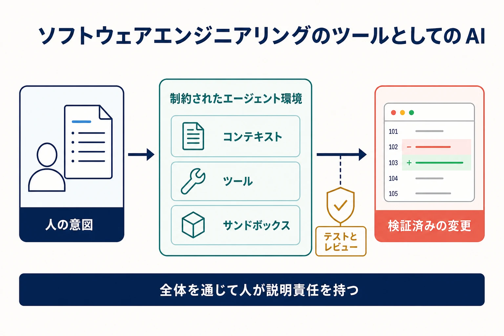

AI は、リポジトリの理解、コードの作成と変換、テスト作成、変更レビュー、障害調査、範囲を限定したワークフローの自動化を支援できます。その価値は、エンジニアリング上の判断や説明責任を取り除くことではなく、フィードバックを改善し、機械的な作業を減らすことにあります。

## 範囲と区別

このページでは、**ソフトウェアエンジニアリングで利用するツールとしての AI** を扱います。製品の振る舞いがモデルや自律エージェントに依存するシステムのソフトウェアエンジニアリングとは異なります。後者は主に [AI エンジニアリング](/docs/ai/ai-engineering/) の対象であり、評価、モデルの振る舞い、データ、ガードレール、AI 運用が提供システムの特性になります。

AI コーディングアシスタントは、通常エディタや対話の中で応答します。コーディングエージェントは、リポジトリを調査し、変更を計画し、ツールを使い、ファイルを編集し、コマンドを実行し、テスト結果へ対応できます。リポジトリレベルのエージェントは、より広いコンテキストと長い行動系列を扱います。自律性が高いほど、潜在的な効果と明示的な境界の必要性がともに増します。

## AI が支援できる領域

**リポジトリの理解** には、関連コードの特定、未知の構成要素の説明、依存関係の追跡、変更履歴の要約があります。出力は、ソースコードと実行時の情報で確認するまでは仮説として扱います。

**実装とリファクタリング** には、コードの下書き、反復的な変換、API 移行、代替案の作成があります。明確な仕様、ローカル規約、小さな差分、自動検査によって、安全性とレビュー可能性が高まります。

**テストとレビュー** には、テストケース生成、境界条件の不足の特定、失敗の説明、明示された要求に対するパッチレビューがあります。AI は注意の範囲を広げられますが、誤った振る舞いを検証するもっともらしいテストや、システムの文脈を見落としたレビューも生成します。

**デリバリーと運用** には、設定更新、ログ解釈、ランブック作成、修復案の提示があります。環境、認証情報、データ、利用者に影響する行為には、読み取り専用の分析より強い権限制御、プレビュー、承認、監査が必要です。

## エージェントハーネス

コーディングエージェントの結果は、モデルを囲むハーネスに依存します。ハーネスエンジニアリングは、エージェントの仕事を形作る指示、リポジトリコンテキスト、ツール、権限、サンドボックス、フィードバック、評価、人の確認点を設計します。

仕様には、期待する成果、境界、不変条件、検証基準を記載します。コンテキストにはタスクに必要な最小限の信頼できる指示と成果物を供給します。ツールは明確なスキーマと制約された操作を公開します。サンドボックスはファイルシステム、ネットワーク、プロセス、認証情報へのアクセスを制限します。重大または取り消しにくい行為の前には人の承認を置きます。

[AGENTS.md](/docs/ai/context-engineering/agents-md/) はリポジトリ固有の作業指示を提供でき、[エージェントスキル](/docs/ai/context-engineering/agent-skills/) は再利用可能な手順と資源をパッケージ化します。[ツールと MCP](/docs/ai/context-engineering/tools-and-mcp/) は相互運用可能なツールアクセスを説明します。これらはコンテキストと能力を改善しますが、認可、検証、レビューを置き換えません。

## エージェントの作業を評価する

生成コードは、説得力のある文章ではなく、システムへの変更として評価します。有用な判断材料には、焦点を絞ったテスト、広い回帰検査、静的解析、ビルド結果、セキュリティ検査、差分確認、要求された振る舞いの直接検証があります。影響の大きいタスクでは、独立したレビューや既知シナリオに対する評価も必要です。

エージェントの信頼性は、タスクと環境に固有です。ベンチマークの点数だけでは、特定のリポジトリを安全に変更できることを示せません。代表的な作業で評価し、失敗モードを記録し、人に隠れたレビューや復旧コストを移さずにワークフロー全体の成果が改善するかを測ります。

## セキュリティと説明責任

プロンプト、リポジトリ内容、Issue、Web ページ、ツール出力は、信頼できない入力になり得るものとして扱います。エージェントには現在のタスクに必要な権限だけを与えます。可能な限り認証情報をモデルコンテキストから外し、外部への作用を明示し、開始した人、エージェント、ツール、承認を追跡できるようにします。

Human-in-the-loop は一つの確認ダイアログではありません。人が介入するための十分な文脈と時間を持てる意思決定点に、有意義なレビューを配置することです。低リスクで可逆的な変換は、本番変更、データ変更、権限変更、セキュリティ上重要な作業より高い自律性を許容できます。

## よくある誤解

- **生成されたコードは検証済みコードではありません。** 流暢に見えることは正しさを保証しません。
- **コンテキストは多いほど良いとは限りません。** 無関係または競合する情報は性能を下げ、不要な情報を露出します。
- **自律性は一つの設定ではありません。** 読み取り、編集、実行、ネットワークアクセス、外部作用は別々の権限です。
- **AI 導入を出力量だけで測るべきではありません。** レビュー負荷、欠陥率、リードタイム、学習、運用結果も重要です。

## まとめ

AI は、意図的に設計されたハーネスの中で使うと、ソフトウェアエンジニアリングを高速で探索的なものにできます。明確な仕様、限定されたコンテキストとツール、サンドボックス実行、層を成す検証、説明可能な人の監督が、モデルの能力を有用なエンジニアリング支援へ変えます。
