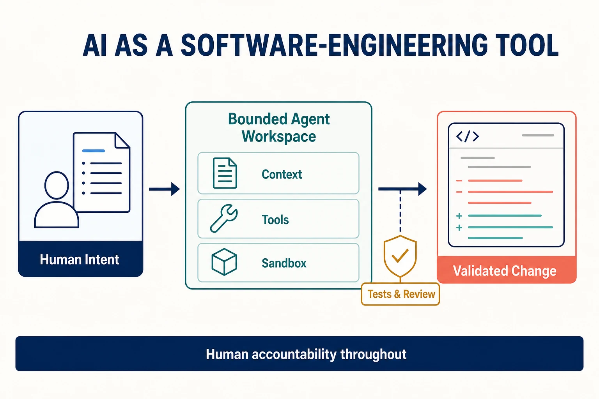

AI can support software-engineering work by helping people understand repositories, draft and transform code, create tests, review changes, investigate failures, and automate bounded workflows. Its value comes from improving feedback and reducing mechanical effort—not from removing engineering judgment or accountability.

## Scope and distinction

This topic concerns **AI as a tool used during software engineering**. It is distinct from software engineering for systems whose product behavior depends on models or autonomous agents. The latter belongs primarily in [AI Engineering](/docs/ai/ai-engineering/), where evaluation, model behavior, data, guardrails, and AI operations are properties of the delivered system.

An AI coding assistant usually responds within an editor or conversation. A coding agent can inspect a repository, plan changes, use tools, edit files, run commands, and respond to test results. Repository-level agents operate across a larger context and longer sequence of actions. Greater autonomy increases both potential leverage and the need for explicit boundaries.

## Where AI can help

**Repository understanding** includes locating relevant code, explaining unfamiliar components, tracing dependencies, and summarizing change history. The output should be treated as a hypothesis until checked against source code and runtime evidence.

**Implementation and refactoring** includes drafting code, applying repetitive transformations, migrating APIs, and producing alternatives. Clear specifications, local conventions, small diffs, and automated checks make this work safer and easier to review.

**Testing and review** includes generating cases, identifying missing boundary conditions, explaining failures, and reviewing a patch against stated requirements. AI can widen attention, but it may also produce plausible tests that assert the wrong behavior or reviews that miss system context.

**Delivery and operations** includes updating configuration, interpreting logs, preparing runbooks, and proposing remediation. Actions that affect environments, credentials, data, or users require stronger permissions, preview, approval, and audit controls than read-only analysis.

## The agent harness

A coding agent's results depend on the harness around the model. Harness engineering designs the instructions, repository context, tools, permissions, sandbox, feedback, evaluation, and human checkpoints that shape an agent's work.

Specifications should state the desired outcome, boundaries, invariants, and validation criteria. Context should supply the smallest authoritative set of instructions and artifacts needed for the task. Tools should expose clear schemas and constrained operations. Sandboxes should limit filesystem, network, process, and credential access. Human approval should be placed before consequential or difficult-to-reverse actions.

[AGENTS.md](/docs/ai/context-engineering/agents-md/) can provide repository-scoped operating instructions, while [Agent Skills](/docs/ai/context-engineering/agent-skills/) package reusable procedures and resources. [Tools and MCP](/docs/ai/context-engineering/tools-and-mcp/) explains interoperable tool access. These mechanisms improve context and capability, but they do not replace authorization, validation, or review.

## Evaluating agent work

Generated code should be evaluated as a change to the system, not as convincing text. Useful evidence includes focused tests, broader regression checks, static analysis, build results, security checks, diff inspection, and direct validation of the requested behavior. High-impact tasks may also need independent review or evaluation against known scenarios.

Agent reliability is task- and environment-specific. A benchmark score does not establish that an agent can safely modify a particular repository. Teams should evaluate representative work, record failure modes, and measure whether the complete workflow improves outcomes without shifting hidden review or recovery cost onto people.

## Security and accountability

Treat prompts, repository content, issue text, webpages, and tool output as potentially untrusted input. An agent should receive only the authority required for the current task. Credentials should remain out of model context where possible, external effects should be explicit, and actions should be attributable to the initiating person, agent, tools, and approvals.

Human-in-the-loop control is not a single confirmation dialog. It means placing meaningful review at decision points where a person has enough context and time to intervene. Low-risk, reversible transformations can be more autonomous than production changes, data modification, permission changes, or security-sensitive work.

## Common misconceptions

- **Generated code is not validated code.** Fluency is not evidence of correctness.
- **More context is not always better.** Irrelevant or conflicting context can reduce performance and expose information unnecessarily.
- **Autonomy is not one setting.** Reading, editing, executing, accessing networks, and creating external effects are separate authorities.
- **AI adoption is not measured only by output volume.** Review load, defect rate, lead time, learning, and operational outcomes also matter.

## Summary

AI can make software engineering faster and more exploratory when it operates inside a deliberate harness. Clear specifications, bounded context and tools, sandboxed execution, layered validation, and accountable human oversight turn model capability into useful engineering assistance.
