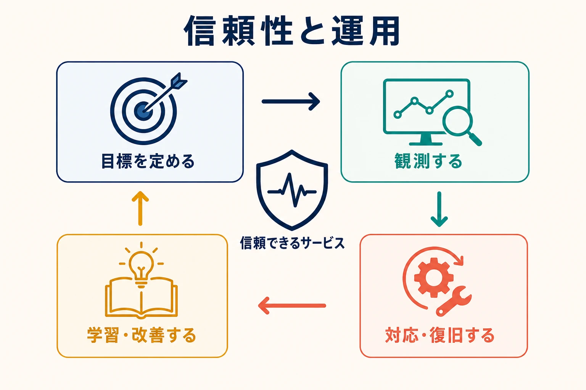

信頼性と運用は、ソフトウェア設計を、現実の環境でシステムが遭遇する条件へ結び付けます。振る舞いを可視化し、許容できるサービスを定義し、障害に備え、本番環境から得られる情報をより良いエンジニアリング判断へつなげます。

## 管理される成果としての信頼性

信頼性とは、明示された条件下で、利用者が依存するサービスをシステムが提供できる度合いです。単なる稼働率ではありません。正しさ、レイテンシ、耐久性、鮮度、復旧可能性も重要です。技術的には稼働中でも、利用者に価値を提供できていない場合があります。

サービスレベル指標は利用者に関係する振る舞いを測定し、サービスレベル目標は期間内の許容水準を設定します。エラーバジェットは、その目標と両立する信頼性の余地を表します。これらは、完全性への漠然とした要求ではなく、明示的な指標によって変更と安定性のバランスを取る助けになります。

## オブザーバビリティと診断

オブザーバビリティとは、システムが生み出す情報から内部の振る舞いを調査できる能力です。ログは個別の事象を記録し、メトリクスは時間に沿った振る舞いを要約し、トレースは境界を越える処理を接続します。プロファイル、イベント、トポロジー、デプロイ情報、業務コンテキストも必要になる場合があります。

テレメトリの収集だけでは不十分です。シグナルには一貫した識別子、有用なコンテキスト、保持、アクセス制御、運用者が実際に問う内容との接続が必要です。ダッシュボードは既知の状況を支え、探索的クエリと相互に関連付けられた情報は未知の状況の診断を助けます。

アラートは行動が必要な状態を示すべきです。すべての内部指標の異常を通知するより、利用者への影響や運用余力の枯渇へ結び付ける方が有用です。行動可能なアラートには、所有者、コンテキスト、現実的な対応が必要です。

## レジリエンスとインシデント管理

レジリエンスとは、構成要素、依存先、人、前提が失敗したときに、継続、意図的な縮退、復旧ができる能力です。タイムアウト、再試行、サーキットブレーカー、負荷制限、冗長化、分離、グレースフルデグラデーションは異なる失敗モードに対応します。予算と境界なしに使うと、過負荷を増幅したり障害を隠したりします。

キャパシティプランニングは、予想需要、資源上限、性能特性、成長を結び付けます。パフォーマンスエンジニアリングは、レイテンシと資源予算がどこで使われるかを調べます。いずれも限界がインシデントになる前にアーキテクチャへ反映します。

インシデント管理は、検知、対応、コミュニケーション、緩和、復旧を調整します。効果的な対応は影響と共有状況の把握を優先します。事後レビューでは、個人への非難に還元せず、技術的・組織的条件を調べます。設計、テスト、デリバリー制御、文書、運用準備が変わって初めて学習になります。

## 運用責任

運用の所有とは、チームが自らのソフトウェアの結果とのつながりを保つことです。すべてのエンジニアがすべての運用役割を担うことではありません。明確なエスカレーション、持続可能なオンコール、プラットフォーム支援、明確な所有境界により、構築者を本番から切り離さず責任を分配できます。

[Twelve-Factor App](../12factor/) は、デプロイ可能で運用管理しやすいサービスの原則を説明します。[デリバリーと DevOps](../delivery-devops/) は変更が本番へ到達する方法を扱い、運用は実際の振る舞いをフィードバックしてループを閉じます。

## よくある誤解

- **信頼性は、どのようなコストでも最大可用性を求めることではありません。** 目標は利用者ニーズと事業上のトレードオフを反映します。
- **オブザーバビリティはテレメトリ製品ではありません。** シグナル、コンテキスト、運用プラクティスから成る調査能力です。
- **再試行を増やせば常に強くなるわけではありません。** 制限のない再試行は障害を増幅します。
- **文書を公開しただけでは事後レビューは完了しません。** 学習をシステムや運用の変更へつなげます。

## まとめ

信頼性と運用は、本番の振る舞いをエンジニアリングへの入力にします。明示的な目標、観測可能なシステム、レジリエントな設計、容量への理解、規律あるインシデント学習により、ソフトウェアを責任を持って運用し、実測結果に基づいて進化させます。
