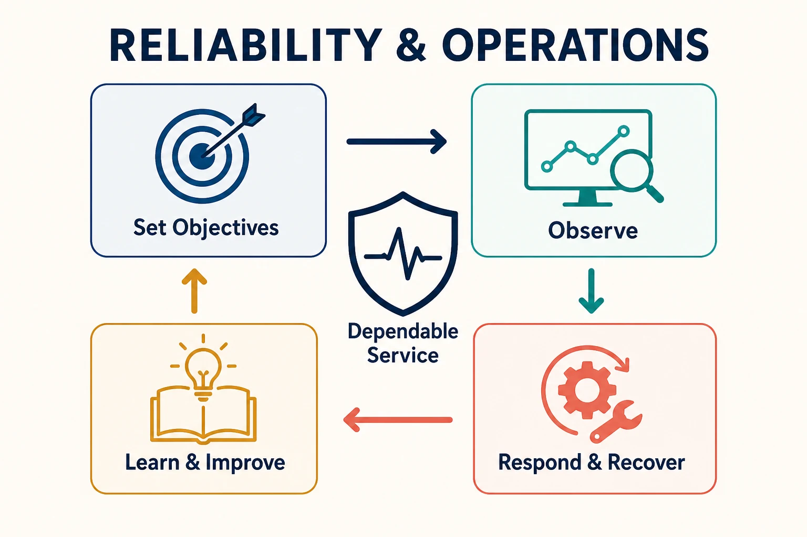

Reliability and operations connect software design with the conditions a system encounters in the real world. They make behavior visible, define acceptable service, prepare for failure, and turn production evidence into better engineering decisions.

## Reliability is a managed outcome

Reliability is the degree to which a system provides the service people depend on under stated conditions. It is not identical to uptime: correctness, latency, durability, freshness, and recoverability may all matter. A system can be technically available while failing its users.

Service-level indicators measure a user-relevant behavior. Service-level objectives set an acceptable target over a period. Error budgets express how much unreliability remains compatible with that target. Together they help teams balance delivery and stability using explicit evidence rather than a general demand for perfection.

## Observability and diagnosis

Observability is the ability to investigate a system's internal behavior from the evidence it produces. Logs record discrete events, metrics summarize behavior over time, and traces connect work across boundaries. Profiles, events, topology, deployment data, and business context may also be necessary.

Collecting telemetry is not enough. Signals need consistent identity, useful context, retention, access control, and a connection to questions operators actually ask. Dashboards support known situations; exploratory queries and correlated evidence help diagnose unfamiliar ones.

Alerting should identify conditions that require action. Alerts tied to user impact or exhausted operating margins are usually more useful than notifications for every abnormal internal metric. Each actionable alert needs ownership, context, and a plausible response.

## Resilience and incident management

Resilience is the ability to continue, degrade deliberately, or recover when components, dependencies, people, or assumptions fail. Timeouts, retries, circuit breakers, load shedding, redundancy, isolation, and graceful degradation address different failure modes. Used without budgets and boundaries, they can amplify overload or hide faults.

Capacity planning connects expected demand, resource limits, performance behavior, and growth. Performance engineering examines where latency and resource budgets are consumed. Both should inform architecture before a limit becomes an incident.

Incident management coordinates detection, response, communication, mitigation, and recovery. Effective response prioritizes impact and shared situational awareness. A post-incident review should examine technical and organizational conditions without reducing the event to individual blame. Its value comes from changes to design, tests, delivery controls, documentation, and operational readiness.

## Operating responsibility

Operational ownership means that teams remain connected to the consequences of their software. It does not require every engineer to perform every operational role. Clear escalation, sustainable on-call practices, platform support, and well-defined ownership boundaries distribute responsibility without separating builders from production learning.

The [Twelve-Factor App](../12factor/) describes useful principles for deployable and operationally manageable services. [Delivery & DevOps](../delivery-devops/) explains how changes reach production; operations closes that loop by returning evidence about their real behavior.

## Common misconceptions

- **Reliability is not maximum availability at any cost.** Targets should reflect user needs and business trade-offs.
- **Observability is not a telemetry product.** It is an investigative capability built from signals, context, and operating practice.
- **More retries do not always improve resilience.** Unbounded retries can magnify failure.
- **An incident review is not complete when a document is published.** Learning must change the system or its operation.

## Summary

Reliability and operations make production behavior an engineering input. Explicit objectives, observable systems, resilient design, capacity awareness, and disciplined incident learning help teams operate software responsibly and evolve it using evidence.
