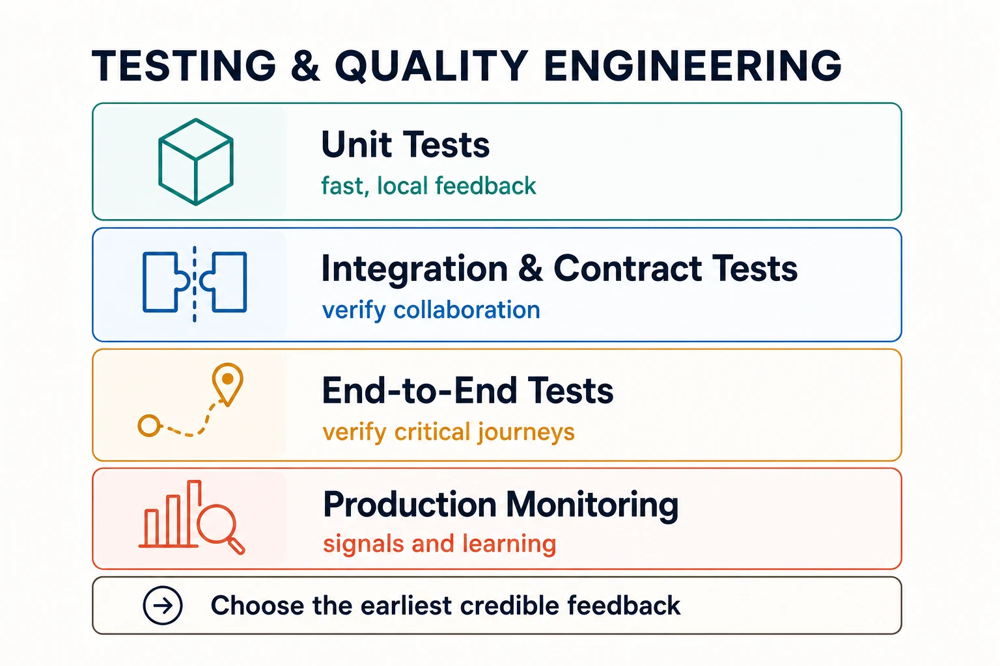

Testing and quality engineering create evidence about whether software is fit for its intended use. They do not prove that a system is perfect. They reduce uncertainty by checking behavior, contracts, system qualities, and important failure modes at useful points in the engineering lifecycle.

## Quality as a system property

Quality is broader than functional correctness. A system may return the right result and still be too slow, insecure, inaccessible, difficult to operate, or unsafe to change. Quality engineering makes these expectations explicit and builds feedback mechanisms that help teams act on them.

Testing is one such mechanism. Reviews, static analysis, type systems, production telemetry, incident learning, and user feedback provide additional evidence. A sound quality strategy combines them rather than expecting one test suite to answer every question.

## Layers of evidence

**Unit tests** examine small units of behavior and usually provide the fastest, most localized feedback. They are valuable when they describe stable behavior without binding every test to private implementation details.

**Integration tests** verify that components collaborate across real boundaries such as databases, queues, file systems, and services. They expose assumptions that isolated tests cannot see, including serialization, configuration, transactions, and failure handling.

**Contract tests** verify an interface between independently changing parties. They are especially useful for APIs, events, and platform capabilities where producer and consumer releases are not synchronized.

**End-to-end tests** exercise a representative user or system journey through deployed components. They provide broad confidence but are slower and harder to diagnose, so a small set of critical journeys is usually more useful than reproducing every case end to end.

**Property-based tests** generate many inputs to verify invariants rather than a fixed set of examples. **Performance tests** examine latency, throughput, resource use, and behavior under load. Security, accessibility, resilience, and recovery tests add evidence for other cross-cutting concerns.

## Designing a feedback portfolio

A testing strategy should match the system's risks. Tests close to the code offer speed and diagnostic precision. Tests across boundaries provide realism. Production signals reveal conditions that pre-release environments cannot fully reproduce. The goal is a portfolio that provides the earliest credible feedback for each important risk.

Testability is a design quality. Explicit dependencies, observable outcomes, deterministic boundaries, controllable time, and replaceable external systems make behavior easier to verify. When a component is difficult to test, the difficulty often reveals hidden coupling or unclear responsibility.

Automation makes feedback repeatable, but automated checks still need ownership. Flaky tests, opaque failures, duplicated coverage, and ever-growing suites can erode trust. Teams should treat test code as maintained production assets: review it, simplify it, measure its usefulness, and remove checks that no longer protect meaningful behavior.

## Quality across delivery and operations

Quality work starts while requirements and architecture are being shaped. Acceptance criteria clarify intent; threat models identify security risks; performance budgets constrain design; and contract definitions make boundaries testable. During [Delivery & DevOps](../delivery-devops/), automated checks become release evidence. During [Reliability & Operations](../reliability-operations/), telemetry and incidents reveal gaps in prior assumptions and feed new tests and design changes.

## Common misconceptions

- **High coverage does not guarantee useful tests.** Coverage shows execution, not whether assertions protect important behavior.
- **The test pyramid is not a fixed quota.** The right distribution depends on system boundaries, risks, and feedback cost.
- **Quality is not owned by a separate testing phase.** Specialists can provide deep expertise, but delivery teams remain accountable for outcomes.
- **Production monitoring is not a substitute for pre-release testing.** The two provide different evidence and should reinforce each other.

## Summary

Testing and quality engineering build confidence through layered evidence and short feedback loops. Effective strategies connect requirements, design, code, delivery, and production learning while matching each important risk with the most useful form of evidence.
